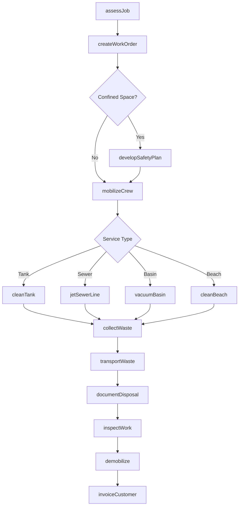
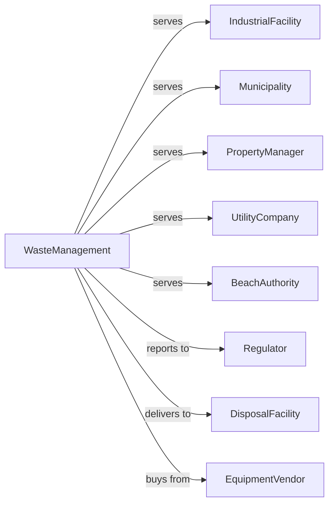

# All Other Miscellaneous Waste Management Services

> Business-as-Code definition for specialized waste management operations. Models services including industrial tank cleaning, sewer cleaning, beach maintenance, and catch basin servicing.

## Overview

All other miscellaneous waste management services includes specialized operations such as industrial tank cleaning, sewer and storm drain cleaning, beach cleaning, and catch basin maintenance. This definition exposes actions for service delivery, events for job tracking, and searches for scheduling and compliance management.

## Actors

| Actor | Description |
|-------|-------------|
| IndustrialFacility | Plant requiring tank or vessel cleaning |
| Municipality | Government entity with infrastructure needs |
| PropertyManager | Manages commercial properties |
| UtilityCompany | Water or sewer system operator |
| BeachAuthority | Manages public beach facilities |
| Regulator | Environmental agency overseeing operations |
| DisposalFacility | Receives waste from cleaning operations |
| EquipmentVendor | Provides specialized cleaning equipment |

## Roles

| Role | Description |
|------|-------------|
| Owner | Owns the business and manages operations |
| ProjectManager | Coordinates complex cleaning projects |
| FieldSupervisor | Oversees on-site crew activities |
| VacuumTruckOperator | Operates vacuum and jetting trucks |
| ConfinedSpaceWorker | Enters tanks and vessels safely |
| SewerTechnician | Services sewer lines and structures |
| BeachCrewMember | Cleans and maintains beach areas |
| SafetyOfficer | Ensures worker health and safety |
| SewerJetter | Operates high-pressure water jetting trucks to clear blockages in storm and sanitary sewer lines |

## Entities

| Entity | Description |
|--------|-------------|
| ServiceContract | Agreement for cleaning services |
| WorkOrder | Specific job to be completed |
| Tank | Industrial vessel requiring cleaning |
| SewerLine | Underground pipe requiring maintenance |
| CatchBasin | Storm drain inlet structure |
| BeachSection | Area of shoreline to be cleaned |
| VacuumTruck | Vehicle for liquid and solids removal |
| JetterTruck | High-pressure water cleaning vehicle |
| Waste | Material removed during cleaning |
| DisposalManifest | Documentation for waste transport |
| SafetyPlan | Confined space or hazard protocol |
| Invoice | Bill for services rendered |

## Actions

| Action | Description |
|--------|-------------|
| assessJob | Evaluate scope and requirements |
| createWorkOrder | Set up specific cleaning job |
| developSafetyPlan | Prepare safety protocols for hazards |
| mobilizeCrew | Deploy personnel and equipment |
| cleanTank | Remove contents and residue from vessel |
| jetSewerLine | Clear blockages with high-pressure water |
| vacuumBasin | Remove debris from catch basin |
| cleanBeach | Remove litter and debris from shoreline |
| collectWaste | Gather removed materials |
| transportWaste | Deliver waste to disposal facility |
| documentDisposal | Complete manifest and tracking |
| inspectWork | Verify cleaning meets standards |
| demobilize | Remove equipment and personnel |
| invoiceCustomer | Bill for services rendered |

## Events

| Event | Description |
|-------|-------------|
| jobAssessed | Scope evaluation completed |
| workOrderCreated | Job entered into system |
| safetyPlanApproved | Protocols accepted |
| crewMobilized | Personnel and equipment on-site |
| cleaningStarted | Work began |
| cleaningCompleted | Work finished |
| wasteCollected | Materials removed and contained |
| wasteDisposed | Materials delivered to facility |
| workInspected | Quality verified |
| demobilizationCompleted | Equipment and crew departed |
| invoiceSent | Bill sent to customer |
| paymentReceived | Customer payment processed |
| incidentReported | Safety or environmental issue |
| complianceFiled | Regulatory report submitted |

## Searches

| Search | Description |
|--------|-------------|
| findWorkOrders | List jobs by customer, date, or status |
| getContracts | Retrieve active service agreements |
| checkCrewAvailability | View personnel schedules |
| getEquipmentStatus | Check vehicle and tool availability |
| findDisposalRecords | List waste manifests |
| getInvoices | Retrieve bills by customer or status |
| getSafetyRecords | View safety plans and incidents |
| getComplianceHistory | Retrieve regulatory filings |

## Workflow



## Actor Relationships



## Usage

### Calling Actions

```typescript
import { cleanIndustrialInfrastructure } from '@headlessly/clean-industrial-infrastructure'

const waste = cleanIndustrialInfrastructure()

// Check pending work orders and crew availability
const pendingJobs = await waste.findWorkOrders({ status: 'pending', serviceType: 'tankCleaning' })
const crewStatus = await waste.checkCrewAvailability({ date: '2024-04-20', minCrewSize: 6 })

// Assess industrial tank cleaning job
const assessment = await waste.assessJob({
  customerId: 'refinery-123',
  serviceType: 'tankCleaning',
  tankId: 'storage-tank-7',
  contents: 'petroleumSludge',
  estimatedVolume: 5000,
  confinedSpace: true
})

// Create work order with safety plan
const workOrder = await waste.createWorkOrder({
  assessmentId: assessment.id,
  scheduledDate: '2024-04-20',
  crewSize: 6,
  equipment: ['vacuumTruck', 'confinedSpaceGear']
})

await waste.developSafetyPlan({
  workOrderId: workOrder.id,
  hazards: ['confinedSpace', 'flammableVapors'],
  permits: ['hotWork', 'confinedSpaceEntry'],
  monitoring: ['oxygenLevel', 'lel']
})
```

### Event-Driven Automation

```typescript
// Auto-schedule recurring service
waste.cleaningCompleted(async ({ workOrderId, contractId }) => {
  const contract = await waste.getContracts({ id: contractId })

  if (contract.frequency === 'quarterly') {
    await waste.createWorkOrder({
      contractId,
      scheduledDate: addMonths(new Date(), 3),
      copyFrom: workOrderId
    })
  }
})

// Alert on safety incident
waste.incidentReported(async ({ workOrderId, incidentType, severity }) => {
  await notifySafetyOfficer({
    workOrderId,
    incidentType,
    severity,
    immediateAction: 'stopWork'
  })

  if (severity === 'major') {
    await waste.complianceFiled({
      reportType: 'oshaIncident',
      workOrderId
    })
  }
})
```

## Related

- [Septic Tank and Related Services](./562991-SepticTankAndRelatedServices.mdx)
- [Materials Recovery Facilities](./562920-MaterialsRecoveryFacilities.mdx)
