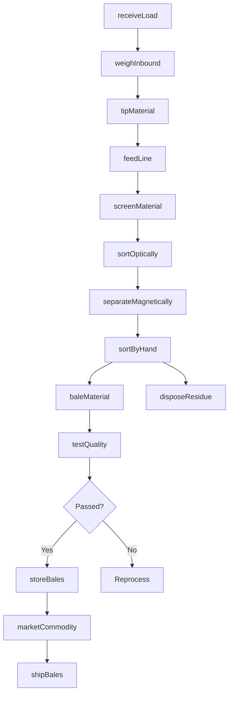
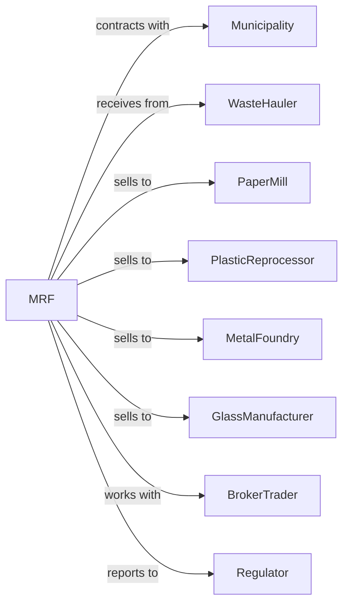

# Materials Recovery Facilities

> Business-as-Code definition for recycling facility operations. Models the complete process from receiving commingled materials through sorting, baling, and marketing to end markets.

## Overview

Materials recovery facilities receive and sort recyclable materials from curbside collection programs, separating paper, plastics, metals, and glass into commodity grades for sale to manufacturers. This definition exposes actions for processing operations, events for quality monitoring, and searches for throughput and market management.

## Actors

| Actor | Description |
|-------|-------------|
| Municipality | Government entity with recycling contract |
| WasteHauler | Transporter delivering commingled recyclables |
| PaperMill | Purchases sorted paper fiber |
| PlasticReprocessor | Buys sorted plastic bales |
| MetalFoundry | Purchases aluminum and steel scrap |
| GlassManufacturer | Buys cullet for new glass production |
| BrokerTrader | Markets commodities internationally |
| Regulator | Environmental agency overseeing operations |

## Roles

| Role | Description |
|------|-------------|
| FacilityManager | Oversees overall MRF operations |
| OperationsManager | Coordinates daily sorting activities |
| LineOperator | Operates sorting equipment |
| QualitySorter | Manually picks materials on line |
| BalerOperator | Compresses sorted materials |
| ScaleOperator | Weighs incoming and outgoing loads |
| MarketingManager | Sells commodities to buyers |
| MaintenanceTechnician | Services sorting equipment |
| SortLinePicker | Manually separates contaminants from recyclable streams on a moving conveyor belt |

## Entities

| Entity | Description |
|--------|-------------|
| InboundLoad | Incoming commingled recyclables |
| SortingLine | Conveyor system with screens and separators |
| Commodity | Sorted material grade for sale |
| Bale | Compressed bundle of sorted material |
| Residue | Non-recyclable contamination |
| WeightTicket | Scale receipt for incoming load |
| QualitySpec | Buyer requirements for commodity grade |
| ContaminationReport | Documentation of rejected material |
| Contract | Sales agreement with buyer |
| Invoice | Bill for processing or commodity sale |
| ProcessingFee | Charge for sorting services |
| MarketPrice | Current commodity value |

## Actions

| Action | Description |
|--------|-------------|
| receiveLoad | Accept incoming recyclables |
| weighInbound | Record weight at scale |
| tipMaterial | Deposit on receiving floor |
| feedLine | Load material onto sorting conveyor |
| screenMaterial | Separate by size using screens |
| sortOptically | Use sensors to identify plastic types |
| separateMagnetically | Extract ferrous metals |
| sortByHand | Manually pick specific materials |
| baleMaterial | Compress sorted commodity |
| testQuality | Sample bale for contamination |
| storeBales | Place in inventory area |
| marketCommodity | Negotiate sale with buyers |
| shipBales | Load and transport to buyer |
| disposeResidue | Send contamination to landfill |

## Events

| Event | Description |
|-------|-------------|
| loadReceived | Recyclables accepted |
| loadWeighed | Weight recorded |
| materialFed | Material entered sorting line |
| materialSorted | Commodity separated |
| baleProduced | Material compressed |
| qualityTested | Bale sampled |
| qualityApproved | Bale met buyer specs |
| qualityRejected | Bale failed specifications |
| saleNegotiated | Price agreed with buyer |
| balesShipped | Commodity transported to market |
| residueDisposed | Contamination sent to landfill |
| invoiceSent | Bill sent to customer or buyer |
| marketPriceChanged | Commodity value shifted |
| inventoryThresholdReached | Sorted commodity bale count has met minimum quantity for sale |
| equipmentMalfunctioned | Sorting system failure |

## Searches

| Search | Description |
|--------|-------------|
| findLoads | List incoming shipments by source |
| getThroughput | View tons processed by period |
| getCommodityInventory | Check bale quantities by grade |
| getQualityReports | Retrieve contamination data |
| getMarketPrices | View current commodity values |
| findContracts | List active sales agreements |
| getResidueRates | View contamination percentages |
| getEquipmentStatus | Check sorting line health |

## Workflow



## Actor Relationships



## Usage

### Calling Actions

```typescript
import { recoverRecyclables } from '@headlessly/recover-recyclables'

const mrf = recoverRecyclables()

// Check commodity inventory and current market prices
const inventory = await mrf.getCommodityInventory({ commodity: 'PET', minimumBales: 1 })
const prices = await mrf.getMarketPrices({ commodity: 'PET' })

// Receive incoming recyclables
const load = await mrf.receiveLoad({
  haulerId: 'hauler-123',
  municipalityId: 'city-metro',
  vehicleId: 'truck-456',
  estimatedWeight: 12000
})

// Weigh and tip material
await mrf.weighInbound({
  loadId: load.id,
  grossWeight: 48000,
  tareWeight: 36000
})

// Process through sorting line
await mrf.feedLine({
  loadId: load.id,
  lineNumber: 1,
  feedRate: 35
})

// Bale sorted plastic
const bale = await mrf.baleMaterial({
  commodity: 'PET',
  gradeSpec: 'A-grade',
  targetWeight: 1200
})
```

### Event-Driven Automation

```typescript
// Auto-market when inventory threshold reached
mrf.inventoryThresholdReached(async ({ commodity, baleCount, totalWeight }) => {
  const price = await mrf.getMarketPrices({ commodity })

  if (price.current >= price.targetFloor) {
    await mrf.marketCommodity({
      commodity,
      quantity: totalWeight,
      minimumPrice: price.targetFloor
    })
  }
})

// Alert on quality rejection
mrf.qualityRejected(async ({ baleId, commodity, contaminationRate }) => {
  await notifyOperations({
    message: `Bale ${baleId} rejected: ${contaminationRate}% contamination`,
    recommendedAction: 'adjustSortingLine'
  })

  await mrf.reprocessBale({
    baleId,
    reason: 'qualityFailure'
  })
})
```

## Related

- [Remediation Services](./562910-RemediationServices.mdx)
- [Septic Tank and Related Services](./562991-SepticTankAndRelatedServices.mdx)
