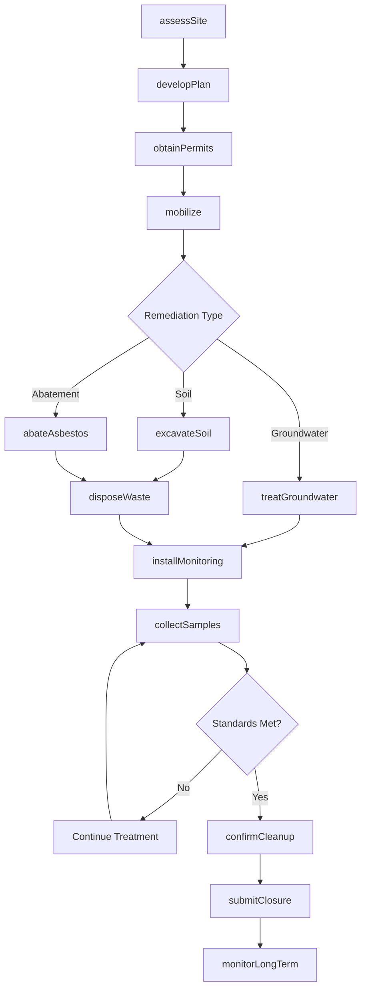
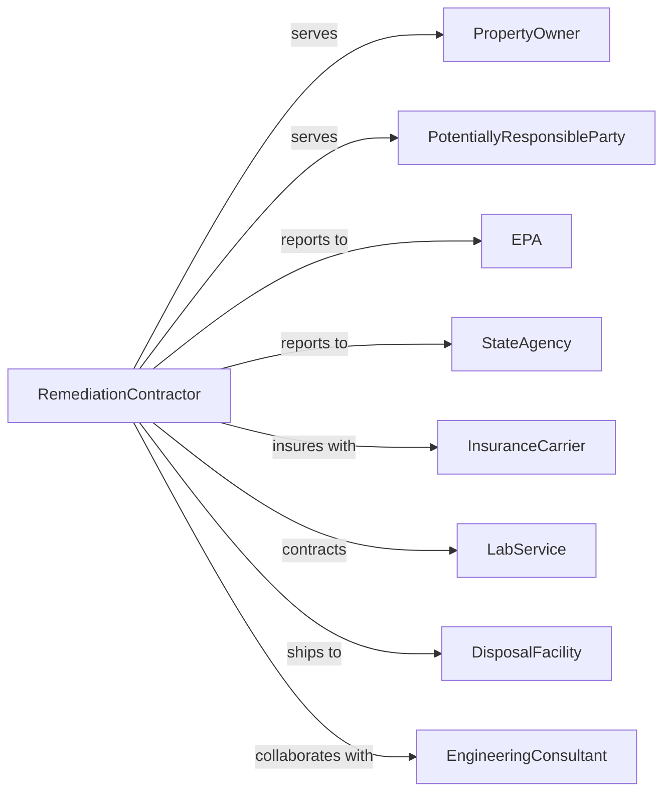

# Remediation Services

> Business-as-Code definition for environmental remediation operations. Models the complete lifecycle from site assessment through cleanup, monitoring, and regulatory closure.

## Overview

Remediation services encompass cleanup of contaminated sites including soil, groundwater, buildings, and mines through methods such as excavation, in-situ treatment, and abatement of hazardous materials like asbestos and lead. This definition exposes actions for project execution, events for compliance tracking, and searches for site and regulatory management.

## Actors

| Actor | Description |
|-------|-------------|
| PropertyOwner | Entity responsible for contaminated property |
| EPA | Federal environmental protection agency |
| StateAgency | State environmental regulatory authority |
| PotentiallyResponsibleParty | Liable party under Superfund or similar law |
| InsuranceCarrier | Provides environmental liability coverage |
| LabService | Performs sampling and analysis |
| DisposalFacility | Receives contaminated materials |
| EngineeringConsultant | Designs remediation systems |

## Roles

| Role | Description |
|------|-------------|
| ProjectManager | Oversees remediation project execution |
| SiteManager | Manages day-to-day field operations |
| EnvironmentalEngineer | Designs treatment systems |
| FieldTechnician | Collects samples and operates equipment |
| SafetyOfficer | Ensures worker health and safety |
| GeologistHydrologist | Assesses subsurface conditions |
| AbatementWorker | Removes asbestos, lead, and hazardous materials |
| ComplianceManager | Manages regulatory submittals |
| AsbestosAbatementWorker | Removes and encapsulates hazardous asbestos-containing materials from buildings |

## Entities

| Entity | Description |
|--------|-------------|
| ContaminatedSite | Property requiring cleanup |
| Contaminant | Hazardous substance requiring removal |
| SamplingPoint | Location for environmental monitoring |
| TreatmentSystem | Equipment for in-situ or ex-situ cleanup |
| RemediationPlan | Strategy document for cleanup |
| WorkPlan | Detailed execution procedures |
| SamplingData | Laboratory analysis results |
| Manifest | Tracking document for waste transport |
| Permit | Regulatory authorization for activities |
| CleanupStandard | Target concentration for contaminants |
| CostEstimate | Budget for remediation activities |
| ClosureReport | Documentation for regulatory sign-off |

## Actions

| Action | Description |
|--------|-------------|
| assessSite | Evaluate contamination extent and type |
| developPlan | Create remediation strategy |
| obtainPermits | Secure regulatory approvals |
| mobilize | Set up equipment and personnel on-site |
| excavateSoil | Remove contaminated material |
| treatGroundwater | Pump and treat or inject remediation agents |
| abateAsbestos | Remove asbestos-containing materials |
| abateLead | Remove lead paint and materials |
| installMonitoring | Place groundwater wells and sampling points |
| collectSamples | Gather soil, water, or air samples |
| disposeWaste | Transport contaminated material off-site |
| confirmCleanup | Verify standards achieved |
| submitClosure | Request regulatory sign-off |
| monitorLongTerm | Conduct ongoing sampling after closure |

## Events

| Event | Description |
|-------|-------------|
| siteAssessed | Contamination evaluation completed |
| planApproved | Regulator accepted remediation strategy |
| permitsObtained | Authorizations secured |
| mobilizationComplete | Equipment and crew on-site |
| excavationCompleted | Contaminated soil removed |
| treatmentStarted | Active cleanup began |
| treatmentCompleted | Cleanup process finished |
| abatementCompleted | Hazardous material removed |
| samplesCollected | Environmental data gathered |
| resultsReceived | Lab analysis returned |
| standardsAchieved | Cleanup goals met |
| closureApproved | Regulator signed off |
| monitoringCompleted | Long-term sampling finished |
| violationCited | Regulatory noncompliance issued |

## Searches

| Search | Description |
|--------|-------------|
| findSites | List remediation projects by status or type |
| getContaminants | View contaminants and concentrations |
| getSamplingData | Retrieve monitoring results |
| getPermitStatus | Check regulatory approvals |
| getTreatmentProgress | View cleanup metrics |
| findManifests | List waste shipments |
| getCostData | Retrieve project expenditures |
| getComplianceHistory | Review regulatory filings |

## Workflow



## Actor Relationships



## Usage

### Calling Actions

```typescript
import { remediateSite } from '@headlessly/remediate-site'

const remediation = remediateSite()

// Assess contamination at site
const assessment = await remediation.assessSite({
  siteId: 'site-brownfield-42',
  contaminants: ['petroleum', 'chlorinatedSolvents'],
  media: ['soil', 'groundwater'],
  phase: 'phaseII'
})

// Develop remediation plan
const plan = await remediation.developPlan({
  siteId: 'site-brownfield-42',
  approach: 'excavationAndPumpTreat',
  targetStandards: 'residential',
  estimatedDuration: 18,
  estimatedCost: 2500000
})

// Excavate contaminated soil
await remediation.excavateSoil({
  siteId: 'site-brownfield-42',
  area: 'hotspot-1',
  depth: 15,
  estimatedVolume: 5000,
  disposalFacility: 'landfill-permitted'
})
```

### Event-Driven Automation

```typescript
// Auto-submit closure when standards achieved
remediation.standardsAchieved(async ({ siteId, contaminants, finalConcentrations }) => {
  await remediation.confirmCleanup({
    siteId,
    verificationSamples: finalConcentrations,
    complianceStatus: 'achieved'
  })

  await remediation.submitClosure({
    siteId,
    closureType: 'noFurtherAction',
    supportingDocuments: ['finalReport', 'samplingData']
  })
})

// Notify on lab results
remediation.resultsReceived(async ({ siteId, samplingEvent, results }) => {
  const exceedances = results.filter(r => r.concentration > r.standard)

  if (exceedances.length > 0) {
    await notifyProjectTeam({
      siteId,
      message: 'Exceedances detected',
      exceedances
    })
  }
})
```

## Related

- [Materials Recovery Facilities](./562920-MaterialsRecoveryFacilities.mdx)
- [Septic Tank and Related Services](./562991-SepticTankAndRelatedServices.mdx)
