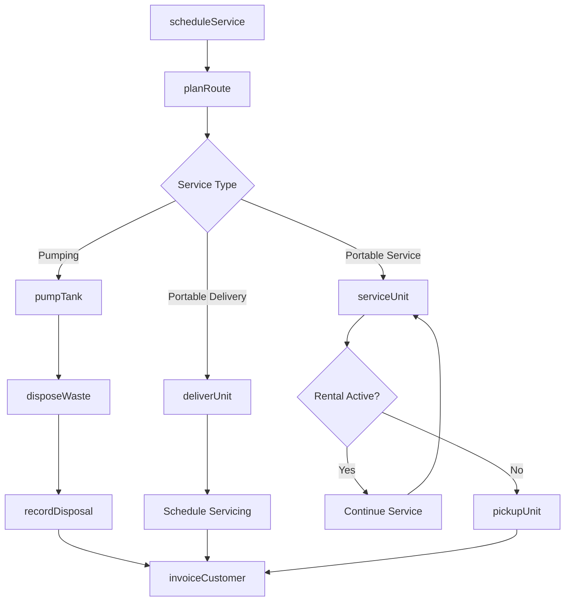
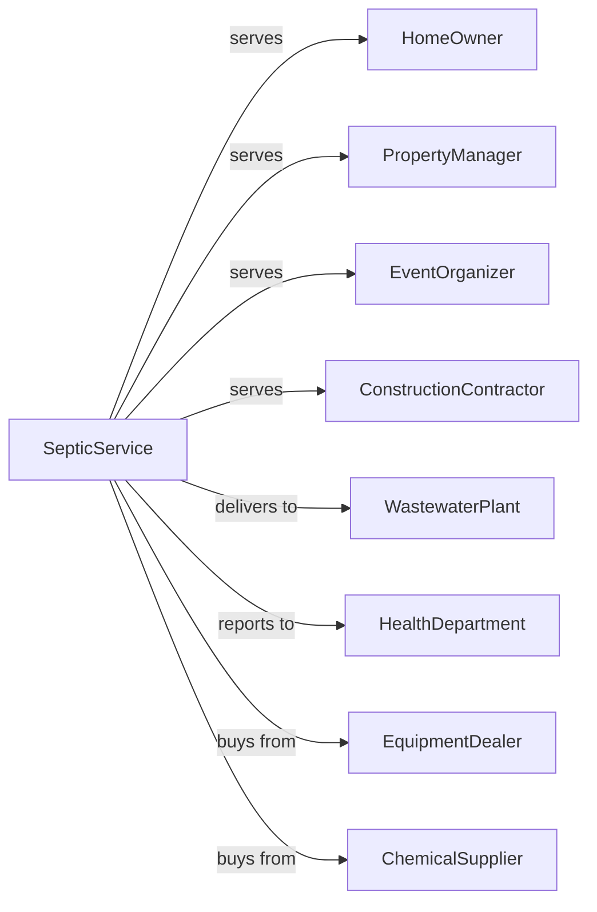

# Septic Tank and Related Services

> Business-as-Code definition for septic and portable sanitation operations. Models services including tank pumping, cesspool cleaning, and portable toilet rental and servicing.

## Overview

Septic tank and related services include pumping septic tanks and cesspools, as well as renting and servicing portable toilets for events and construction sites. This definition exposes actions for service delivery, events for scheduling automation, and searches for customer and route management.

## Actors

| Actor | Description |
|-------|-------------|
| HomeOwner | Residential client with septic system |
| PropertyManager | Manages properties with onsite wastewater |
| EventOrganizer | Rents portable toilets for gatherings |
| ConstructionContractor | Needs portable sanitation for job sites |
| WastewaterPlant | Receives pumped septage for treatment |
| HealthDepartment | Regulates septic systems and sanitation |
| EquipmentDealer | Provides pump trucks and portable units |
| ChemicalSupplier | Provides treatment additives and deodorizers |

## Roles

| Role | Description |
|------|-------------|
| Owner | Owns the business and manages operations |
| OperationsManager | Coordinates scheduling and routes |
| PumpTruckDriver | Operates vacuum truck for pumping |
| ServiceTechnician | Maintains and services portable units |
| RouteCoordinator | Plans efficient service routes |
| CustomerService | Books appointments and handles inquiries |
| DeliveryDriver | Transports portable toilets |
| MaintenanceTech | Repairs equipment and trucks |
| SepticPumper | Operates vacuum truck to extract and haul septage from residential and commercial tanks |

## Entities

| Entity | Description |
|--------|-------------|
| SepticSystem | Customer onsite wastewater treatment |
| PumpingJob | Scheduled tank pumping appointment |
| PortableToilet | Rental sanitation unit |
| RentalContract | Agreement for portable unit placement |
| VacuumTruck | Vehicle for pumping operations |
| Route | Planned sequence of service stops |
| DisposalTicket | Receipt from treatment plant |
| Invoice | Bill for services rendered |
| MaintenanceRecord | Equipment service history |
| ServiceArea | Geographic coverage zone |
| ChemicalTreatment | Additive applied to systems |
| Inspection | Assessment of system condition |

## Actions

| Action | Description |
|--------|-------------|
| scheduleService | Book pumping or portable service appointment |
| planRoute | Create efficient sequence of stops |
| pumpTank | Vacuum contents from septic tank |
| pumpCesspool | Empty cesspool or holding tank |
| disposeWaste | Deliver septage to treatment facility |
| deliverUnit | Place portable toilet at site |
| serviceUnit | Clean and restock portable toilet |
| relocateUnit | Move portable to new location |
| pickupUnit | Retrieve portable after rental ends |
| inspectSystem | Assess septic system condition |
| addTreatment | Apply biological or chemical additives |
| invoiceCustomer | Bill for services rendered |
| maintainEquipment | Service trucks and portable units |
| recordDisposal | Document waste delivery to plant |

## Events

| Event | Description |
|-------|-------------|
| serviceScheduled | Appointment booked |
| routeDispatched | Truck departed on route |
| tankPumped | Septic tank emptied |
| wasteDisposed | Septage delivered to plant |
| unitDelivered | Portable toilet placed |
| unitServiced | Portable cleaned and restocked |
| unitRelocated | Portable moved to new site |
| unitPickedUp | Portable retrieved |
| inspectionCompleted | System assessment finished |
| treatmentApplied | Additive added to system |
| invoiceSent | Bill sent to customer |
| paymentReceived | Customer payment processed |
| equipmentServiced | Truck or unit maintenance completed |
| serviceIntervalReached | Scheduled servicing period has been reached for a portable unit rental |
| disposalRecorded | Waste documentation filed |

## Searches

| Search | Description |
|--------|-------------|
| findAppointments | List scheduled services by date |
| getCustomers | Retrieve clients with service history |
| getRentals | List active portable toilet placements |
| getRoutes | View planned service sequences |
| checkAvailability | Find open scheduling slots |
| getDisposalTickets | Retrieve plant delivery records |
| getEquipmentStatus | View truck and unit availability |
| findOverdueService | List customers due for pumping |

## Workflow



## Actor Relationships



## Usage

### Calling Actions

```typescript
import { serviceSepticSystem } from '@headlessly/service-septic-system'

const septic = serviceSepticSystem()

// Check overdue accounts and truck availability
const overdue = await septic.findOverdueService({ monthsSinceLastPump: 36 })
const trucks = await septic.getEquipmentStatus({ type: 'vacuumTruck', status: 'available' })

// Schedule septic pumping
const appointment = await septic.scheduleService({
  customerId: 'homeowner-123',
  serviceType: 'septicPumping',
  address: '456 Rural Road',
  tankSize: 1000,
  preferredDate: '2024-04-15',
  accessNotes: 'Tank lid under deck'
})

// Deliver portable toilets for event
const rental = await septic.deliverUnit({
  customerId: 'eventco-789',
  siteAddress: '100 Festival Grounds',
  unitType: 'standard',
  quantity: 20,
  deliveryDate: '2024-05-01',
  rentalDuration: 3,
  serviceFrequency: 'daily'
})

// Pump septic tank
await septic.pumpTank({
  appointmentId: appointment.id,
  truckId: 'vac-truck-01',
  gallonsPumped: 950,
  systemCondition: 'good'
})
```

### Event-Driven Automation

```typescript
// Auto-schedule next service
septic.tankPumped(async ({ customerId, gallonsPumped, systemCondition }) => {
  const nextServiceMonths = systemCondition === 'good' ? 36 : 24

  await septic.scheduleService({
    customerId,
    serviceType: 'septicPumping',
    preferredDate: addMonths(new Date(), nextServiceMonths),
    reminder: true
  })
})

// Auto-service portables on schedule
septic.serviceIntervalReached(async ({ rentalId, lastServiceDate }) => {
  const rental = await septic.getRentals({ id: rentalId })

  if (rental.serviceFrequency === 'daily') {
    await septic.serviceUnit({
      rentalId,
      scheduledDate: addDays(lastServiceDate, 1)
    })
  }
})
```

## Related

- [Remediation Services](./562910-RemediationServices.mdx)
- [All Other Miscellaneous Waste Management Services](./562998-AllOtherMiscellaneousWasteManagementServices.mdx)
