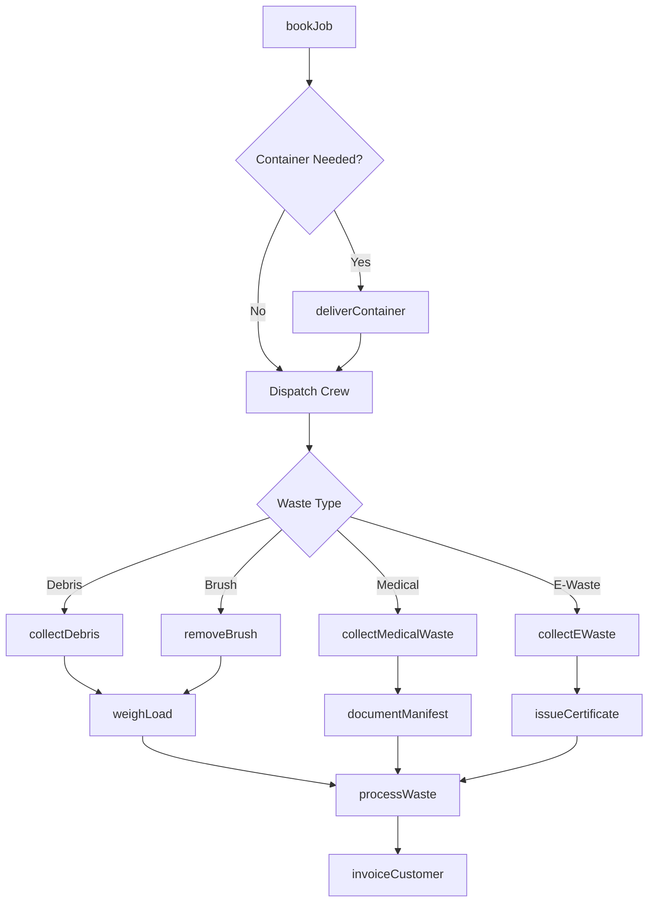
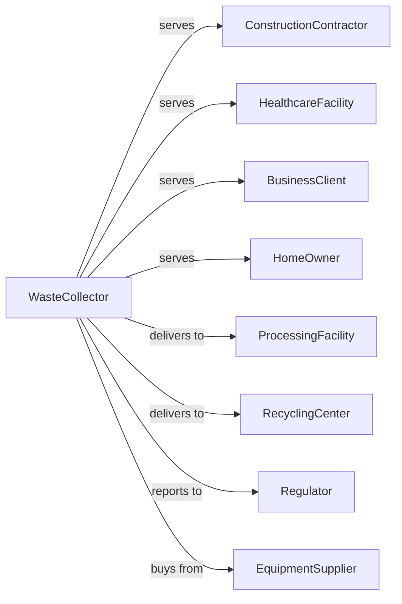

# Other Waste Collection

> Business-as-Code definition for specialty waste collection operations. Models services including construction debris, brush removal, medical waste, and electronic waste collection.

## Overview

Other waste collection includes collecting and hauling specialty waste such as construction debris, brush, yard waste, medical waste, and electronic waste. This definition exposes actions for specialized collection, events for operational tracking, and searches for job and compliance management.

## Actors

| Actor | Description |
|-------|-------------|
| ConstructionContractor | Client generating demolition and construction debris |
| HealthcareFacility | Hospital or clinic generating medical waste |
| BusinessClient | Company disposing of electronic waste |
| HomeOwner | Residential client with brush or debris removal needs |
| ProcessingFacility | Receives and processes specialty waste |
| RecyclingCenter | Processes recyclable specialty materials |
| Regulator | Environmental agency overseeing operations |
| EquipmentSupplier | Provides specialty collection equipment |

## Roles

| Role | Description |
|------|-------------|
| Owner | Owns the company and manages operations |
| OperationsManager | Oversees daily collection activities |
| Driver | Operates collection vehicles |
| FieldCrew | Performs manual loading and debris handling |
| MedicalWasteTech | Handles regulated medical waste |
| Dispatcher | Coordinates jobs and truck assignments |
| CustomerService | Books jobs and handles inquiries |
| SafetyOfficer | Ensures compliance with handling protocols |
| RollOffDriver | Delivers and retrieves open-top dumpsters at construction and demolition sites |

## Entities

| Entity | Description |
|--------|-------------|
| ServiceOrder | Job request from customer |
| Container | Roll-off, dumpster, or specialty receptacle |
| Load | Collected material from a job |
| Vehicle | Truck configured for specialty waste |
| Manifest | Tracking document for regulated waste |
| DisposalTicket | Receipt from processing facility |
| Invoice | Bill for collection services |
| Permit | Authorization for specialty waste handling |
| SafetyProtocol | Handling procedures for waste types |
| RecyclingCertificate | Documentation of material recycled |
| JobSite | Location of collection activity |
| WeightTicket | Scale receipt for load measurement |

## Actions

| Action | Description |
|--------|-------------|
| bookJob | Schedule specialty waste collection |
| deliverContainer | Place roll-off or dumpster at job site |
| collectDebris | Load construction or demolition waste |
| removeBrush | Clear and haul yard waste and brush |
| collectMedicalWaste | Pick up regulated medical waste |
| collectEWaste | Gather electronic waste for recycling |
| weighLoad | Record weight at disposal facility |
| processWaste | Deliver to appropriate processing facility |
| swapContainer | Exchange full container for empty |
| documentManifest | Complete tracking paperwork |
| issueCertificate | Provide recycling or destruction documentation |
| invoiceCustomer | Bill for services rendered |
| maintainEquipment | Service collection vehicles and containers |
| auditCompliance | Verify regulatory adherence |

## Events

| Event | Description |
|-------|-------------|
| jobBooked | Collection appointment scheduled |
| containerDelivered | Receptacle placed at customer site |
| collectionCompleted | Waste picked up from site |
| containerSwapped | Full container exchanged for empty |
| loadWeighed | Weight recorded at scale |
| wasteProcessed | Material delivered to facility |
| manifestCompleted | Tracking document signed |
| certificateIssued | Recycling documentation provided |
| invoiceSent | Bill sent to customer |
| paymentReceived | Customer payment processed |
| incidentReported | Safety or compliance issue documented |
| permitRenewed | Operating authorization updated |

## Searches

| Search | Description |
|--------|-------------|
| findJobs | List jobs by customer, date, or status |
| getContainers | Track containers by location or type |
| findLoads | Retrieve loads by date or waste type |
| getManifests | List tracking documents by status |
| checkVehicleStatus | View truck locations and availability |
| getDisposalTickets | Retrieve facility receipts |
| findCertificates | List recycling certifications issued |
| getComplianceRecords | Retrieve audit and permit documentation |

## Workflow



## Actor Relationships



## Usage

### Calling Actions

```typescript
import { collectSpecialtyWaste } from '@headlessly/collect-specialty-waste'

const waste = collectSpecialtyWaste()

// Book construction debris removal
const job = await waste.bookJob({
  customerId: 'contractor-456',
  wasteType: 'constructionDebris',
  siteAddress: '789 Building Ave',
  containerSize: '30-yard',
  estimatedTons: 8,
  scheduledDate: '2024-04-05'
})

// Deliver roll-off container
await waste.deliverContainer({
  jobId: job.id,
  containerType: 'rollOff',
  size: '30-yard',
  placementInstructions: 'Driveway, door facing street'
})

// Collect medical waste from clinic
const medicalJob = await waste.collectMedicalWaste({
  facilityId: 'clinic-123',
  containers: [
    { type: 'sharpsContainer', quantity: 5 },
    { type: 'redBag', weight: 50 }
  ],
  manifestRequired: true
})
```

### Event-Driven Automation

```typescript
// Auto-swap container when full
waste.containerFull(async ({ containerId, jobId }) => {
  await waste.swapContainer({
    jobId,
    containerId,
    scheduledDate: addDays(new Date(), 1)
  })

  await notifyCustomer({
    jobId,
    message: 'Container swap scheduled for tomorrow'
  })
})

// Issue certificate after e-waste processing
waste.wasteProcessed(async ({ loadId, wasteType, facilityId }) => {
  if (wasteType === 'electronicWaste') {
    await waste.issueCertificate({
      loadId,
      certificateType: 'recycling',
      facilityId,
      materialsRecovered: ['metals', 'plastics', 'glass']
    })
  }
})
```

## Related

- [Solid Waste Collection](./562111-SolidWasteCollection.mdx)
- [Hazardous Waste Collection](./562112-HazardousWasteCollection.mdx)
