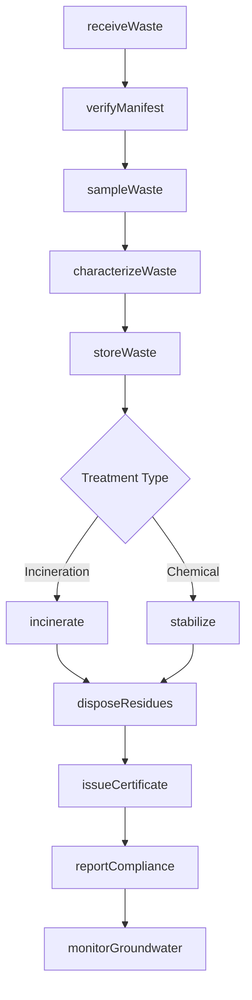
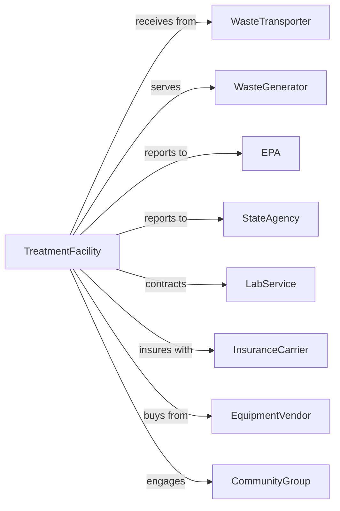

# Hazardous Waste Treatment and Disposal

> Business-as-Code definition for hazardous waste treatment and disposal facility operations. Models the regulated lifecycle from waste receipt through treatment, stabilization, and final disposal.

## Overview

Hazardous waste treatment and disposal facilities operate RCRA-permitted facilities that receive, treat, and dispose of regulated hazardous materials through methods including incineration, chemical treatment, and secure landfilling. This definition exposes actions for compliant operations, events for regulatory tracking, and searches for manifest and permit management.

## Actors

| Actor | Description |
|-------|-------------|
| WasteTransporter | Licensed hauler delivering hazardous waste |
| WasteGenerator | Industrial source of hazardous waste |
| EPA | Federal environmental protection agency |
| StateAgency | State environmental regulatory authority |
| LabService | Performs waste characterization analysis |
| InsuranceCarrier | Provides environmental liability coverage |
| EquipmentVendor | Supplies treatment and safety equipment |
| CommunityGroup | Local stakeholders concerned with operations |

## Roles

| Role | Description |
|------|-------------|
| FacilityDirector | Manages overall facility operations |
| ComplianceManager | Ensures regulatory adherence |
| OperationsManager | Oversees daily treatment activities |
| ChemistTechnician | Analyzes and characterizes incoming waste |
| TreatmentOperator | Runs treatment systems and equipment |
| SafetyOfficer | Manages health and emergency protocols |
| ManifestClerk | Processes receiving documentation |
| EnvironmentalEngineer | Designs and optimizes treatment processes |
| IncinerationOperator | Controls high-temperature combustion systems that destroy hazardous waste |

## Entities

| Entity | Description |
|--------|-------------|
| Manifest | EPA tracking document for waste shipments |
| WasteProfile | Characterization of waste stream properties |
| TreatmentUnit | Equipment system for processing waste |
| StorageUnit | Permitted container or tank area |
| DisposalCell | Secure landfill area for treated waste |
| Permit | RCRA authorization for facility operations |
| LabAnalysis | Chemical testing results |
| Certificate | Proof of treatment or destruction |
| EmergencyPlan | Contingency procedures for incidents |
| MonitoringWell | Groundwater sampling point |
| Residue | Byproduct remaining after treatment |
| AuditReport | Compliance inspection documentation |

## Actions

| Action | Description |
|--------|-------------|
| receiveWaste | Accept incoming shipment with manifest |
| verifyManifest | Confirm paperwork matches delivery |
| sampleWaste | Collect material for analysis |
| characterizeWaste | Determine treatment requirements |
| storeWaste | Place in permitted storage area |
| treatWaste | Process through appropriate treatment system |
| incinerate | Destroy waste through high-temperature combustion |
| stabilize | Chemically treat to reduce hazard |
| disposeResidues | Place treated material in secure cell |
| monitorGroundwater | Sample wells for contamination |
| reportCompliance | Submit regulatory filings |
| issueCertificate | Provide proof of destruction |
| conductAudit | Perform facility compliance inspection |
| respondEmergency | Execute contingency plan for incident |

## Events

| Event | Description |
|-------|-------------|
| wasteReceived | Shipment accepted at facility |
| manifestVerified | Documentation confirmed accurate |
| wasteCharacterized | Analysis completed |
| wasteStored | Material placed in permitted area |
| treatmentStarted | Processing began |
| treatmentCompleted | Waste processed through system |
| residuesDisposed | Treated material placed in cell |
| certificateIssued | Destruction proof provided |
| groundwaterSampled | Monitoring wells tested |
| exceedanceDetected | Contamination above limits found |
| auditCompleted | Compliance inspection finished |
| permitRenewed | Operating authorization updated |
| incidentReported | Emergency or release documented |
| violationCited | Regulatory noncompliance issued |

## Searches

| Search | Description |
|--------|-------------|
| findManifests | List received manifests by date or generator |
| getWasteInventory | View stored waste by type or location |
| getTreatmentRecords | Retrieve processing history |
| checkCapacity | View available storage and treatment capacity |
| getMonitoringData | Retrieve groundwater sampling results |
| findCertificates | List destruction certificates issued |
| getPermitStatus | View permit expiration and conditions |
| getAuditHistory | Retrieve compliance inspection records |

## Workflow



## Actor Relationships



## Usage

### Calling Actions

```typescript
import { treatHazardousWaste } from '@headlessly/treat-hazardous-waste'

const facility = treatHazardousWaste()

// Receive incoming waste shipment
const receipt = await facility.receiveWaste({
  manifestId: 'EPA-123456789',
  transporterId: 'trans-001',
  generatorId: 'gen-EPA456',
  containers: [
    { type: '55-gallon drum', quantity: 20, wasteCode: 'D001' }
  ],
  weight: 4000
})

// Characterize waste for treatment
const characterization = await facility.characterizeWaste({
  receiptId: receipt.id,
  labAnalysisId: 'lab-789',
  treatmentRequired: 'incineration',
  landDisposalRestrictions: ['D001']
})

// Process through incineration
await facility.incinerate({
  wasteId: characterization.wasteId,
  incineratorUnit: 'unit-alpha',
  temperature: 2000,
  residenceTime: 2.0
})
```

### Event-Driven Automation

```typescript
// Auto-report after treatment
facility.treatmentCompleted(async ({ wasteId, treatmentType, residueWeight }) => {
  await facility.issueCertificate({
    wasteId,
    treatmentType,
    destructionEfficiency: 99.99,
    residueWeight
  })

  await facility.reportCompliance({
    reportType: 'biennial',
    wasteProcessed: wasteId
  })
})

// Alert on groundwater exceedance
facility.exceedanceDetected(async ({ wellId, contaminant, level, limit }) => {
  await facility.respondEmergency({
    type: 'groundwaterExceedance',
    wellId,
    immediateActions: ['increaseMonitoring', 'notifyRegulator']
  })

  await notifyAgency({
    agency: 'StateAgency',
    type: 'exceedance-notification',
    wellId,
    contaminant
  })
})
```

## Related

- [Solid Waste Landfill](./562212-SolidWasteLandfill.mdx)
- [Solid Waste Combustors and Incinerators](./562213-SolidWasteCombustorsAndIncinerators.mdx)
