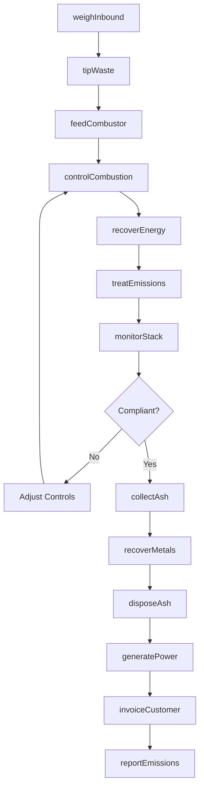
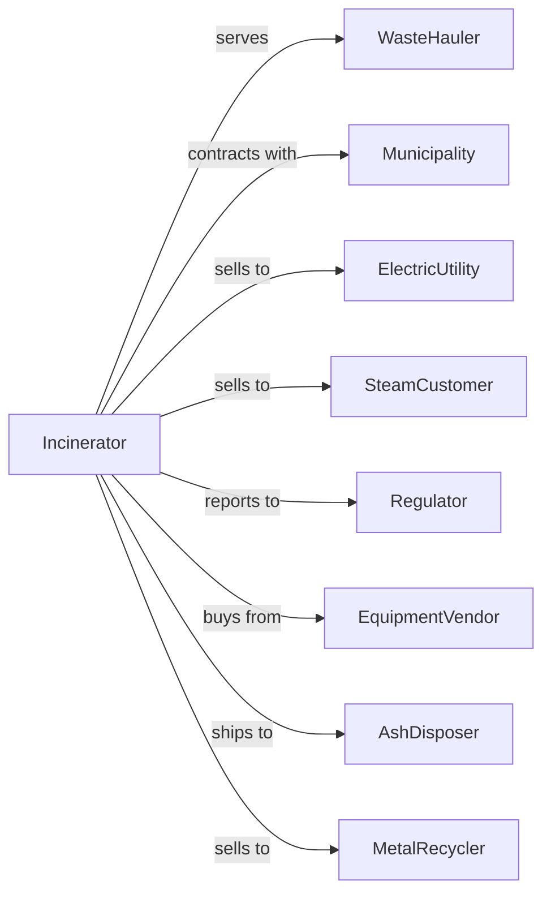

# Solid Waste Combustors and Incinerators

> Business-as-Code definition for waste-to-energy and incineration facility operations. Models the complete process from waste receipt through combustion, energy recovery, and ash disposal.

## Overview

Solid waste combustors and incinerators operate facilities that dispose of nonhazardous solid waste through controlled burning, often recovering energy as electricity or steam. This definition exposes actions for facility operations, events for process monitoring, and searches for throughput and emissions management.

## Actors

| Actor | Description |
|-------|-------------|
| WasteHauler | Transporter delivering waste to facility |
| Municipality | Government entity with disposal contract |
| ElectricUtility | Purchases generated electricity |
| SteamCustomer | Industrial user of recovered steam |
| Regulator | Environmental agency overseeing operations |
| EquipmentVendor | Provides combustion and pollution control equipment |
| AshDisposer | Landfill receiving combustion residues |
| MetalRecycler | Processes recovered ferrous materials |

## Roles

| Role | Description |
|------|-------------|
| PlantManager | Oversees overall facility operations |
| OperationsManager | Coordinates daily combustion activities |
| ControlRoomOperator | Monitors and adjusts combustion systems |
| ScaleOperator | Weighs incoming loads |
| MaintenanceTechnician | Services equipment and systems |
| EnvironmentalEngineer | Manages emissions and compliance |
| AshHandlingOperator | Manages combustion residues |
| QualityControlTech | Tests ash and emissions |
| BoilerOperator | Monitors steam generation from waste combustion heat recovery systems |

## Entities

| Entity | Description |
|--------|-------------|
| CombustionUnit | Furnace or boiler for waste burning |
| TippingFloor | Area where waste is received and processed |
| WeightTicket | Scale receipt documenting load |
| BoilerSystem | Heat recovery equipment |
| TurbineGenerator | Electricity production equipment |
| AirPollutionControl | Emissions treatment systems |
| Ash | Combustion residue requiring disposal |
| EmissionsData | Continuous monitoring readings |
| EnergyOutput | Electricity or steam produced |
| Permit | Air quality and operating authorization |
| MaintenanceRecord | Equipment service history |
| Invoice | Bill for disposal or energy services |

## Actions

| Action | Description |
|--------|-------------|
| weighInbound | Record weight of incoming load |
| tipWaste | Deposit waste on receiving floor |
| feedCombustor | Load waste into furnace system |
| controlCombustion | Adjust temperature and air flow |
| recoverEnergy | Generate electricity or steam from heat |
| treatEmissions | Process exhaust through pollution controls |
| monitorStack | Continuously measure emissions |
| collectAsh | Remove bottom and fly ash |
| disposeAsh | Transport residues to landfill |
| recoverMetals | Extract ferrous materials from ash |
| generatePower | Produce and export electricity |
| invoiceCustomer | Bill for disposal services |
| reportEmissions | Submit air quality data to regulators |
| maintainEquipment | Service combustion and control systems |

## Events

| Event | Description |
|-------|-------------|
| loadWeighed | Weight recorded at scale |
| wasteTipped | Material deposited on floor |
| combustionStarted | Furnace ignited |
| temperatureReached | Operating temperature achieved |
| energyGenerated | Power or steam produced |
| emissionsTreated | Exhaust processed |
| ashCollected | Residues removed |
| ashDisposed | Residues sent to landfill |
| metalsRecovered | Ferrous materials extracted |
| emissionsExceeded | Pollutant above permit limit |
| outageOccurred | Unplanned shutdown |
| maintenanceCompleted | Equipment service finished |
| complianceFiled | Regulatory report submitted |
| invoiceSent | Bill sent to customer |

## Searches

| Search | Description |
|--------|-------------|
| findTickets | List weight tickets by date or customer |
| getThroughput | View tons processed by period |
| getEnergyOutput | Retrieve electricity or steam production |
| getEmissionsData | View continuous monitoring readings |
| getAshVolumes | Retrieve ash generation data |
| checkEquipmentStatus | View combustion system health |
| getMaintenanceSchedule | List upcoming service needs |
| getComplianceHistory | Retrieve regulatory filings |

## Workflow



## Actor Relationships



## Usage

### Calling Actions

```typescript
import { incinerateSolidWaste } from '@headlessly/incinerate-solid-waste'

const facility = incinerateSolidWaste()

// Weigh incoming load
const ticket = await facility.weighInbound({
  haulerId: 'hauler-123',
  vehicleId: 'truck-456',
  grossWeight: 52000,
  tareWeight: 18000,
  wasteType: 'municipalSolidWaste'
})

// Tip waste on receiving floor
await facility.tipWaste({
  ticketId: ticket.id,
  tippingBay: 'bay-3',
  pitSection: 'north'
})

// Control combustion process
await facility.controlCombustion({
  unitId: 'combustor-1',
  targetTemperature: 1800,
  feedRate: 25,
  excessAir: 80
})
```

### Event-Driven Automation

```typescript
// Auto-adjust on emissions exceedance
facility.emissionsExceeded(async ({ unitId, pollutant, level, limit }) => {
  await facility.controlCombustion({
    unitId,
    adjustments: calculateCorrection(pollutant, level),
    reason: 'emissionsControl'
  })

  await logExceedance({
    unitId,
    pollutant,
    level,
    limit,
    correctiveAction: 'autoAdjusted'
  })
})

// Report daily energy production
facility.dailyCutoff(async ({ date }) => {
  const output = await facility.getEnergyOutput({ date })

  await facility.generatePower({
    date,
    mwhGenerated: output.totalMwh,
    steamProduced: output.steamLbs,
    exportedToGrid: output.mwhExported
  })

  await reportToUtility({
    date,
    output: output.mwhExported
  })
})
```

## Related

- [Solid Waste Landfill](./562212-SolidWasteLandfill.mdx)
- [Other Nonhazardous Waste Treatment and Disposal](./562219-OtherNonhazardousWasteTreatmentAndDisposal.mdx)
