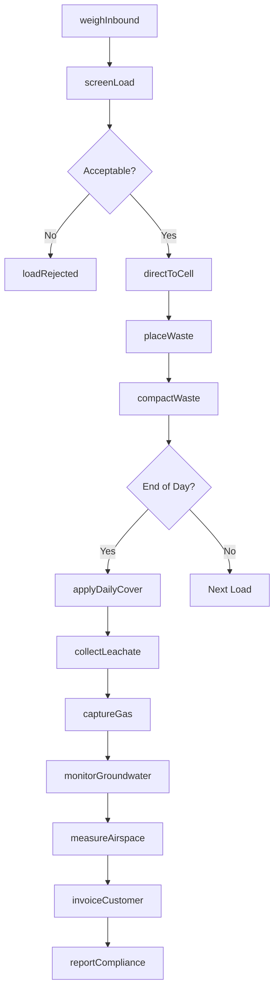
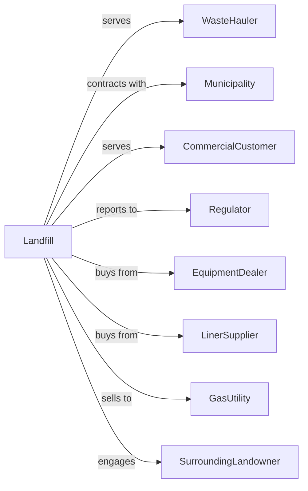

# Solid Waste Landfill

> Business-as-Code definition for solid waste landfill operations. Models the complete lifecycle from waste acceptance through placement, compaction, monitoring, and closure.

## Overview

Solid waste landfills receive and dispose of nonhazardous solid waste through engineered burial in lined cells with leachate and gas management systems. This definition exposes actions for daily operations, events for environmental tracking, and searches for capacity and compliance management.

## Actors

| Actor | Description |
|-------|-------------|
| WasteHauler | Transporter delivering waste to landfill |
| Municipality | Government entity with disposal contract |
| CommercialCustomer | Business bringing waste directly |
| Regulator | Environmental agency overseeing operations |
| EquipmentDealer | Provides heavy equipment and parts |
| LinerSupplier | Provides geomembrane and clay materials |
| GasUtility | Purchases captured methane for energy |
| SurroundingLandowner | Adjacent property owner |

## Roles

| Role | Description |
|------|-------------|
| LandfillManager | Oversees overall facility operations |
| OperationsManager | Coordinates daily disposal activities |
| ScaleOperator | Weighs incoming loads and processes tickets |
| EquipmentOperator | Operates dozers, compactors, and excavators |
| EnvironmentalTechnician | Monitors groundwater and gas systems |
| MaintenanceMechanic | Services heavy equipment |
| ComplianceOfficer | Manages regulatory filings and audits |
| SpotterWorker | Directs traffic and monitors tipping |
| LandfillGasEngineer | Manages methane extraction wells and gas-to-energy conversion systems |

## Entities

| Entity | Description |
|--------|-------------|
| DisposalCell | Lined area for waste placement |
| WeightTicket | Scale receipt documenting load |
| Liner | Engineered barrier preventing leachate escape |
| LeachateSystem | Collection and treatment infrastructure |
| GasSystem | Methane capture and flaring equipment |
| MonitoringWell | Groundwater sampling location |
| DailyCover | Material applied over waste each day |
| Permit | Regulatory authorization for operations |
| CapacityReport | Remaining airspace documentation |
| ClosurePlan | Post-closure care requirements |
| Invoice | Bill for disposal services |
| Load | Individual delivery of waste |

## Actions

| Action | Description |
|--------|-------------|
| weighInbound | Record weight of incoming load |
| screenLoad | Inspect for prohibited materials |
| directToCell | Route truck to active disposal area |
| placeWaste | Deposit load in designated location |
| compactWaste | Run compactor over deposited waste |
| applyDailyCover | Spread soil or alternative over waste |
| collectLeachate | Pump liquid from collection system |
| captureGas | Extract methane from waste mass |
| monitorGroundwater | Sample wells for contamination |
| measureAirspace | Calculate remaining capacity |
| invoiceCustomer | Bill for disposal services |
| reportCompliance | Submit regulatory filings |
| constructCell | Build new lined disposal area |
| closeCell | Cap and vegetate filled area |

## Events

| Event | Description |
|-------|-------------|
| loadWeighed | Weight recorded at scale |
| loadRejected | Prohibited material turned away |
| wasteCompacted | Compaction completed |
| dailyCoverApplied | Waste covered for day |
| leachateCollected | Liquid pumped from system |
| gasCaptured | Methane extracted |
| groundwaterSampled | Monitoring wells tested |
| exceedanceDetected | Contamination above limits |
| capacityMeasured | Airspace calculated |
| invoiceSent | Bill sent to customer |
| complianceFiled | Regulatory report submitted |
| cellConstructed | New disposal area ready |
| cellClosed | Filled area capped |
| dailyCutoffReached | End-of-day operations period has been reached for cover and reporting |
| permitRenewed | Operating authorization updated |

## Searches

| Search | Description |
|--------|-------------|
| findTickets | List weight tickets by date or customer |
| getCapacity | View remaining airspace by cell |
| getLeachateVolumes | Retrieve collection data |
| getGasProduction | View methane capture volumes |
| getMonitoringData | Retrieve groundwater results |
| findCustomers | List accounts by municipality or type |
| getComplianceHistory | Retrieve regulatory filings |
| checkEquipmentStatus | View machinery availability |

## Workflow



## Actor Relationships



## Usage

### Calling Actions

```typescript
import { landfillSolidWaste } from '@headlessly/landfill-solid-waste'

const landfill = landfillSolidWaste()

// Check today's tickets and remaining cell capacity
const todayTickets = await landfill.findTickets({ date: '2024-04-01' })
const cellCapacity = await landfill.getCapacity({ cellId: 'cell-7B' })

// Weigh incoming load
const ticket = await landfill.weighInbound({
  haulerId: 'hauler-123',
  vehicleId: 'truck-456',
  accountId: 'municipality-city',
  grossWeight: 48000,
  tareWeight: 18000
})

// Screen for prohibited materials
const screening = await landfill.screenLoad({
  ticketId: ticket.id,
  inspectedBy: 'spotter-001',
  hazmatFound: false,
  recyclablesFound: false
})

// Direct to active disposal cell
await landfill.directToCell({
  ticketId: ticket.id,
  cellId: 'cell-7B',
  gridLocation: 'N-42'
})
```

### Event-Driven Automation

```typescript
// Auto-apply cover at end of day
landfill.dailyCutoffReached(async ({ date, activeCell }) => {
  await landfill.applyDailyCover({
    cellId: activeCell,
    coverType: 'alternativeDailyCover',
    thickness: 6
  })

  await landfill.collectLeachate({
    cellId: activeCell,
    pumpDuration: 2
  })
})

// Alert on groundwater exceedance
landfill.exceedanceDetected(async ({ wellId, parameter, level, limit }) => {
  await notifyRegulator({
    agency: 'StateEPA',
    type: 'exceedance-notification',
    wellId,
    parameter,
    level
  })

  await landfill.monitorGroundwater({
    wellId,
    frequency: 'weekly',
    parameters: [parameter]
  })
})
```

## Related

- [Hazardous Waste Treatment and Disposal](./562211-HazardousWasteTreatmentAndDisposal.mdx)
- [Solid Waste Combustors and Incinerators](./562213-SolidWasteCombustorsAndIncinerators.mdx)
