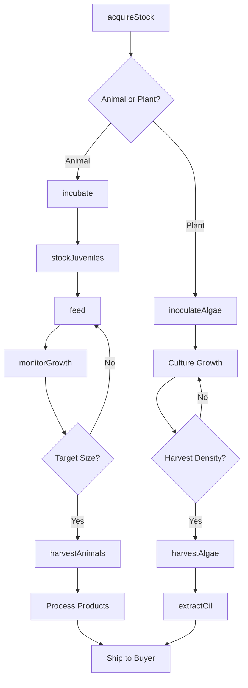
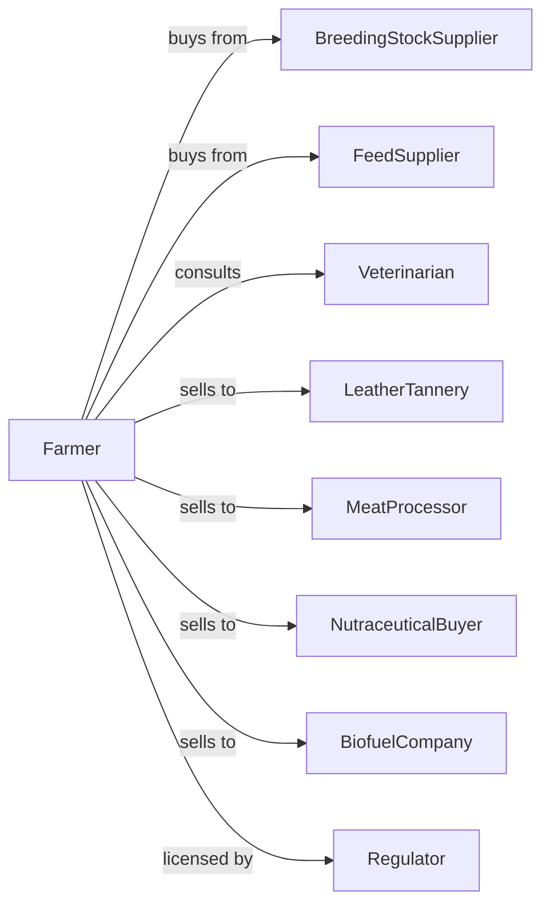

# Other Aquaculture

> Business-as-Code definition for specialty aquaculture operations. Models raising alligators, turtles, frogs, and aquatic plants including seaweed and algae for food, leather, and biofuel markets.

## Overview

Other aquaculture involves farm raising aquatic animals and plants beyond finfish and shellfish, including alligators for meat and leather, turtles for meat and shells, frogs for legs, and aquatic plants like seaweed and microalgae for food, supplements, and biofuels. This definition exposes actions for species-specific husbandry, product harvesting, and specialty market coordination with events for automation and searches for production analytics.

## Actors

| Actor | Description |
|-------|-------------|
| BreedingStockSupplier | Provides eggs, juveniles, or breeding animals |
| FeedSupplier | Provides species-specific feeds and supplements |
| Veterinarian | Provides exotic animal health services |
| LeatherTannery | Purchases alligator or other reptile skins |
| MeatProcessor | Purchases animals for specialty meat processing |
| NutraceuticalBuyer | Purchases algae and seaweed for supplements |
| BiofuelCompany | Purchases algae for fuel production |
| Regulator | Oversees exotic animal permits and CITES compliance |

## Roles

| Role | Description |
|------|-------------|
| FarmOwner | Owns operation and manages permits |
| AquacultureManager | Oversees daily operations and production |
| AnimalHandler | Specializes in safe handling of reptiles |
| HarvestTechnician | Manages humane harvest and processing |
| AlgaeCulturist | Manages photobioreactors and ponds |
| Bookkeeper | Manages permits, compliance, and finances |

## Entities

| Entity | Description |
|--------|-------------|
| Alligator | Crocodilian raised for meat and leather |
| Turtle | Chelonian raised for meat or shell products |
| Frog | Amphibian raised for legs or bait |
| Seaweed | Macroalgae raised for food or extracts |
| Microalgae | Single-celled organisms for supplements or fuel |
| Pond | Containment for animal grow-out |
| Photobioreactor | Controlled system for algae cultivation |
| Raceway | Flow-through system for aquatic plants |
| Permit | License required for exotic species |
| Skin | Hide from reptile harvest |

## Actions

| Action | Description |
|--------|-------------|
| acquireStock | Purchase eggs, juveniles, or breeding animals |
| incubate | Hatch eggs under controlled conditions |
| stockJuveniles | Place young animals in grow-out facilities |
| feed | Provide species-appropriate nutrition |
| monitorGrowth | Track size and development progress |
| inoculateAlgae | Start new algae cultures from starter |
| harvestAlgae | Collect mature algae from systems |
| harvestAnimals | Humanely process animals for products |
| tanHides | Prepare skins for leather market |
| extractOil | Process algae for oil or supplements |
| maintainPermits | Renew exotic animal licenses |
| exportProduct | Ship products under CITES documentation |

## Events

| Event | Description |
|-------|-------------|
| stockAcquired | New breeding stock or juveniles received |
| eggsHatched | Incubation completed successfully |
| juvenilesStocked | Young animals placed in grow-out |
| targetSizeReached | Animals at harvestable size |
| harvestComplete | Animals processed and products collected |
| algaeCultureReady | Algae at harvest density |
| algaeHarvested | Biomass collected from systems |
| productShipped | Finished goods dispatched to buyer |
| permitRenewed | Exotic animal license updated |
| healthIssueDetected | Disease or injury identified |

## Searches

| Search | Description |
|--------|-------------|
| getInventory | List animals by species, size, and location |
| trackGrowth | Get weight and length progression metrics |
| getAlgaeProduction | Retrieve biomass yields by system |
| findBuyers | List meat, leather, and specialty buyers |
| getPermitStatus | Check license expiration and requirements |
| getHealthRecords | Retrieve treatment and mortality history |
| getHarvestSchedule | View upcoming harvest dates |
| getCITESDocuments | Track export permit documentation |

## Workflow



## Actor Relationships



## Usage

### Calling Actions

```typescript
import { farmAquaticSpecies } from '@headlessly/farm-aquatic-species'

const farm = farmAquaticSpecies()

// Check permit and CITES status for regulated species
const permits = await farm.getPermitStatus({ species: 'american-alligator' })

// Review current inventory by species and system
const inventory = await farm.getInventory({ facility: 'gator-ranch-1' })

// Acquire alligator eggs for incubation
const eggs = await farm.acquireStock({
  species: 'american-alligator',
  type: 'eggs',
  quantity: 500,
  source: 'louisiana-gator-farms'
})

// Incubate eggs at temperature for sex determination
await farm.incubate({
  eggLotId: eggs.id,
  temperature: 32, // Celsius for male bias
  humidity: 95,
  incubatorId: 'incubator-1'
})

// Harvest algae for biofuel
const algaeHarvest = await farm.harvestAlgae({
  systemId: 'photobioreactor-4',
  species: 'chlorella',
  targetBiomass: 500 // kg dry weight
})

// Extract oil for biofuel buyer
await farm.extractOil({
  harvestId: algaeHarvest.id,
  method: 'solvent-extraction',
  buyerId: 'green-fuel-corp'
})
```

### Event-Driven Automation

```typescript
// Auto-schedule harvest when target size reached
farm.targetSizeReached(async ({ species, pondId, avgWeight, count }) => {
  const buyers = await farm.findBuyers({
    species,
    productType: species === 'alligator' ? 'leather' : 'meat'
  })

  if (buyers.length > 0) {
    await farm.harvestAnimals({
      pondId,
      count,
      processorId: buyers[0].id,
      harvestDate: addDays(new Date(), 7)
    })
  }
})

// Alert on permit expiration
farm.permitRenewed(async ({ permitId, expirationDate }) => {
  const daysRemaining = daysBetween(new Date(), expirationDate)

  if (daysRemaining <= 90) {
    await scheduleRenewal({
      permitId,
      alertDate: subtractDays(expirationDate, 60),
      message: 'Begin permit renewal process'
    })
  }
})
```

## Related

- [Finfish Farming and Fish Hatcheries](./112511-FinfishFarmingAndFishHatcheries.mdx)
- [Shellfish Farming](./112512-ShellfishFarming.mdx)
