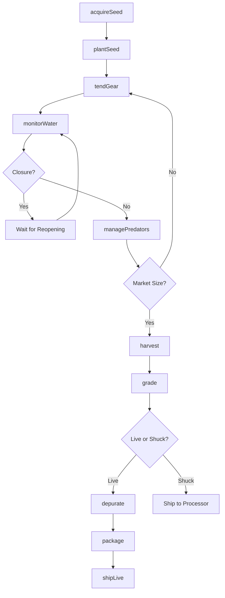
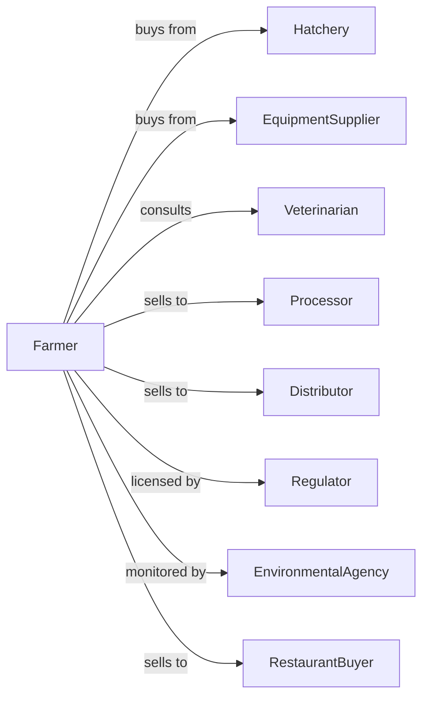

# Shellfish Farming

> Business-as-Code definition for shellfish aquaculture operations. Models the complete production cycle from seed acquisition through harvest including oyster, clam, mussel, and shrimp cultivation methods.

## Overview

Shellfish farming involves cultivating bivalves like oysters, clams, and mussels, as well as crustaceans like shrimp and crayfish in controlled marine or freshwater environments. Operations range from subtidal bottom culture to suspended systems and intensive pond culture. This definition exposes actions for seed management, growing system maintenance, and harvest coordination with events for automation and searches for production analytics.

## Actors

| Actor | Description |
|-------|-------------|
| Hatchery | Supplies seed, spat, or post-larvae |
| EquipmentSupplier | Provides cages, bags, lines, and gear |
| Veterinarian | Provides shellfish health and biosecurity services |
| Processor | Purchases and shucks or processes shellfish |
| Distributor | Purchases live shellfish for restaurant trade |
| Regulator | Oversees water quality, permits, and closures |
| EnvironmentalAgency | Monitors lease areas and ecosystem health |
| RestaurantBuyer | Purchases premium oysters and shellfish direct |

## Roles

| Role | Description |
|------|-------------|
| FarmOwner | Owns leases and makes strategic decisions |
| AquacultureManager | Oversees daily operations and production planning |
| GrowOutTechnician | Maintains cages, bags, and growing systems |
| HarvestCrew | Collects, grades, and prepares shellfish for sale |
| QualityController | Monitors water quality and shellfish health |
| Bookkeeper | Manages sales, permits, and compliance records |
| OysterTumbler | Sorts and tumbles oysters in cages to shape shells and improve cup depth |

## Entities

| Entity | Description |
|--------|-------------|
| Seed | Juvenile shellfish for planting (spat, post-larvae) |
| Oyster | Bivalve mollusk grown for half-shell or shucking |
| Clam | Bivalve mollusk grown in bottom or suspended culture |
| Mussel | Bivalve mollusk grown on ropes or longlines |
| Shrimp | Crustacean grown in ponds or raceways |
| Cage | Floating or bottom container for grow-out |
| Bag | Mesh container for oyster tumbling |
| Lease | Permitted water or bottom area for cultivation |
| WaterQuality | Salinity, temperature, and safety parameters |
| Harvest | Batch of shellfish collected for sale |

## Actions

| Action | Description |
|--------|-------------|
| acquireSeed | Purchase seed or spat from hatchery |
| plantSeed | Deploy seed in growing systems |
| tendGear | Maintain cages, bags, and lines |
| tumbleOysters | Agitate oysters to shape shells |
| monitorWater | Test salinity, temperature, and safety |
| managePredators | Control crabs, starfish, and other threats |
| harvest | Collect market-size shellfish |
| grade | Sort shellfish by size for different markets |
| depurate | Purify shellfish in clean water before sale |
| package | Prepare shellfish for transport and sale |
| shipLive | Transport live shellfish to buyers |
| maintainPermits | Renew leases and comply with regulations |

## Events

| Event | Description |
|-------|-------------|
| seedAcquired | Juvenile shellfish received from hatchery |
| seedPlanted | Seed deployed in growing systems |
| gearTended | Maintenance completed on cages or bags |
| waterQualityDegraded | Water quality parameters fell outside acceptable range |
| closureIssued | Harvest prohibited due to water quality |
| closureLifted | Harvest reopened after testing |
| marketSizeReached | Shellfish at harvestable size |
| harvestCompleted | Shellfish collected and brought to shore |
| shipmentDispatched | Live shellfish sent to buyer |
| permitRenewed | Lease or license updated |
| predatorDetected | Predator presence detected near farming area |

## Searches

| Search | Description |
|--------|-------------|
| getLeaseInventory | List shellfish counts by lease and size |
| trackGrowthRate | Get size progression and survival metrics |
| getWaterQualityLogs | Retrieve salinity and temperature readings |
| getClosureStatus | Check harvest area status |
| findBuyers | List processors and restaurant buyers |
| getHarvestHistory | Retrieve past harvest volumes and grades |
| getPermitStatus | Check lease and license expiration dates |
| getGearInventory | Track cages, bags, and equipment |

## Workflow



## Actor Relationships



## Usage

### Calling Actions

```typescript
import { farmShellfish } from '@headlessly/farm-shellfish'

const farm = farmShellfish()

// Check harvest area closure status
const closures = await farm.getClosureStatus({ area: 'chesapeake-bay' })

// Review lease inventory by size class
const leases = await farm.getLeaseInventory({ species: 'eastern-oyster' })

// Acquire oyster seed from hatchery
const seed = await farm.acquireSeed({
  species: 'eastern-oyster',
  quantity: 500000,
  size: 'spat',
  hatcheryId: 'chesapeake-shellfish'
})

// Plant seed in floating cages
await farm.plantSeed({
  seedLotId: seed.id,
  leaseId: 'lease-42',
  gearType: 'floating-cage',
  density: 250
})

// Harvest market-size oysters
const harvest = await farm.harvest({
  leaseId: 'lease-42',
  cageIds: ['cage-1', 'cage-2', 'cage-3'],
  estimatedCount: 10000
})

// Ship to restaurant buyer
await farm.shipLive({
  harvestId: harvest.id,
  buyerId: 'blue-fin-oyster-bar',
  grade: 'choice',
  count: 5000
})
```

### Event-Driven Automation

```typescript
// Alert on harvest closure
farm.closureIssued(async ({ leaseId, reason, estimatedDuration }) => {
  await notifyTeam({
    alert: 'harvestClosure',
    leaseId,
    reason,
    duration: estimatedDuration,
    message: 'Suspend all harvest activities'
  })

  // Cancel pending shipments
  const pendingOrders = await farm.findBuyers({ leaseId, status: 'scheduled' })
  for (const order of pendingOrders) {
    await notifyBuyer({
      buyerId: order.buyerId,
      message: 'Harvest delayed due to water quality closure'
    })
  }
})

// Auto-notify buyers when market size reached
farm.marketSizeReached(async ({ leaseId, species, avgSize, count }) => {
  const buyers = await farm.findBuyers({
    species,
    sizePreference: avgSize,
    minQuantity: count
  })

  for (const buyer of buyers) {
    await notifyBuyer({
      buyerId: buyer.id,
      availability: { species, size: avgSize, count, leaseId }
    })
  }
})
```

## Related

- [Finfish Farming and Fish Hatcheries](./112511-FinfishFarmingAndFishHatcheries.mdx)
- [Other Aquaculture](./112519-OtherAquaculture.mdx)
- [Shellfish Fishing](../../114-FishingHuntingAndTrapping/1141-Fishing/114112-ShellfishFishing.mdx)
