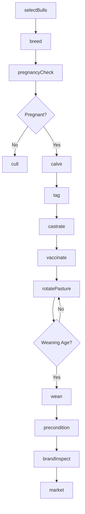
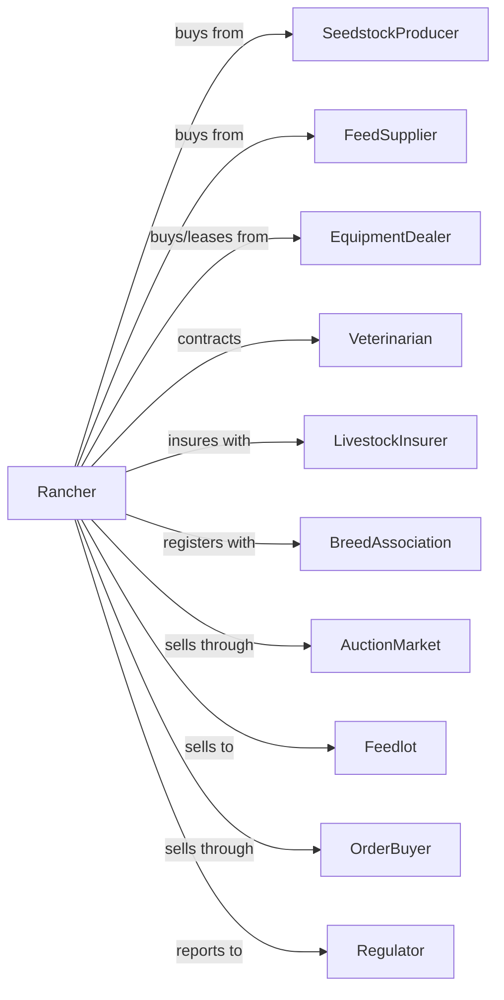

# Beef Cattle Ranching and Farming

> Business-as-Code definition for beef cattle production operations. Models cow-calf, stocker, and seedstock operations from breeding through sale.

## Overview

Beef cattle ranching involves the production of feeder calves, breeding stock, and finished cattle for meat markets. This definition exposes actions for herd management, breeding programs, calving operations, weaning and preconditioning, pasture rotation, and marketing through auctions, video sales, or direct contracts with feedlots.

## Actors

| Actor | Description |
|-------|-------------|
| SeedstockProducer | Provides registered breeding bulls and heifers |
| FeedSupplier | Provides hay, supplements, and minerals |
| EquipmentDealer | Sells and services livestock handling equipment |
| Veterinarian | Provides animal health services and vaccines |
| LivestockInsurer | Provides coverage for death and theft losses |
| AuctionMarket | Facilitates public sale of cattle |
| Feedlot | Purchases feeder cattle for finishing |
| OrderBuyer | Purchases cattle on behalf of feedlots |
| BreedAssociation | Registers purebred cattle and records |
| Regulator | Oversees animal health and brand inspection |

## Roles

| Role | Description |
|------|-------------|
| RanchOwner | Owns land and cattle, makes strategic decisions |
| RanchManager | Coordinates daily operations and herd management |
| Cowboy | Performs cattle handling, fence repair, and feeding |
| HerdManager | Tracks breeding, calving, and health records |
| Bookkeeper | Manages sales, purchases, and tax records |
| CalvingNightwatch | Patrols calving pastures during spring to assist difficult births |

## Entities

| Entity | Description |
|--------|-------------|
| Cow | Mature female for breeding and calf production |
| Bull | Mature male for breeding |
| Calf | Young animal before weaning |
| Heifer | Young female before first calf |
| Steer | Castrated male for meat production |
| Herd | Group of cattle managed together |
| Pasture | Grazing land unit |
| EPD | Expected progeny differences for genetic selection |
| BrandInspection | Legal proof of ownership for sale |
| Contract | Forward sale agreement with buyer |

## Actions

| Action | Description |
|--------|-------------|
| selectBulls | Choose breeding bulls based on EPDs and traits |
| breed | Expose cows to bulls or use artificial insemination |
| pregnancyCheck | Confirm pregnancy status via palpation or ultrasound |
| calve | Assist with birth and pair cow with calf |
| tag | Apply identification ear tags to calves |
| castrate | Convert bull calves to steers |
| vaccinate | Administer vaccines for common diseases |
| wean | Separate calves from cows |
| precondition | Prepare calves for sale with vaccinations and bunk training |
| rotatePasture | Move cattle to fresh grazing |
| supplementFeed | Provide hay or supplements during shortage |
| cull | Remove non-productive animals from herd |
| market | Sell cattle through auction or direct contract |
| brandInspect | Obtain legal documentation for sale |

## Events

| Event | Description |
|-------|-------------|
| bullsSelected | Breeding bulls chosen for season |
| bred | Cows exposed to breeding |
| pregnancyConfirmed | Pregnancy status determined |
| calved | Calf born and paired |
| tagged | Identification applied |
| castrated | Bull calves converted to steers |
| vaccinated | Vaccines administered |
| weaned | Calves separated from cows |
| preconditioned | Calves prepared for sale |
| pastureRotated | Cattle moved to new pasture |
| supplemented | Additional feed provided |
| culled | Animals removed from herd |
| marketed | Cattle sold |
| brandInspected | Ownership verified for sale |

## Searches

| Search | Description |
|--------|-------------|
| findHerd | List cattle by location, age, and status |
| getBreedingRecords | Retrieve breeding dates and bull assignments |
| getCalvingReport | View calving dates, weights, and performance |
| checkPasture | Get grazing capacity and rotation status |
| getPrice | Get current market prices by weight and grade |
| findBuyers | List feedlots, order buyers, and auction dates |
| getHealthRecords | Retrieve vaccination and treatment history |
| getEPDs | Check genetic merit of breeding stock |

## Workflow



## Actor Relationships



## Usage

### Calling Actions

```typescript
import { raiseBeefCattle } from '@headlessly/raise-beef-cattle'

const ranch = raiseBeefCattle()

// Check current feeder cattle market prices
const prices = await ranch.getPrice({ class: 'steers', weight: 550, grade: 'medium-large' })

// Check pasture capacity and rotation status
const pasture = await ranch.checkPasture({ herdId: 'spring-calving' })

// Select bulls for breeding season
const bulls = await ranch.selectBulls({
  breed: 'angus',
  minWeaning: 75,
  minYearling: 100,
  maxBirthWeight: 85,
  calfEase: 'direct'
})

// Breed cows during breeding season
await ranch.breed({
  herdId: 'spring-calving',
  bulls: bulls.map(b => b.id),
  method: 'natural',
  startDate: '2024-05-15',
  durationDays: 63
})

// Wean and precondition calves
await ranch.wean({
  herdId: 'spring-calving',
  method: 'fenceline',
  targetWeight: 550
})

await ranch.precondition({
  lotId: 'weaned-calves',
  program: 'vac-45',
  duration: 45
})
```

### Event-Driven Automation

```typescript
// Auto-record calf at birth
ranch.calved(async ({ cowId, calfId, birthWeight, sex }) => {
  await ranch.tag({
    calfId,
    motherId: cowId,
    birthWeight,
    sex,
    birthDate: new Date()
  })

  if (sex === 'bull') {
    await scheduleCastration({
      calfId,
      targetDate: addDays(new Date(), 60)
    })
  }
})

// Auto-market when preconditioned
ranch.preconditioned(async ({ lotId, headCount, avgWeight }) => {
  const { perCwt } = await ranch.getPrice({
    weight: avgWeight,
    grade: 'preconditioned'
  })

  if (perCwt >= 180) {
    await ranch.brandInspect({ lotId })
    await ranch.market({
      lotId,
      method: 'video-auction',
      headCount,
      avgWeight
    })
  }
})

// Auto-cull open cows
ranch.pregnancyConfirmed(async ({ cowId, status }) => {
  if (status === 'open') {
    await ranch.cull({
      animalId: cowId,
      reason: 'open',
      destination: 'market'
    })
  }
})
```

## Related

- [Cattle Feedlots](./112112-CattleFeedlots.mdx)
- [Dual-Purpose Cattle Ranching and Farming](./112130-DualPurposeCattleRanchingAndFarming.mdx)
