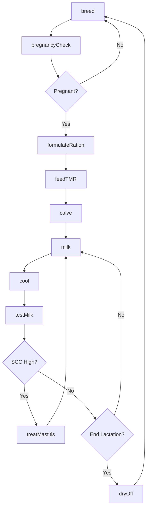
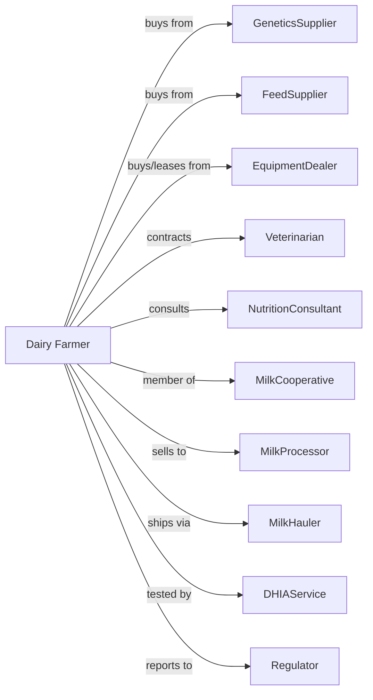

# Dairy Cattle and Milk Production

> Business-as-Code definition for dairy farming operations. Models the management of dairy herds from breeding through milking and milk marketing.

## Overview

Dairy farming involves the management of dairy cattle for milk production sold to processors and cooperatives. This definition exposes actions for reproductive management, milking operations, milk quality monitoring, herd health protocols, feed management, and marketing milk through cooperatives or direct contracts with processors.

## Actors

| Actor | Description |
|-------|-------------|
| GeneticsSupplier | Provides semen and embryos for breeding |
| FeedSupplier | Provides forages, concentrates, and supplements |
| EquipmentDealer | Sells and services milking and cooling systems |
| Veterinarian | Provides herd health and reproduction services |
| MilkCooperative | Markets milk and manages hauling |
| MilkProcessor | Purchases milk for processing into products |
| MilkHauler | Transports milk from farm to processor |
| NutritionConsultant | Formulates rations for production stages |
| DHIAService | Provides milk testing and records |
| Regulator | Oversees milk quality and food safety |

## Roles

| Role | Description |
|------|-------------|
| DairyOwner | Owns herd and makes strategic decisions |
| HerdManager | Coordinates breeding, health, and culling |
| MilkingManager | Oversees parlor operations and quality |
| FeedingManager | Manages ration mixing and delivery |
| CalfManager | Cares for young stock from birth to breeding |
| Bookkeeper | Manages milk checks, costs, and compliance |

## Entities

| Entity | Description |
|--------|-------------|
| Cow | Lactating female producing milk |
| Heifer | Young female being raised for milking herd |
| Calf | Young animal from birth to weaning |
| Herd | Group of dairy cattle managed together |
| Milk | Raw product harvested from cows |
| BulkTank | Refrigerated storage for raw milk |
| SCC | Somatic cell count indicating udder health |
| Components | Fat and protein percentages in milk |
| Lactation | Production period from calving to dry-off |
| MilkCheck | Payment received for milk sold |

## Actions

| Action | Description |
|--------|-------------|
| breed | Inseminate cows with selected genetics |
| pregnancyCheck | Confirm pregnancy via ultrasound or palpation |
| calve | Assist with birth and start calf on colostrum |
| milk | Extract milk in parlor or robotic system |
| cool | Chill milk in bulk tank for pickup |
| testMilk | Sample for SCC, components, and bacteria |
| dryOff | End lactation and prepare for next calving |
| treatMastitis | Address udder infections |
| vaccinate | Administer vaccines per protocol |
| formulateRation | Create feed mix for production group |
| feedTMR | Deliver total mixed ration to cows |
| cull | Remove low-producing or unhealthy cows |
| ship | Load milk for transport to processor |
| sell | Market milk through cooperative or contract |

## Events

| Event | Description |
|-------|-------------|
| bred | Cow inseminated |
| pregnancyConfirmed | Pregnancy status determined |
| calved | Calf born and cow entered lactation |
| milked | Milk harvested |
| cooled | Milk chilled in bulk tank |
| milkTested | Quality results available |
| driedOff | Lactation ended |
| mastitisDetected | Udder infection identified |
| mastitisTreated | Treatment administered |
| vaccinated | Vaccines given |
| rationFormulated | Feed mix created |
| tmrDelivered | Ration distributed |
| culled | Cow removed from herd |
| milkShipped | Milk loaded for transport |
| milkSold | Payment received |

## Searches

| Search | Description |
|--------|-------------|
| findCows | List cows by lactation, production, and status |
| getBreedingRecords | Retrieve breeding and conception rates |
| getMilkProduction | Check daily and lactation totals |
| getSCCHistory | View somatic cell count trends |
| getComponentTests | Retrieve fat and protein percentages |
| getMilkPrice | Get current Class I-IV prices |
| getHealthRecords | View treatment and vaccination history |
| getDHIAReport | Retrieve official production records |

## Workflow



## Actor Relationships



## Usage

### Calling Actions

```typescript
import { raiseDairyCattle } from '@headlessly/raise-dairy-cattle'

const dairy = raiseDairyCattle()

// Check current Class III milk price
const milkPrice = await dairy.getMilkPrice({ class: 'III' })

// Review herd SCC trends
const sccTrend = await dairy.getSCCHistory({ herdId: 'main-herd', months: 6 })

// Breed cow with selected sire
await dairy.breed({
  cowId: 'cow-2847',
  sire: 'stgen-delta-lambda',
  method: 'ai',
  technician: 'tech-001'
})

// Milk herd in parlor
const milking = await dairy.milk({
  parlor: 'double-12',
  shift: 'morning',
  expectedCows: 240
})

// Test bulk tank sample
await dairy.testMilk({
  tankId: 'bulk-tank-1',
  tests: ['scc', 'fat', 'protein', 'bacteria', 'antibiotic']
})
```

### Event-Driven Automation

```typescript
// Auto-schedule dry-off based on breeding
dairy.pregnancyConfirmed(async ({ cowId, daysPregnant, dueDate }) => {
  const dryOffDate = subtractDays(dueDate, 60)

  await scheduleDryOff({
    cowId,
    date: dryOffDate,
    protocol: 'blanket-dry-treat'
  })
})

// Auto-alert for high SCC
dairy.milkTested(async ({ tankId, scc, fat, protein }) => {
  if (scc > 200000) {
    await alertManager({
      type: 'scc-warning',
      tankId,
      scc,
      recommendation: 'Check fresh cows and recent clinical cases'
    })
  }
})

// Auto-cull low producers
dairy.milked(async ({ cowId, lactation, daysInMilk, production }) => {
  const expectedProduction = getExpectedCurve(lactation, daysInMilk)

  if (production < expectedProduction * 0.7 && daysInMilk > 100) {
    await dairy.cull({
      cowId,
      reason: 'low-production',
      destination: 'market'
    })
  }
})
```

## Related

- [Beef Cattle Ranching and Farming](./112111-BeefCattleRanchingAndFarming.mdx)
- [Dual-Purpose Cattle Ranching and Farming](./112130-DualPurposeCattleRanchingAndFarming.mdx)
