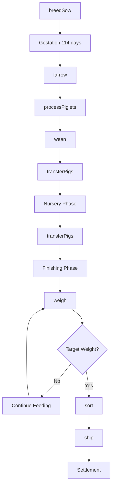
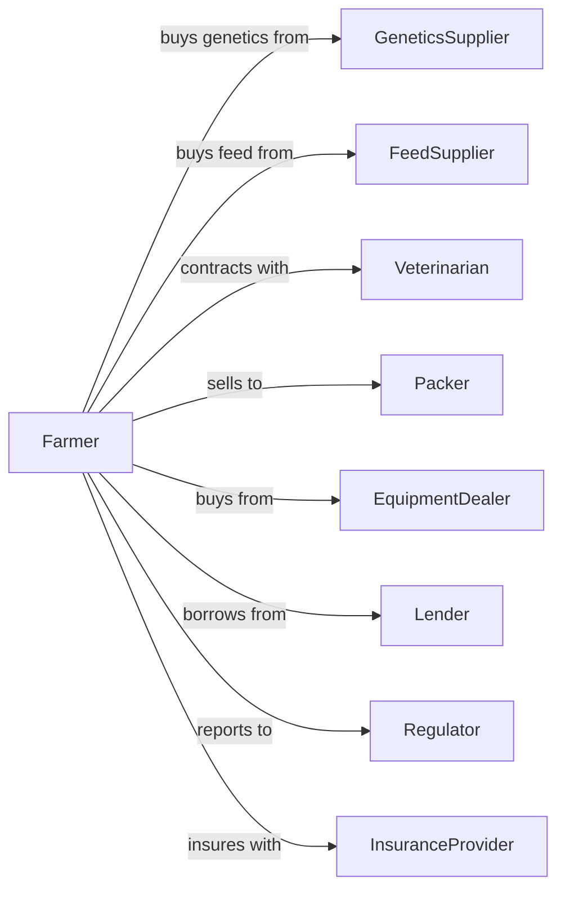

# Hog and Pig Farming

> Business-as-Code definition for swine production operations. Models the complete lifecycle from breeding through market delivery including farrowing, nursery, and finishing phases.

## Overview

Hog and pig farming involves raising swine for meat production through integrated operations that include breeding, farrowing, weaning, and finishing. Modern operations utilize advanced genetics, nutrition programs, and biosecurity protocols to maximize efficiency and animal welfare. This definition exposes actions for each production phase, events for workflow automation, and searches for herd management data retrieval.

## Actors

| Actor | Description |
|-------|-------------|
| GeneticsSupplier | Provides breeding stock, semen, and genetic consulting |
| FeedSupplier | Provides feed ingredients, complete rations, and supplements |
| Veterinarian | Provides health services, vaccinations, and disease management |
| Packer | Purchases market hogs for processing |
| EquipmentDealer | Sells and services confinement equipment and systems |
| Lender | Provides operating capital and facility financing |
| Regulator | Oversees environmental compliance and animal welfare |
| InsuranceProvider | Provides livestock mortality and business coverage |

## Roles

| Role | Description |
|------|-------------|
| FarmOwner | Owns the operation and makes strategic decisions |
| HerdManager | Oversees breeding and production operations |
| FarrowingTechnician | Manages sow breeding and piglet care |
| FinishingManager | Oversees grow-finish barns and market preparation |
| MaintenanceWorker | Maintains facilities, equipment, and ventilation systems |
| Bookkeeper | Manages financial records, contracts, and compliance reporting |
| LoadOutOperator | Sorts and loads market hogs onto trailers at target weight |

## Entities

| Entity | Description |
|--------|-------------|
| Sow | Female breeding pig in the herd |
| Boar | Male breeding pig or semen source |
| Piglet | Newborn pig from birth to weaning |
| FeederPig | Weaned pig ready for grow-finish phase |
| MarketHog | Finished pig ready for sale to packer |
| Barn | Confinement facility for housing pigs |
| Litter | Group of piglets born to one sow |
| Ration | Formulated feed for specific production stage |
| HealthProtocol | Vaccination and medication schedule |
| Contract | Agreement with packer for delivery terms |
| Manure | Waste product requiring management and disposal |

## Actions

| Action | Description |
|--------|-------------|
| breedSow | Artificially inseminate or naturally breed sow |
| farrow | Manage sow through birthing process |
| processPiglets | Perform initial care including iron shots and tail docking |
| wean | Separate piglets from sow at target age and weight |
| transferPigs | Move pigs between barns or production stages |
| formulate | Create or adjust feed rations for nutritional needs |
| vaccinate | Administer vaccines per health protocol |
| treat | Provide medical treatment for sick animals |
| weigh | Record pig weights for performance tracking |
| sort | Separate pigs by size or market readiness |
| ship | Load and transport market hogs to packer |
| cull | Remove underperforming animals from herd |

## Events

| Event | Description |
|-------|-------------|
| sowBred | Sow has been successfully inseminated |
| farrowed | Sow has given birth to litter |
| pigletsProcessed | Initial piglet care completed |
| pigsWeaned | Piglets separated from sow |
| pigsTransferred | Pigs moved to new facility or phase |
| vaccinated | Vaccination protocol completed for group |
| diseaseDetected | Health issue identified in herd |
| targetWeightReached | Pigs have reached market weight |
| shipmentScheduled | Delivery arranged with packer |
| hogsShipped | Market hogs loaded and transported |
| contractExecuted | Sale terms finalized with packer |
| regulatoryInspectionOccurred | Compliance inspection completed |

## Searches

| Search | Description |
|--------|-------------|
| findSows | List sows with filters for parity, status, or genetics |
| getBarnInventory | Get current pig counts and weights by barn |
| getBreedingSchedule | Retrieve upcoming breeding and farrowing dates |
| trackPerformance | Get production metrics like pigs weaned per sow |
| getHealthRecords | Retrieve vaccination and treatment history |
| findMarketReady | List pigs meeting weight and age criteria for sale |
| getContractStatus | Check delivery obligations and pricing |
| getManureRecords | Retrieve waste management and application records |

## Workflow



## Actor Relationships



## Usage

### Calling Actions

```typescript
import { raiseHogs } from '@headlessly/raise-hogs'

const farm = raiseHogs()

// Check barn inventory and weights across facilities
const inventory = await farm.getBarnInventory({ barns: ['finish-1', 'finish-2', 'nursery-3'] })

// Find market-ready hogs meeting packer specs
const marketReady = await farm.findMarketReady({ minWeight: 270, maxWeight: 290 })

// Breed sow with selected genetics
const breeding = await farm.breedSow({
  sowId: 'sow-2847',
  semenLot: 'duroc-elite-2024',
  technique: 'artificial',
  date: new Date()
})

// Wean piglets at target age
const weaning = await farm.wean({
  litterId: 'litter-4521',
  weanAge: 21,
  targetWeight: 15,
  destinationBarn: 'nursery-3'
})

// Ship market hogs to packer
await farm.ship({
  barnId: 'finish-2',
  headCount: 180,
  avgWeight: 280,
  packerId: 'smithfield-nc',
  contractId: 'contract-2024-q4'
})
```

### Event-Driven Automation

```typescript
// Auto-schedule shipping when target weight reached
farm.targetWeightReached(async ({ barnId, avgWeight, headCount }) => {
  const contract = await farm.getContractStatus({ active: true })

  if (contract.remainingHead >= headCount) {
    await farm.ship({
      barnId,
      headCount,
      avgWeight,
      packerId: contract.packerId,
      contractId: contract.id
    })
  }
})

// Alert on disease detection
farm.diseaseDetected(async ({ barnId, symptoms, affectedCount }) => {
  await farm.treat({
    barnId,
    protocol: diagnoseCondition(symptoms),
    isolate: affectedCount > 10
  })

  await notifyVeterinarian({
    urgency: affectedCount > 50 ? 'emergency' : 'routine',
    symptoms,
    barnId
  })
})
```

## Related

- [Support Activities for Animal Production](../../1152-SupportActivitiesForAnimalProduction/115210-SupportActivitiesForAnimalProduction.mdx)
- [Animal Slaughtering](../../../31-33-Manufacturing/311-FoodManufacturing/3116-AnimalSlaughteringAndProcessing/311611-AnimalExceptPoultrySlaughtering.mdx)
