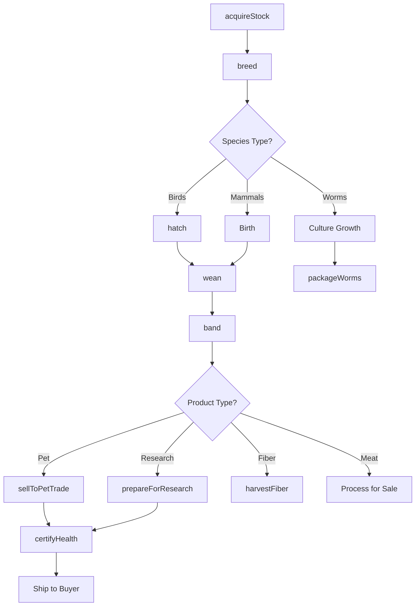
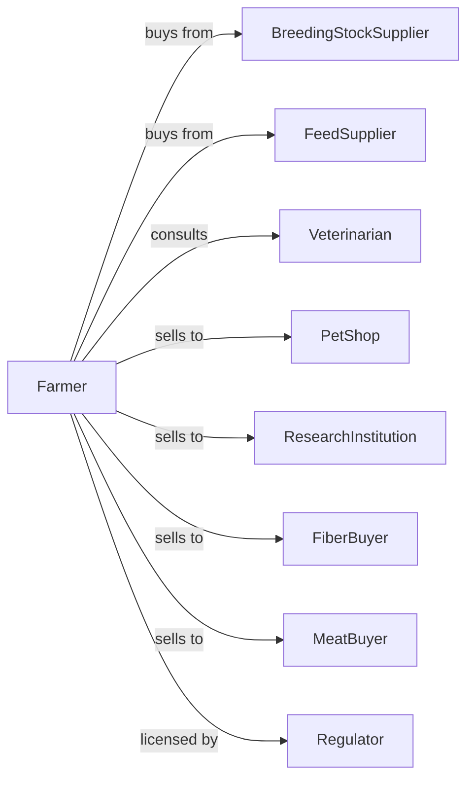

# All Other Animal Production

> Business-as-Code definition for specialty animal production operations. Models raising companion birds, laboratory animals, worms, and other niche species including multi-species diversified operations.

## Overview

All other animal production involves raising specialty animals not classified elsewhere, including companion birds (canaries, parakeets, parrots), laboratory animals (mice, rats, guinea pigs), earthworms, llamas, alpacas, bison, deer, elk, and diversified operations with no single species dominating. This definition exposes actions for species-specific husbandry, product sales, and niche market coordination with events for automation and searches for production analytics.

## Actors

| Actor | Description |
|-------|-------------|
| BreedingStockSupplier | Provides quality breeding animals |
| FeedSupplier | Provides species-specific feeds |
| Veterinarian | Provides exotic animal health services |
| PetShop | Purchases companion animals for retail |
| ResearchInstitution | Purchases laboratory animals |
| FiberBuyer | Purchases alpaca and llama fiber |
| MeatBuyer | Purchases specialty meat animals |
| Regulator | Oversees exotic animal permits and welfare |

## Roles

| Role | Description |
|------|-------------|
| FarmOwner | Owns operation and manages strategy |
| AnimalManager | Oversees species-specific programs |
| BirdBreeder | Specializes in companion bird production |
| LabAnimalTech | Maintains laboratory animal colonies |
| FiberHarvester | Shears fiber-producing animals |
| Bookkeeper | Manages permits, sales, and compliance |

## Entities

| Entity | Description |
|--------|-------------|
| CompanionBird | Parakeet, parrot, canary, or other pet bird |
| LabAnimal | Mouse, rat, guinea pig for research |
| Alpaca | South American camelid for fiber |
| Llama | Pack and guard animal |
| Bison | Large bovine for specialty meat |
| Elk | Cervid raised for meat or velvet |
| Earthworm | Invertebrate for bait or composting |
| Aviary | Enclosure for breeding birds |
| Vivarium | Facility for laboratory animals |
| Pasture | Grazing land for large animals |

## Actions

| Action | Description |
|--------|-------------|
| acquireStock | Purchase breeding animals or eggs |
| breed | Pair animals for reproduction |
| hatch | Incubate eggs for bird production |
| wean | Separate young from parents |
| band | Apply identification bands to birds |
| harvestFiber | Shear alpacas or llamas |
| harvestVelvet | Collect elk antler velvet |
| packageWorms | Prepare earthworms for bait sales |
| prepareForResearch | Condition lab animals for delivery |
| sellToPetTrade | Market companion animals |
| maintainPermits | Renew exotic animal licenses |
| certifyHealth | Obtain veterinary health certificates |

## Events

| Event | Description |
|-------|-------------|
| stockAcquired | New breeding animals received |
| eggsHatched | Bird eggs successfully hatched |
| youngWeaned | Animals separated from parents |
| birdsBanded | Identification applied |
| fiberHarvested | Shearing completed |
| velvetHarvested | Antlers processed |
| orderFulfilled | Customer shipment completed |
| permitRenewed | License updated |
| healthCertified | Vet certificate obtained |
| healthIssueDetected | Disease or condition identified |

## Searches

| Search | Description |
|--------|-------------|
| getInventory | List animals by species and status |
| trackBreedingRecords | Get reproduction metrics |
| getFiberProduction | Retrieve shearing yields |
| findBuyers | List buyers by species and market |
| getPermitStatus | Check license requirements |
| getHealthRecords | Retrieve treatment history |
| getPendingOrders | List unfulfilled customer orders |
| getProductionSchedule | View breeding and harvest calendar |

## Workflow



## Actor Relationships



## Usage

### Calling Actions

```typescript
import { raiseSpecialtyAnimals } from '@headlessly/raise-specialty-animals'

const farm = raiseSpecialtyAnimals()

// Check exotic animal permit status
const permits = await farm.getPermitStatus({ species: 'parakeet' })

// Review pending wholesale orders
const orders = await farm.getPendingOrders({ species: 'parakeet' })

// Set up breeding pairs for parakeets
await farm.breed({
  species: 'parakeet',
  pairs: 20,
  aviaryId: 'aviary-budgie-1',
  expectedClutches: 4
})

// Hatch and band young birds
const hatch = await farm.hatch({
  clutchId: 'clutch-2024-spring-5',
  incubatorId: 'incubator-2'
})

await farm.band({
  birdIds: hatch.chicks,
  bandType: 'closed',
  bandYear: 2024
})

// Harvest alpaca fiber
await farm.harvestFiber({
  herdId: 'alpaca-herd-1',
  shearer: 'professional-shearing-service',
  date: new Date('2024-05-15')
})

// Sell birds to pet distributor
await farm.sellToPetTrade({
  species: 'parakeet',
  quantity: 50,
  buyerId: 'national-pet-distributors',
  healthCert: true
})
```

### Event-Driven Automation

```typescript
// Auto-schedule health certification for orders
farm.orderFulfilled(async ({ orderId, species, quantity, buyerId }) => {
  const buyer = await farm.getBuyerRequirements({ buyerId })

  if (buyer.requiresHealthCert) {
    await farm.certifyHealth({
      orderId,
      species,
      quantity,
      vetId: 'county-vet-services',
      certDate: subtractDays(buyer.shipDate, 3)
    })
  }
})

// Alert on permit expiration
farm.permitRenewed(async ({ permitId, species, expirationDate }) => {
  const daysRemaining = daysBetween(new Date(), expirationDate)

  if (daysRemaining <= 60) {
    await notifyOwner({
      alert: 'permitExpiring',
      permitId,
      species,
      expirationDate,
      action: 'Begin renewal process'
    })
  }
})
```

## Related

- [Apiculture](./112910-Apiculture.mdx)
- [Horses and Other Equine Production](./112920-HorsesAndOtherEquineProduction.mdx)
- [Fur-Bearing Animal and Rabbit Production](./112930-FurBearingAnimalAndRabbitProduction.mdx)
