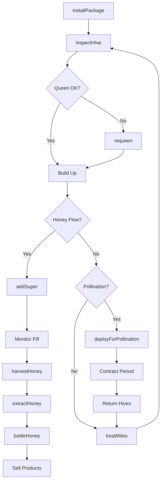
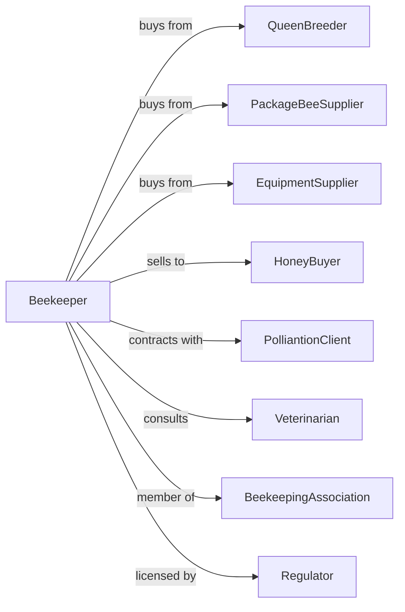

# Apiculture

> Business-as-Code definition for beekeeping operations. Models the complete apiary management cycle from hive establishment through honey harvest and pollination services including queen rearing and bee product sales.

## Overview

Apiculture involves raising honey bees for honey production, pollination services, and bee products including beeswax, propolis, royal jelly, and pollen. Operations manage seasonal colony cycles, honey flows, and migratory pollination contracts. This definition exposes actions for hive management, harvest protocols, and pollination scheduling with events for automation and searches for production analytics.

## Actors

| Actor | Description |
|-------|-------------|
| QueenBreeder | Supplies mated queens and queen cells |
| PackageBeeSupplier | Provides package bees for new colonies |
| EquipmentSupplier | Sells hives, frames, extractors, and gear |
| HoneyBuyer | Purchases bulk honey for packing or processing |
| PolliantionClient | Contracts colonies for crop pollination |
| Veterinarian | Provides bee health services and disease guidance |
| BeekeepingAssociation | Provides education and industry advocacy |
| Regulator | Oversees honey standards and bee movement permits |

## Roles

| Role | Description |
|------|-------------|
| Beekeeper | Owns and manages bee colonies |
| ApiaryManager | Oversees multiple apiary locations |
| QueenRearer | Specializes in raising and mating queens |
| ExtractingCrew | Operates honey extraction and bottling |
| TransportDriver | Moves hives for pollination contracts |
| Bookkeeper | Manages sales, contracts, and compliance |

## Entities

| Entity | Description |
|--------|-------------|
| Colony | Complete bee family with queen, workers, and drones |
| Queen | Egg-laying female leader of colony |
| Hive | Physical structure housing a colony |
| Super | Box added for honey storage |
| Frame | Removable structure holding comb |
| Honey | Primary product extracted from comb |
| Beeswax | Comb material harvested and processed |
| Propolis | Resinous substance collected by bees |
| Pollen | Protein source collected in traps |
| Apiary | Location where hives are kept |

## Actions

| Action | Description |
|--------|-------------|
| installPackage | Establish new colony from package bees |
| requeen | Replace queen in existing colony |
| inspectHive | Examine colony for health and queen status |
| addSuper | Place additional box for honey storage |
| harvestHoney | Remove and extract honey from supers |
| extractHoney | Spin frames and filter honey |
| bottleHoney | Package honey for retail or wholesale |
| collectPollen | Gather pollen from traps |
| renderWax | Process cappings and comb into beeswax |
| treatMites | Apply varroa mite treatment |
| moveHives | Transport colonies to new location |
| deployForPollination | Place hives in crop fields per contract |

## Events

| Event | Description |
|-------|-------------|
| packageInstalled | New colony established |
| requeened | New queen introduced to colony |
| hiveInspected | Colony examination completed |
| superAdded | Honey storage expanded |
| honeyHarvested | Supers removed for extraction |
| honeyExtracted | Frames processed and honey collected |
| honeyBottled | Product packaged for sale |
| hivesDeployed | Colonies placed for pollination |
| hivesReturned | Colonies retrieved after pollination |
| diseaseDetected | Colony health issue identified |
| swarmCaptured | Wild swarm added to operation |

## Searches

| Search | Description |
|--------|-------------|
| getHiveInventory | List colonies by location and strength |
| trackHoneyProduction | Get yields by apiary and season |
| getPollinationSchedule | View upcoming contract placements |
| findHoneyBuyers | List buyers and current pricing |
| getHealthRecords | Retrieve mite counts and treatment history |
| getQueenStatus | Check queen age and performance by hive |
| getWaxInventory | Track processed beeswax on hand |
| getContractStatus | Check pollination agreement terms |

## Workflow



## Actor Relationships



## Usage

### Calling Actions

```typescript
import { keepBees } from '@headlessly/keep-bees'

const apiary = keepBees()

// Check hive inventory and strength across yards
const hives = await apiary.getHiveInventory({ yard: 'home-yard' })

// View upcoming pollination contract schedule
const contracts = await apiary.getPollinationSchedule({ season: '2024' })

// Install new package colony
await apiary.installPackage({
  hiveId: 'hive-42',
  packageSource: 'georgia-bee-company',
  queenMarked: true,
  installDate: new Date()
})

// Harvest honey during main flow
const harvest = await apiary.harvestHoney({
  apiaryId: 'home-yard',
  hiveIds: ['hive-1', 'hive-2', 'hive-3'],
  supersPerHive: 2
})

// Extract and bottle honey
await apiary.extractHoney({ harvestId: harvest.id })
await apiary.bottleHoney({
  batchId: harvest.id,
  containerSizes: ['1lb', '2lb', '5lb'],
  label: 'wildflower-2024'
})

// Deploy for almond pollination
await apiary.deployForPollination({
  contractId: 'almond-2024-ca',
  hiveCount: 200,
  location: 'central-valley-orchard-5',
  deployDate: new Date('2024-02-01')
})
```

### Event-Driven Automation

```typescript
// Schedule treatment after pollination return
apiary.hivesReturned(async ({ contractId, hiveIds, returnDate }) => {
  await apiary.treatMites({
    hiveIds,
    treatment: 'oxalic-acid',
    scheduledDate: addDays(returnDate, 3)
  })
})

// Alert on disease detection
apiary.diseaseDetected(async ({ hiveId, condition, severity }) => {
  if (severity === 'high') {
    await notifyBeekeeper({
      urgency: 'immediate',
      hiveId,
      condition,
      recommendation: getTreatmentProtocol(condition)
    })

    // Quarantine affected hive
    await apiary.quarantineHive({
      hiveId,
      reason: condition
    })
  }
})
```

## Related

- [Horses and Other Equine Production](./112920-HorsesAndOtherEquineProduction.mdx)
- [Support Activities for Crop Production](../../115-SupportActivitiesForAgricultureAndForestry/1151-SupportActivitiesForCropProduction/115112-SoilPreparationPlantingAndCultivating.mdx)
