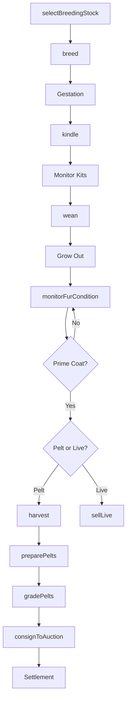
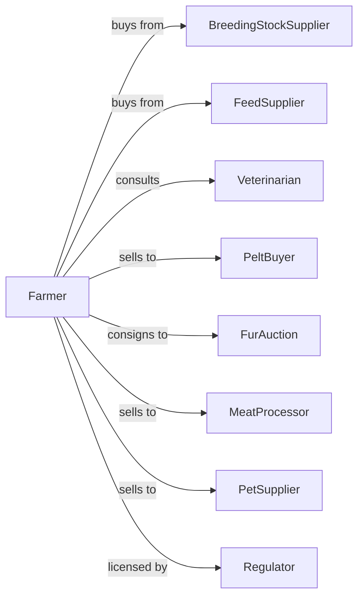

# Fur-Bearing Animal and Rabbit Production

> Business-as-Code definition for fur-bearing animal and rabbit farming operations. Models the complete production cycle from breeding through pelt harvest or live sales including mink, chinchilla, and rabbit husbandry.

## Overview

Fur-bearing animal and rabbit production involves raising mink, chinchilla, fox, rabbit, and other fur-bearing animals for pelt production, meat, fiber, or breeding stock sales. Operations manage seasonal breeding cycles, pelt quality optimization, and humane harvesting practices. This definition exposes actions for colony management, pelt processing, and market coordination with events for automation and searches for production analytics.

## Actors

| Actor | Description |
|-------|-------------|
| BreedingStockSupplier | Provides quality breeding animals |
| FeedSupplier | Provides species-specific feeds and supplements |
| Veterinarian | Provides animal health services |
| PeltBuyer | Purchases raw pelts for processing |
| FurAuction | Conducts international fur sales |
| MeatProcessor | Purchases rabbits for meat processing |
| PetSupplier | Purchases rabbits for pet trade |
| Regulator | Oversees animal welfare and fur labeling |

## Roles

| Role | Description |
|------|-------------|
| FarmOwner | Owns operation and manages strategy |
| ColonyManager | Oversees breeding and production |
| AnimalCareTech | Provides daily feeding and care |
| PeltingTechnician | Performs humane harvest and pelt processing |
| GradingSpecialist | Evaluates pelt quality and color |
| Bookkeeper | Manages sales and compliance records |

## Entities

| Entity | Description |
|--------|-------------|
| Mink | Primary fur-bearing animal for pelts |
| Chinchilla | Luxury fur animal with dense coat |
| Fox | Fur animal raised for long-haired pelts |
| Rabbit | Multi-purpose animal for fur, meat, and pets |
| Doe | Female breeding animal |
| Buck | Male breeding animal |
| Kit | Young animal before weaning |
| Pelt | Processed animal skin with fur |
| Cage | Housing unit for individual animals |
| Colony | Group of animals managed together |

## Actions

| Action | Description |
|--------|-------------|
| selectBreedingStock | Choose animals for genetic improvement |
| breed | Pair animals for reproduction |
| kindle | Assist does through birthing |
| wean | Separate young from mothers |
| grade | Evaluate animals for pelt quality |
| feed | Provide species-appropriate nutrition |
| monitorFurCondition | Assess coat quality and development |
| harvest | Humanely process animals for pelts |
| preparePelts | Flesh, stretch, and dry pelts |
| gradePelts | Sort pelts by size, color, and quality |
| consignToAuction | Submit pelts for fur auction sale |
| sellLive | Market live animals for pets or breeding |

## Events

| Event | Description |
|-------|-------------|
| breedingCompleted | Seasonal breeding finished |
| kindled | Does have given birth |
| kitsWeaned | Young separated from mothers |
| primingCompleted | Fur coat at peak condition |
| harvestCompleted | Animals processed |
| peltsGraded | Quality assessment finished |
| peltsConsigned | Pelts submitted to auction |
| auctionResultsReceived | Sale prices confirmed |
| healthIssueDetected | Disease or condition identified |
| regulatoryInspectionOccurred | Compliance audit completed |

## Searches

| Search | Description |
|--------|-------------|
| getColonyInventory | List animals by species, age, and quality |
| trackBreedingRecords | Get reproduction metrics by strain |
| getPeltProduction | Retrieve harvest volumes and grades |
| getAuctionHistory | View past sale prices and results |
| findBuyers | List pelt and live animal buyers |
| getHealthRecords | Retrieve treatment and mortality data |
| getGeneticRecords | Track lineage and quality traits |
| getFeedInventory | Check feed supplies on hand |

## Workflow



## Actor Relationships



## Usage

### Calling Actions

```typescript
import { raiseFurAnimals } from '@headlessly/raise-fur-animals'

const farm = raiseFurAnimals()

// Review recent auction results and pricing trends
const auctions = await farm.getAuctionHistory({ colorPhase: 'black', seasons: 3 })

// Check colony inventory by species and age class
const colonies = await farm.getColonyInventory({ species: 'mink' })

// Select breeding stock for quality improvement
const selection = await farm.selectBreedingStock({
  species: 'mink',
  criteria: {
    colorPhase: 'black',
    furDensity: 'premium',
    size: 'large'
  },
  quantity: 50
})

// Breed selected animals
await farm.breed({
  breedingGroupId: 'mink-black-2024',
  does: selection.doesSelected,
  bucks: selection.bucksSelected,
  startDate: new Date('2024-03-01')
})

// Harvest animals at prime
await farm.harvest({
  colonyId: 'mink-black-2024',
  targetCount: 500,
  harvestDate: new Date('2024-12-01'),
  method: 'carbon-dioxide'
})

// Consign pelts to auction
await farm.consignToAuction({
  auctionId: 'kopenhagen-fur-2025-feb',
  pelts: 500,
  colorPhase: 'black',
  grade: 'saga-royal'
})
```

### Event-Driven Automation

```typescript
// Schedule harvest when prime condition reached
farm.primingCompleted(async ({ colonyId, species, avgFurScore }) => {
  if (avgFurScore >= 8.5) {
    const nextAuction = await farm.findAuction({
      species,
      dateRange: { start: addDays(new Date(), 30), end: addDays(new Date(), 90) }
    })

    await farm.harvest({
      colonyId,
      targetDate: subtractDays(nextAuction.deadline, 14),
      auctionTarget: nextAuction.id
    })
  }
})

// Alert on health issues
farm.healthIssueDetected(async ({ animalId, condition, severity }) => {
  await notifyVeterinarian({
    urgency: severity === 'high' ? 'emergency' : 'routine',
    animalId,
    condition
  })

  if (severity === 'high') {
    await farm.quarantine({
      animalId,
      reason: condition
    })
  }
})
```

## Related

- [Horses and Other Equine Production](./112920-HorsesAndOtherEquineProduction.mdx)
- [All Other Animal Production](./112990-AllOtherAnimalProduction.mdx)
