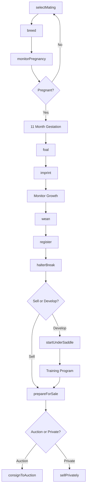
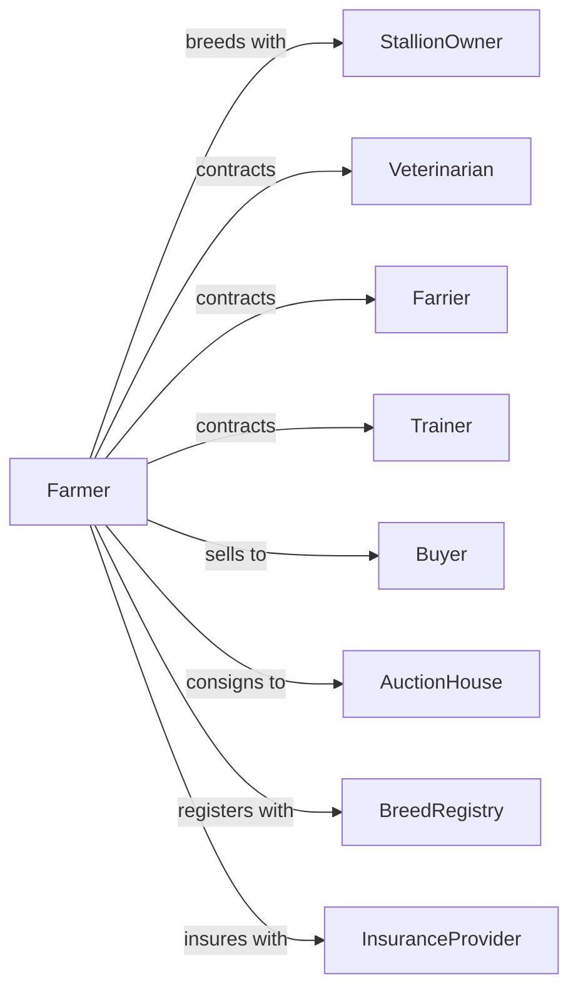

# Horses and Other Equine Production

> Business-as-Code definition for equine breeding and production operations. Models the complete lifecycle from breeding through training and sale including mare management, foaling, and performance horse development.

## Overview

Horse and equine production involves breeding, raising, and developing horses, mules, donkeys, and other equines for racing, showing, recreation, work, and breeding stock sales. Operations manage breeding programs, foaling seasons, training regimens, and marketing strategies. This definition exposes actions for herd management, training protocols, and sales coordination with events for automation and searches for production analytics.

## Actors

| Actor | Description |
|-------|-------------|
| StallionOwner | Provides breeding services from proven sires |
| Veterinarian | Provides reproductive and health services |
| Farrier | Provides hoof care and shoeing services |
| Trainer | Develops horses for specific disciplines |
| Buyer | Purchases horses for racing, showing, or recreation |
| AuctionHouse | Conducts public sales of horses |
| BreedRegistry | Maintains pedigree records and breed standards |
| InsuranceProvider | Provides mortality and loss of use coverage |

## Roles

| Role | Description |
|------|-------------|
| FarmOwner | Owns breeding operation and sets strategy |
| BreedingManager | Oversees mare and stallion programs |
| FoalingAttendant | Monitors mares and assists with births |
| GrOOm | Provides daily care and handling |
| RidingTrainer | Develops young horses under saddle |
| SalesManager | Markets and sells horses |
| ExerciseRider | Conditions and evaluates young horses under saddle daily |

## Entities

| Entity | Description |
|--------|-------------|
| Mare | Female horse used for breeding |
| Stallion | Male horse standing at stud |
| Foal | Young horse from birth to weaning |
| Weanling | Foal separated from mare |
| Yearling | Horse between one and two years old |
| Broodmare | Mare maintained for breeding purposes |
| Stud | Breeding operation or individual stallion |
| Pedigree | Documented ancestry and lineage |
| Pasture | Grazing land for horses |
| Barn | Housing facility for horses |

## Actions

| Action | Description |
|--------|-------------|
| selectMating | Choose stallion for mare based on pedigree |
| breed | Perform live cover or artificial insemination |
| monitorPregnancy | Track gestation progress and mare health |
| foal | Assist mare through delivery |
| imprint | Handle newborn foal for early socialization |
| wean | Separate foal from mare |
| register | Submit foal to breed registry |
| halterBreak | Train young horse to lead and handle |
| startUnderSaddle | Begin riding training |
| prepareForSale | Condition and present horse for buyers |
| consignToAuction | Enter horse in public sale |
| sellPrivately | Complete direct sale to buyer |

## Events

| Event | Description |
|-------|-------------|
| maresBred | Breeding season completed |
| pregnancyConfirmed | Mare pregnancy verified |
| foaled | Mare delivered foal |
| foalImprinted | Early handling completed |
| weanlingsSeparated | Foals weaned from mares |
| foalRegistered | Breed registration received |
| trainingStarted | Horse entered training program |
| horseConsigned | Horse listed for auction |
| horseSold | Sale transaction completed |
| vetCheckPassed | Pre-sale examination cleared |
| injuryReported | Horse health issue identified |

## Searches

| Search | Description |
|--------|-------------|
| getHerdInventory | List horses by age, sex, and status |
| trackPedigrees | Retrieve lineage and ancestry |
| getBreedingSchedule | View upcoming breeding dates |
| findStallions | List available stallions and fees |
| getSalesHistory | Retrieve past sale prices and results |
| getHealthRecords | Retrieve veterinary and farrier history |
| findBuyers | List potential buyers by discipline |
| getTrainingProgress | Track development milestones |

## Workflow



## Actor Relationships



## Usage

### Calling Actions

```typescript
import { raiseHorses } from '@headlessly/raise-horses'

const farm = raiseHorses()

// Search available stallions by discipline and bloodline
const stallions = await farm.findStallions({ discipline: 'dressage', registry: 'hanoverian' })

// Check upcoming breeding schedule
const schedule = await farm.getBreedingSchedule({ season: '2024' })

// Select mating for mare
const mating = await farm.selectMating({
  mareId: 'mare-silverbelle',
  criteria: {
    discipline: 'dressage',
    bloodlines: ['hanoverian', 'trakehner'],
    minRating: 'premium'
  }
})

// Breed mare with selected stallion
await farm.breed({
  mareId: 'mare-silverbelle',
  stallionId: mating.recommendedStallion.id,
  method: 'artificial-insemination',
  date: new Date()
})

// Register foal with breed association
await farm.register({
  foalId: 'foal-2024-spring-1',
  registry: 'american-hanoverian-society',
  sireId: mating.recommendedStallion.id,
  damId: 'mare-silverbelle'
})

// Consign yearling to select sale
await farm.consignToAuction({
  horseId: 'yearling-2023-fall-2',
  auctionId: 'keeneland-september-2024',
  reservePrice: 25000
})
```

### Event-Driven Automation

```typescript
// Schedule vet check before sale
farm.horseConsigned(async ({ horseId, auctionId, saleDate }) => {
  await farm.scheduleVetExam({
    horseId,
    examType: 'pre-sale',
    date: subtractDays(saleDate, 14)
  })
})

// Alert on foaling
farm.foaled(async ({ mareId, foalId, foalSex, complications }) => {
  await notifyBreedingManager({
    event: 'foalBorn',
    mareId,
    foalId,
    sex: foalSex,
    complications,
    urgency: complications ? 'immediate' : 'routine'
  })

  // Schedule imprinting session
  await farm.scheduleImprinting({
    foalId,
    sessionTime: addHours(new Date(), 2)
  })
})
```

## Related

- [Apiculture](./112910-Apiculture.mdx)
- [Support Activities for Animal Production](../../115-SupportActivitiesForAgricultureAndForestry/1152-SupportActivitiesForAnimalProduction/115210-SupportActivitiesForAnimalProduction.mdx)
