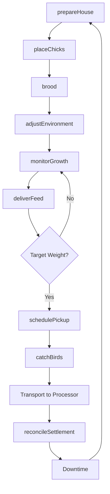
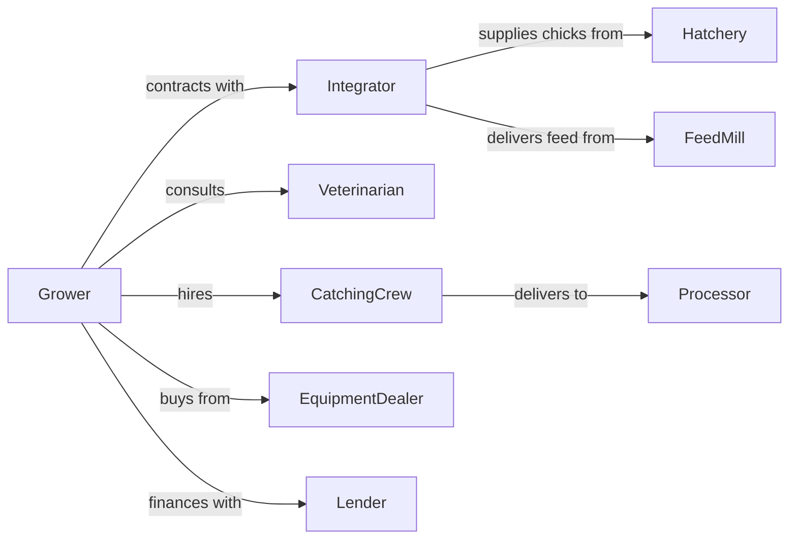

# Broilers and Other Meat Type Chicken Production

> Business-as-Code definition for meat chicken production operations. Models the complete grow-out cycle from chick placement through processing delivery including feed management and live haul coordination.

## Overview

Broiler production involves raising chickens specifically for meat through intensive grow-out operations. Contract growers receive day-old chicks from integrators and raise them to market weight in 6-8 weeks. Operations focus on feed conversion, bird welfare, and biosecurity to achieve target weights and quality grades. This definition exposes actions for flock management, events for production automation, and searches for performance tracking.

## Actors

| Actor | Description |
|-------|-------------|
| Integrator | Provides chicks, feed, and technical support under contract |
| Hatchery | Supplies day-old chicks to integrator or grower |
| FeedMill | Manufactures and delivers feed rations |
| Veterinarian | Provides flock health services and medication |
| CatchingCrew | Catches and loads birds for processing |
| Processor | Slaughters and processes market-weight birds |
| EquipmentDealer | Sells and services poultry housing equipment |
| Lender | Provides financing for house construction and upgrades |

## Roles

| Role | Description |
|------|-------------|
| GrowOutOperator | Contract grower responsible for daily bird care |
| FarmManager | Oversees multiple houses and production scheduling |
| ServiceTech | Maintains ventilation, heating, and feeding systems |
| FlockSupervisor | Integrator representative monitoring grower performance |
| CatchCaptain | Leads catching crew during live haul |
| Bookkeeper | Manages settlement statements and farm finances |

## Entities

| Entity | Description |
|--------|-------------|
| Chick | Day-old bird placed for grow-out |
| Broiler | Market-weight chicken ready for processing |
| Flock | Group of birds placed and raised together |
| House | Climate-controlled building for raising broilers |
| Feed | Formulated ration for specific growth phase |
| Litter | Bedding material on house floor |
| Drinker | Water delivery system for birds |
| Feeder | Feed delivery system for birds |
| Settlement | Payment calculation based on performance |
| Contract | Agreement between grower and integrator |

## Actions

| Action | Description |
|--------|-------------|
| prepareHouse | Clean, disinfect, and set up house for new flock |
| placeChicks | Receive and distribute day-old chicks in house |
| brood | Provide heat and care during first weeks of life |
| adjustEnvironment | Modify temperature, ventilation, and lighting |
| deliverFeed | Receive and store feed from mill |
| monitorGrowth | Weigh birds and track feed conversion |
| vaccinate | Administer vaccines via water or spray |
| treat | Apply medication for health issues |
| schedulePickup | Coordinate catching and transport to processor |
| catchBirds | Load market-weight birds onto trucks |
| reconcileSettlement | Review and approve payment from integrator |
| cullMortality | Remove and dispose of dead birds |

## Events

| Event | Description |
|-------|-------------|
| housePrepped | Facility ready for chick placement |
| chicksPlaced | Day-old chicks delivered and distributed |
| broodingComplete | Birds transitioned from heat lamps |
| feedDelivered | New feed load received at farm |
| targetWeightReached | Flock at market weight |
| pickupScheduled | Catching date confirmed with processor |
| birdsCaught | Flock loaded for transport |
| flockSettled | Payment processed for completed flock |
| mortalityAlert | Death rate exceeds threshold |
| condemnationAlert | Processing rejects exceed threshold |
| houseVacant | Flock removed and downtime begins |

## Searches

| Search | Description |
|--------|-------------|
| getFlockStatus | Retrieve current bird count, age, and weight |
| trackFeedConversion | Get feed efficiency metrics |
| getMortalityRate | Calculate death rate by cause |
| getSettlementHistory | Retrieve past flock payments and rankings |
| findUpcomingPlacements | List scheduled chick deliveries |
| getEnvironmentLogs | Retrieve temperature and ventilation history |
| comparePerformance | Benchmark against other growers |

## Workflow



## Actor Relationships



## Usage

### Calling Actions

```typescript
import { raiseBroilers } from '@headlessly/raise-broilers'

const farm = raiseBroilers()

// Check upcoming chick placement schedule
const placements = await farm.findUpcomingPlacements({ houseId: 'house-4' })

// Review past settlement history for benchmarking
const settlements = await farm.getSettlementHistory({ flocks: 5 })

// Prepare house for new flock
await farm.prepareHouse({
  houseId: 'house-4',
  litterType: 'pine-shavings',
  litterDepth: 4,
  preheatTemp: 92
})

// Place day-old chicks
const placement = await farm.placeChicks({
  houseId: 'house-4',
  count: 25000,
  strain: 'cobb-500',
  hatchDate: new Date()
})

// Monitor growth and adjust environment
const weights = await farm.monitorGrowth({
  houseId: 'house-4',
  sampleSize: 100
})

await farm.adjustEnvironment({
  houseId: 'house-4',
  targetTemp: calculateTemp(weights.avgWeight),
  ventilation: 'tunnel'
})
```

### Event-Driven Automation

```typescript
// Auto-schedule pickup when target weight reached
farm.targetWeightReached(async ({ houseId, avgWeight, birdCount }) => {
  const processor = await farm.getContractProcessor()

  await farm.schedulePickup({
    houseId,
    estimatedHead: birdCount,
    avgWeight,
    processorId: processor.id,
    preferredDate: addDays(new Date(), 2)
  })
})

// Alert on mortality spike
farm.mortalityAlert(async ({ houseId, dailyRate, cause }) => {
  if (dailyRate > 0.5) {
    await notifyVeterinarian({
      urgency: 'emergency',
      houseId,
      mortalityRate: dailyRate,
      suspectedCause: cause
    })

    await farm.treat({
      houseId,
      protocol: emergencyProtocol(cause)
    })
  }
})
```

## Related

- [Chicken Egg Production](./112310-ChickenEggProduction.mdx)
- [Poultry Hatcheries](./112340-PoultryHatcheries.mdx)
- [Poultry Processing](../../../31-33-Manufacturing/311-FoodManufacturing/3116-AnimalSlaughteringAndProcessing/311615-PoultryProcessing.mdx)
