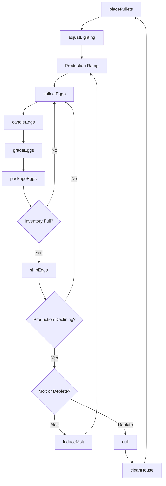
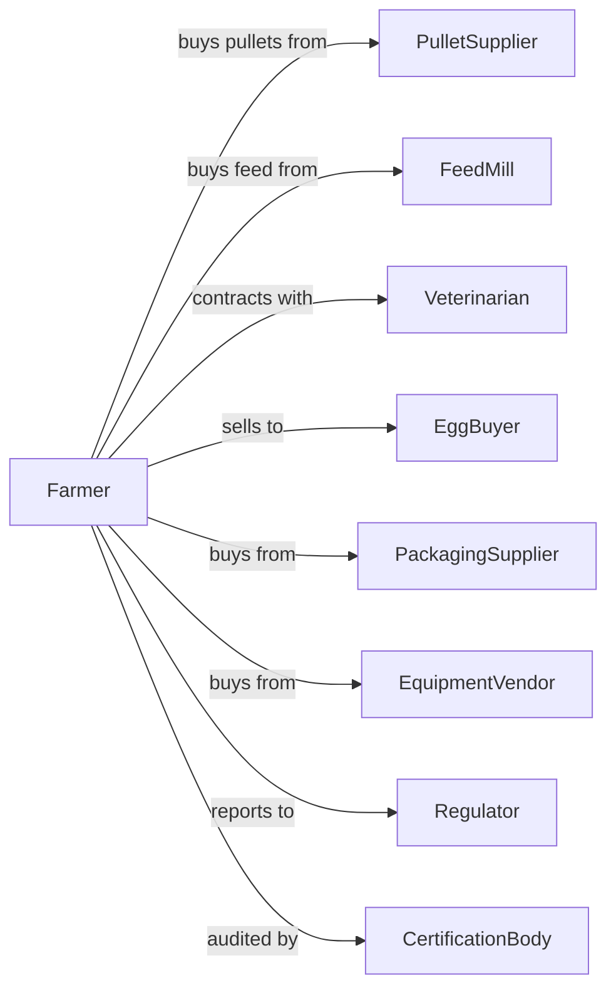

# Chicken Egg Production

> Business-as-Code definition for commercial egg production operations. Models the complete layer hen lifecycle from pullet placement through egg collection, grading, and sale.

## Overview

Chicken egg production involves raising laying hens for table egg or hatching egg production. Operations manage flocks through placement, peak production, and molt cycles while maintaining optimal nutrition, lighting, and biosecurity. This definition exposes actions for flock management, egg handling, and quality control with events for automation and searches for production analytics.

## Actors

| Actor | Description |
|-------|-------------|
| PulletSupplier | Provides ready-to-lay pullets for placement |
| FeedMill | Supplies complete layer rations and supplements |
| Veterinarian | Provides flock health services and vaccination programs |
| EggBuyer | Purchases eggs for retail, food service, or processing |
| PackagingSupplier | Provides cartons, flats, and packaging materials |
| EquipmentVendor | Sells and services layer housing and collection systems |
| Regulator | Oversees food safety, animal welfare, and environmental compliance |
| CertificationBody | Audits and certifies organic, cage-free, or humane standards |

## Roles

| Role | Description |
|------|-------------|
| FarmOwner | Owns the operation and makes strategic decisions |
| FlockManager | Oversees bird health, nutrition, and production |
| EggHandler | Collects, grades, and packages eggs |
| MaintenanceTech | Maintains equipment, ventilation, and automated systems |
| QualityController | Monitors egg quality and food safety compliance |
| Bookkeeper | Manages financial records, contracts, and payroll |
| CandlerOperator | Inspects eggs by light for blood spots, cracks, and interior quality |

## Entities

| Entity | Description |
|--------|-------------|
| LayerHen | Mature female chicken producing eggs |
| Pullet | Young female chicken before laying age |
| Egg | Product collected for sale or hatching |
| Flock | Group of hens housed together |
| House | Building containing layer cages or floor systems |
| Feed | Formulated ration for layer nutrition |
| LightingProgram | Schedule controlling day length for production |
| NestBox | Location where hens lay eggs |
| GradingStation | Equipment for sorting eggs by size and quality |
| Contract | Agreement with buyer for egg delivery |
| HealthRecord | Documentation of vaccinations and treatments |

## Actions

| Action | Description |
|--------|-------------|
| placePullets | Introduce new pullets into layer housing |
| adjustLighting | Modify light schedule to stimulate or maintain production |
| formulateFeed | Create or adjust ration for nutritional requirements |
| collectEggs | Gather eggs from nests or collection belts |
| gradeEggs | Sort eggs by size, weight, and shell quality |
| packageEggs | Place graded eggs into cartons or flats |
| candleEggs | Inspect eggs for internal defects |
| vaccinate | Administer vaccines per health protocol |
| cull | Remove non-productive or sick birds |
| cleanHouse | Sanitize housing between flocks |
| shipEggs | Transport packaged eggs to buyer |
| induceMolt | Trigger molting cycle to extend flock life |

## Events

| Event | Description |
|-------|-------------|
| pulletsPlaced | New flock has been introduced to housing |
| productionStarted | Flock has begun laying eggs |
| peakProductionReached | Flock at maximum laying rate |
| eggsCollected | Daily collection completed |
| eggsGraded | Sorting and grading completed |
| eggsShipped | Delivery sent to buyer |
| qualityIssueDetected | Egg defects or contamination identified |
| diseaseDetected | Health issue identified in flock |
| moltInduced | Flock has entered molting phase |
| flockDepleted | Flock removed and house ready for cleaning |
| auditCompleted | Certification or compliance audit finished |

## Searches

| Search | Description |
|--------|-------------|
| getFlockStatus | Retrieve current production rate and bird counts |
| getEggInventory | Get eggs on hand by grade and age |
| trackProduction | Get daily, weekly, or monthly egg output |
| getQualityMetrics | Retrieve shell quality and defect rates |
| findBuyers | List active buyers and current pricing |
| getHealthRecords | Retrieve vaccination and mortality history |
| getContractObligations | Check delivery commitments and pricing |

## Workflow



## Actor Relationships



## Usage

### Calling Actions

```typescript
import { produceEggs } from '@headlessly/produce-eggs'

const farm = produceEggs()

// Place new flock of pullets
const placement = await farm.placePullets({
  houseId: 'layer-house-3',
  count: 50000,
  breed: 'hy-line-w36',
  ageWeeks: 17,
  source: 'midwest-pullet-farm'
})

// Collect and grade eggs
const collection = await farm.collectEggs({
  houseId: 'layer-house-3',
  date: new Date()
})

await farm.gradeEggs({
  collectionId: collection.id,
  grades: ['AA', 'A', 'B'],
  sizes: ['jumbo', 'xlarge', 'large', 'medium']
})

// Ship to buyer
await farm.shipEggs({
  buyerId: 'regional-grocery',
  cases: 500,
  grades: ['AA', 'A'],
  sizes: ['large', 'xlarge']
})
```

### Event-Driven Automation

```typescript
// Auto-ship when inventory reaches threshold
farm.eggsGraded(async ({ gradeId, totalCases }) => {
  const inventory = await farm.getEggInventory({ maxAge: 7 })

  if (inventory.totalCases >= 1000) {
    const contract = await farm.getContractObligations({ active: true })
    await farm.shipEggs({
      buyerId: contract.buyerId,
      cases: Math.min(inventory.totalCases, contract.weeklyCommitment)
    })
  }
})

// Alert on quality issues
farm.qualityIssueDetected(async ({ houseId, issueType, severity }) => {
  if (severity === 'critical') {
    await farm.cull({
      houseId,
      reason: issueType,
      quarantine: true
    })
  }

  await notifyQualityTeam({
    houseId,
    issue: issueType,
    severity
  })
})
```

## Related

- [Poultry Hatcheries](./112340-PoultryHatcheries.mdx)
- [Broilers and Other Meat Type Chicken Production](./112320-BroilersAndOtherMeatTypeChickenProduction.mdx)
