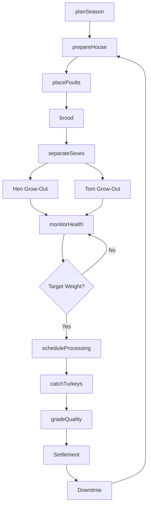
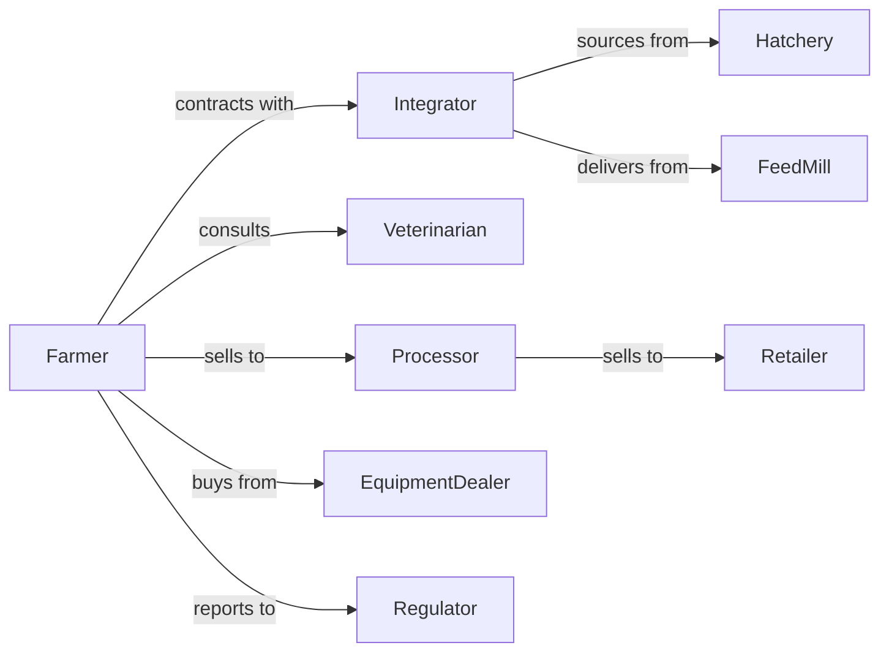

# Turkey Production

> Business-as-Code definition for turkey production operations. Models the complete grow-out cycle from poult placement through processing including breeder flock management and seasonal production planning.

## Overview

Turkey production involves raising turkeys for meat through grow-out operations that span 12-20 weeks depending on target market weight. Operations coordinate with integrators and processors for seasonal demand peaks like Thanksgiving and holiday periods. This definition exposes actions for flock management, production scheduling, and quality optimization with events for automation and searches for performance analytics.

## Actors

| Actor | Description |
|-------|-------------|
| Integrator | Provides poults, feed, and technical support under contract |
| Hatchery | Supplies day-old poults from breeder flocks |
| FeedMill | Manufactures and delivers turkey-specific rations |
| Veterinarian | Provides flock health services and disease management |
| Processor | Slaughters and further processes market turkeys |
| EquipmentDealer | Sells and services turkey housing and equipment |
| Regulator | Oversees food safety and animal welfare compliance |
| Retailer | Purchases whole birds and turkey products |

## Roles

| Role | Description |
|------|-------------|
| FarmOwner | Owns operation and manages grower contracts |
| FlockManager | Oversees daily bird care and house management |
| BreederManager | Manages breeder flock for egg and poult production |
| ServiceTechnician | Maintains heating, ventilation, and feeding systems |
| QualitySpecialist | Monitors bird health and processing quality |
| ProductionPlanner | Coordinates placement and processing schedules |

## Entities

| Entity | Description |
|--------|-------------|
| Poult | Day-old turkey placed for grow-out |
| Tom | Male turkey raised for heavy market weights |
| Hen | Female turkey raised for lighter market weights |
| BreederHen | Female turkey producing fertile eggs |
| Flock | Group of turkeys placed and raised together |
| House | Climate-controlled building for turkey production |
| Feed | Formulated ration for growth phase and sex |
| Litter | Bedding material covering house floor |
| ProcessingSlot | Reserved capacity at processing plant |
| Contract | Agreement defining payment and specifications |

## Actions

| Action | Description |
|--------|-------------|
| prepareHouse | Clean, disinfect, and configure house for poults |
| placePoults | Receive and distribute day-old turkeys |
| brood | Provide heat and intensive care for young poults |
| separateSexes | Split toms and hens for different grow-out schedules |
| formulateFeed | Adjust rations for growth phase and target weight |
| monitorHealth | Conduct daily flock observations and sampling |
| vaccinate | Administer vaccines per health program |
| scheduleProcessing | Reserve slots at processing plant |
| catchTurkeys | Load market-weight birds for transport |
| gradeQuality | Evaluate birds at processing for defects |
| planSeason | Schedule placements to meet seasonal demand |
| manageBreeder | Oversee egg collection from breeder flock |

## Events

| Event | Description |
|-------|-------------|
| housePrepped | Facility ready for poult placement |
| poultsPlaced | Day-old turkeys delivered and distributed |
| broodingComplete | Turkeys transitioned from heat sources |
| sexesSeparated | Toms and hens moved to separate housing |
| targetWeightReached | Flock at market weight |
| processingScheduled | Plant slots confirmed |
| turkeysCaught | Flock loaded for transport |
| flockProcessed | Birds slaughtered and graded |
| qualityIssueDetected | Processing defects exceed threshold |
| seasonalPeakReached | Holiday demand period arrived |
| breederEggsCollected | Fertile eggs gathered from breeder flock |

## Searches

| Search | Description |
|--------|-------------|
| getFlockStatus | Retrieve bird count, age, and average weight |
| trackGrowthCurve | Compare actual vs target weight progression |
| getMortalityReport | Get death rates and causes by flock |
| getProcessingSchedule | List upcoming plant reservations |
| findAvailableSlots | Query processor capacity |
| getSeasonalForecast | Retrieve demand projections |
| getBreederPerformance | Track egg production and fertility rates |
| getQualityMetrics | Retrieve grade distribution and condemnation rates |

## Workflow



## Actor Relationships



## Usage

### Calling Actions

```typescript
import { raiseTurkeys } from '@headlessly/raise-turkeys'

const farm = raiseTurkeys()

// Get seasonal demand forecast for holiday production
const forecast = await farm.getSeasonalForecast({ holiday: 'thanksgiving', year: 2024 })

// Check processor capacity and available slots
const slots = await farm.findAvailableSlots({ processor: 'butterball-midwest', weeks: 4 })

// Plan seasonal production for Thanksgiving
const season = await farm.planSeason({
  targetDate: new Date('2024-11-28'),
  targetHead: 50000,
  avgWeight: { toms: 38, hens: 18 },
  processor: 'butterball-midwest'
})

// Place poults based on plan
await farm.placePoults({
  houseId: 'turkey-house-2',
  count: 12500,
  sex: 'tom',
  strain: 'nicholas-white',
  targetWeight: 38
})

// Schedule processing slots
await farm.scheduleProcessing({
  flockId: season.flocks[0].id,
  processorId: 'butterball-midwest',
  date: new Date('2024-11-15'),
  headCount: 12500
})
```

### Event-Driven Automation

```typescript
// Auto-schedule when target weight reached
farm.targetWeightReached(async ({ flockId, avgWeight, headCount }) => {
  const slots = await farm.findAvailableSlots({
    dateRange: { start: new Date(), end: addDays(new Date(), 7) },
    minCapacity: headCount
  })

  if (slots.length > 0) {
    await farm.scheduleProcessing({
      flockId,
      processorId: slots[0].processorId,
      date: slots[0].date,
      headCount
    })
  }
})

// Quality alert handling
farm.qualityIssueDetected(async ({ flockId, defectType, rate }) => {
  if (rate > 0.05) {
    await notifyQualityTeam({
      severity: 'high',
      flockId,
      issue: defectType,
      condemnationRate: rate
    })

    // Adjust future flock management
    await farm.updateProtocol({
      flockId,
      adjustments: getCorrectiveActions(defectType)
    })
  }
})
```

## Related

- [Poultry Hatcheries](./112340-PoultryHatcheries.mdx)
- [Other Poultry Production](./112390-OtherPoultryProduction.mdx)
- [Poultry Processing](../../../31-33-Manufacturing/311-FoodManufacturing/3116-AnimalSlaughteringAndProcessing/311615-PoultryProcessing.mdx)
