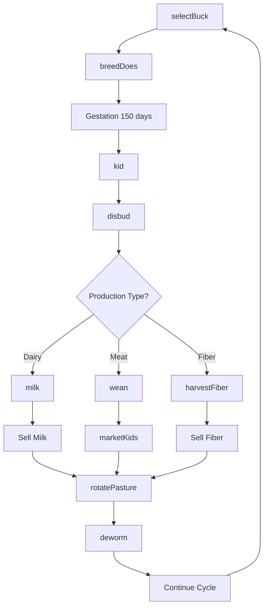
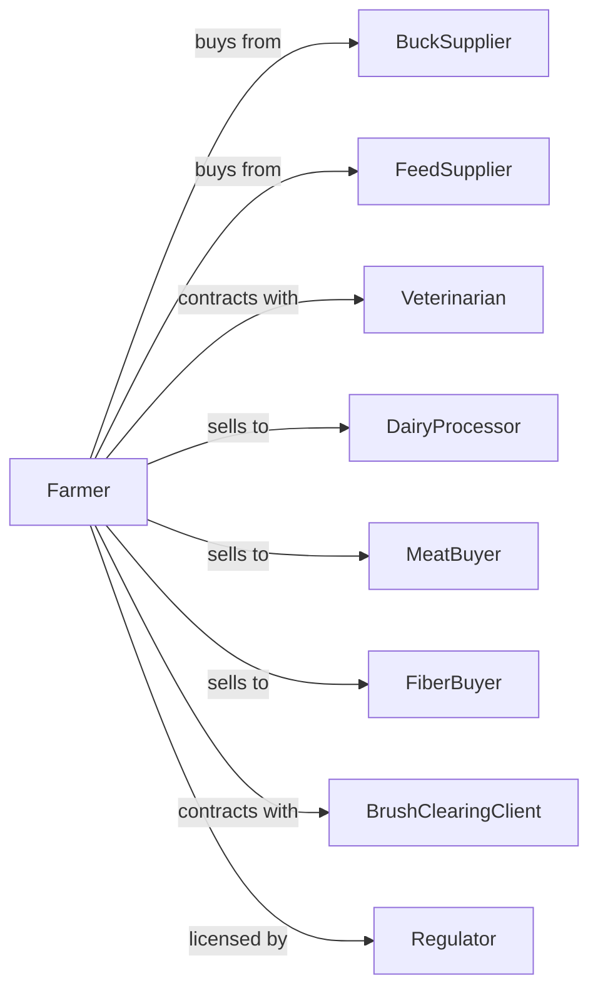

# Goat Farming

> Business-as-Code definition for goat production operations. Models the complete herd lifecycle from breeding through meat, dairy, and fiber sales including kidding management and specialized product handling.

## Overview

Goat farming involves raising goats for meat (chevon), dairy products, fiber (cashmere and mohair), or brush clearing services. Operations manage breeding cycles, kidding seasons, and product-specific processing while maintaining herd health and pasture management. This definition exposes actions for herd management, product harvesting, and market coordination with events for automation and searches for production analytics.

## Actors

| Actor | Description |
|-------|-------------|
| BuckSupplier | Provides breeding bucks with desired genetics |
| FeedSupplier | Provides hay, grain, and mineral supplements |
| Veterinarian | Provides herd health services and kidding assistance |
| DairyProcessor | Purchases milk for cheese and product manufacturing |
| MeatBuyer | Purchases market kids and cull animals |
| FiberBuyer | Purchases cashmere, mohair, or other goat fiber |
| BrushClearingClient | Hires goats for vegetation management |
| Regulator | Oversees dairy licensing and animal health |

## Roles

| Role | Description |
|------|-------------|
| HerdOwner | Owns herd and makes strategic decisions |
| HerdManager | Oversees daily goat care and breeding |
| KiddingAttendant | Assists does during kidding season |
| Milker | Operates milking equipment and handles dairy |
| FiberHarvester | Shears or combs fiber-producing goats |
| Bookkeeper | Manages sales records and herd registrations |
| CheeseArtisan | Transforms fresh goat milk into chevre and aged farmstead cheeses |

## Entities

| Entity | Description |
|--------|-------------|
| Doe | Female goat for breeding, dairy, or fiber |
| Buck | Male goat used for breeding |
| Kid | Young goat from birth to weaning |
| Herd | Group of goats managed together |
| Pasture | Grazing land including browse areas |
| Milk | Dairy product from lactating does |
| Fiber | Cashmere or mohair harvested from goats |
| KiddingPen | Enclosure for doe and newborn kids |
| MilkingParlor | Facility for dairy goat milking |
| BreedingGroup | Does assigned to specific buck |

## Actions

| Action | Description |
|--------|-------------|
| selectBuck | Choose breeding buck based on production goals |
| breedDoes | Introduce buck to breeding group |
| kid | Assist does through birthing process |
| disbud | Remove horn buds from kids |
| wean | Separate kids from does |
| milk | Collect milk from lactating does |
| harvestFiber | Shear or comb fiber from goats |
| rotatePasture | Move herd to fresh grazing or browse |
| deworm | Administer parasite control treatment |
| vaccinate | Administer disease prevention vaccines |
| marketKids | Sell market kids to buyers |
| deployForClearing | Send herd for brush clearing contract |

## Events

| Event | Description |
|-------|-------------|
| buckIntroduced | Breeding season initiated |
| doesBred | Breeding period completed |
| kiddingStarted | First kids of season born |
| kidsDisbudded | Horn bud removal completed |
| kidsWeaned | Kids separated from does |
| milkCollected | Daily milking completed |
| fiberHarvested | Annual fiber collection completed |
| pastureRotated | Herd moved to new grazing area |
| healthTreatmentAdministered | Herd received deworming or vaccination |
| kidsSold | Market kids shipped to buyer |
| clearingContractCompleted | Brush clearing job finished |

## Searches

| Search | Description |
|--------|-------------|
| getHerdInventory | List goats by age, sex, and production type |
| trackMilkProduction | Get daily and seasonal milk yields |
| trackFiberYield | Retrieve fiber weights by animal |
| findMeatBuyers | List current market kid buyers and prices |
| findDairyBuyers | List milk processors and pricing |
| getPastureStatus | Check grazing availability and condition |
| getHealthRecords | Retrieve deworming and vaccination history |
| getClearingContracts | List active vegetation management jobs |

## Workflow



## Actor Relationships



## Usage

### Calling Actions

```typescript
import { raiseGoats } from '@headlessly/raise-goats'

const farm = raiseGoats()

// Check herd inventory by production type
const herd = await farm.getHerdInventory({ productionType: 'dairy', status: 'breeding-ready' })

// Find meat kid buyers and current prices
const buyers = await farm.findMeatBuyers({ type: 'market-kids', region: 'southeast' })

// Breed does for spring kidding
await farm.breedDoes({
  breedingGroupId: 'dairy-group-1',
  buckId: 'buck-nubian-15',
  does: 30,
  startDate: new Date('2024-10-01')
})

// Collect daily milk
const milking = await farm.milk({
  parlorId: 'main-parlor',
  session: 'morning',
  date: new Date()
})

// Market kids to ethnic meat buyer
await farm.marketKids({
  count: 45,
  avgWeight: 60,
  buyerId: 'halal-meats-inc',
  deliveryDate: new Date('2024-06-15')
})

// Deploy herd for brush clearing
await farm.deployForClearing({
  contractId: 'clearing-2024-05',
  herdSize: 100,
  location: 'county-park-north',
  duration: 14
})
```

### Event-Driven Automation

```typescript
// Auto-schedule milking based on production
farm.kidsWeaned(async ({ doeIds, weanDate }) => {
  // Increase milking frequency after weaning
  for (const doeId of doeIds) {
    await farm.updateMilkingSchedule({
      doeId,
      sessionsPerDay: 2,
      startDate: weanDate
    })
  }
})

// Alert on low milk production
farm.milkCollected(async ({ totalGallons, doeCount, session }) => {
  const avgPerDoe = totalGallons / doeCount

  if (avgPerDoe < 0.5) {
    await notifyHerdManager({
      alert: 'lowProduction',
      avgYield: avgPerDoe,
      session,
      recommendation: 'Check feed quality and health status'
    })
  }
})
```

## Related

- [Sheep Farming](./112410-SheepFarming.mdx)
- [Dairy Cattle and Milk Production](../1121-CattleRanchingAndFarming/112120-DairyCattleAndMilkProduction.mdx)
