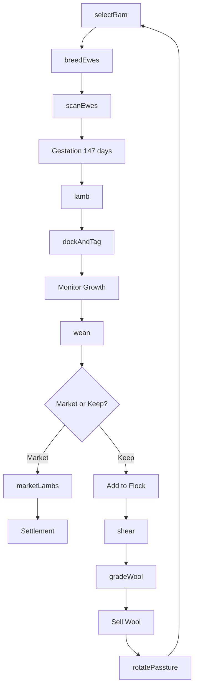
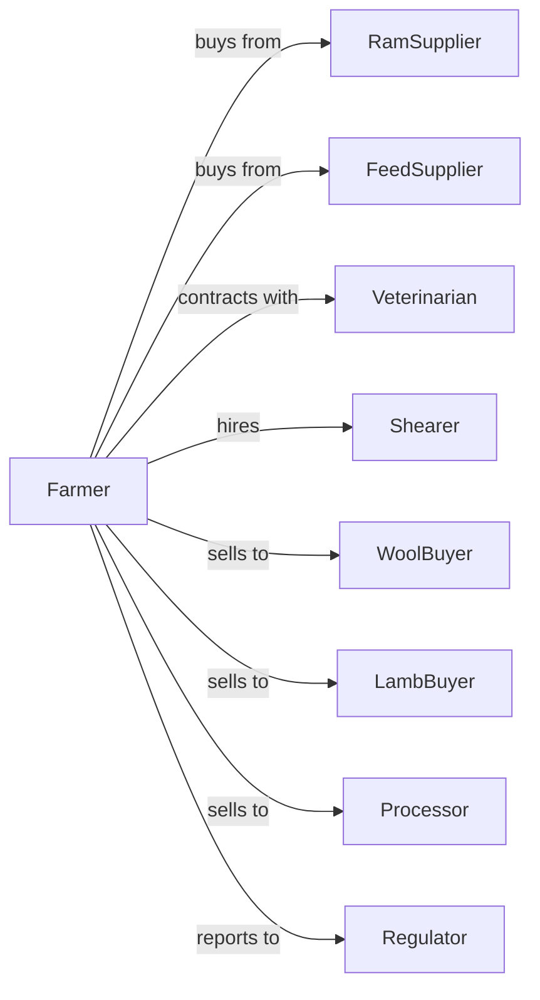

# Sheep Farming

> Business-as-Code definition for sheep production operations. Models the complete flock lifecycle from breeding through lamb and wool sales including lambing management, shearing, and market timing.

## Overview

Sheep farming involves raising sheep for meat (lamb and mutton), wool, and breeding stock. Operations manage seasonal breeding cycles, lambing periods, and annual shearing while rotating pastures and supplementing nutrition. This definition exposes actions for flock management, wool production, and meat marketing with events for automation and searches for production analytics.

## Actors

| Actor | Description |
|-------|-------------|
| RamSupplier | Provides breeding rams with desired genetics |
| FeedSupplier | Provides hay, grain, and mineral supplements |
| Veterinarian | Provides flock health services and lambing assistance |
| Shearer | Provides annual wool harvesting services |
| WoolBuyer | Purchases raw fleece by grade |
| LambBuyer | Purchases feeder or market lambs |
| Processor | Slaughters and processes lambs for meat |
| Regulator | Oversees animal welfare and scrapie programs |

## Roles

| Role | Description |
|------|-------------|
| ShepherdOwner | Owns flock and makes strategic decisions |
| FlockManager | Oversees daily sheep care and breeding |
| LambingAttendant | Assists ewes during lambing season |
| PastureManager | Rotates grazing and manages forage |
| ShearingHelper | Assists shearer during wool harvest |
| Bookkeeper | Manages sales records and flock registrations |
| WoolClasser | Skirts, grades, and sorts fleeces by fiber diameter and staple length |

## Entities

| Entity | Description |
|--------|-------------|
| Ewe | Female sheep for breeding and wool production |
| Ram | Male sheep used for breeding |
| Lamb | Young sheep from birth to market weight |
| Flock | Group of sheep managed together |
| Pasture | Grazing land for sheep |
| Fleece | Wool coat shorn from sheep |
| LambingJug | Small pen for ewe and newborn lambs |
| EarTag | Identification for individual animals |
| BreedingGroup | Ewes assigned to specific ram |
| WoolGrade | Quality classification for fleece |

## Actions

| Action | Description |
|--------|-------------|
| selectRam | Choose breeding ram based on genetics and traits |
| breedEwes | Introduce ram to breeding group |
| scanEwes | Ultrasound to confirm pregnancy and count lambs |
| lamb | Assist ewes through birthing process |
| dockAndTag | Perform tail docking and ear tagging on lambs |
| wean | Separate lambs from ewes |
| shear | Remove wool from sheep |
| gradeWool | Sort fleece by quality and fiber characteristics |
| rotatePassture | Move flock to fresh grazing |
| drench | Administer dewormer medication |
| cull | Remove unproductive animals from flock |
| marketLambs | Sell lambs to buyers or processors |

## Events

| Event | Description |
|-------|-------------|
| ramIntroduced | Breeding season started |
| ewesBred | Breeding period completed |
| ewesScanned | Pregnancy status confirmed |
| lambingStarted | First lambs of season born |
| lambsProcessed | Docking and tagging completed |
| lambsWeaned | Lambs separated from ewes |
| shearingComplete | Annual wool harvest finished |
| woolSold | Fleece sold to buyer |
| lambsSold | Market lambs shipped to buyer |
| pastureRotated | Flock moved to new grazing area |
| healthTreatment | Flock received medication or vaccination |

## Searches

| Search | Description |
|--------|-------------|
| getFlockInventory | List sheep by age, sex, and breeding status |
| trackLambingRecords | Get birth rates and lamb survival |
| getWoolProduction | Retrieve fleece weights and grades |
| findLambBuyers | List current buyers and prices |
| getPastureStatus | Check grazing availability and rotation schedule |
| getHealthRecords | Retrieve vaccination and treatment history |
| getBreedingPerformance | Track lambing percentages by ram |
| getMarketPrices | Query current lamb and wool prices |

## Workflow



## Actor Relationships



## Usage

### Calling Actions

```typescript
import { raiseSheep } from '@headlessly/raise-sheep'

const farm = raiseSheep()

// Check current lamb and wool market prices
const prices = await farm.getMarketPrices({ class: 'feeder-lamb', woolGrade: 'fine' })

// Review flock inventory by breeding status
const flock = await farm.getFlockInventory({ status: 'open-ewes' })

// Breed ewes with selected ram
await farm.breedEwes({
  breedingGroupId: 'group-a',
  ramId: 'ram-suffolk-22',
  ewes: 50,
  startDate: new Date('2024-10-15')
})

// Scan ewes for pregnancy
const scan = await farm.scanEwes({
  breedingGroupId: 'group-a',
  scanDate: new Date('2024-12-01')
})

// Shear flock after lambing
const shearing = await farm.shear({
  flockId: 'main-flock',
  shearer: 'county-shearing-service',
  date: new Date('2024-05-01')
})

// Market lambs at target weight
await farm.marketLambs({
  count: 85,
  avgWeight: 130,
  buyerId: 'superior-farms',
  deliveryDate: new Date('2024-08-15')
})
```

### Event-Driven Automation

```typescript
// Auto-notify buyers when lambs reach market weight
farm.lambsWeaned(async ({ count, avgWeight, weanDate }) => {
  const projectedMarketDate = addDays(weanDate, 60)
  const projectedWeight = avgWeight + (60 * 0.5) // 0.5 lb/day gain

  const buyers = await farm.findLambBuyers({
    minQuantity: count,
    deliveryWindow: { start: projectedMarketDate, end: addDays(projectedMarketDate, 14) }
  })

  for (const buyer of buyers) {
    await notifyBuyer({
      buyerId: buyer.id,
      availability: { count, projectedWeight, projectedMarketDate }
    })
  }
})

// Schedule shearing after lambing complete
farm.lambingStarted(async ({ expectedEndDate }) => {
  await farm.scheduleShearing({
    date: addDays(expectedEndDate, 30),
    estimatedHead: await farm.getFlockInventory({ type: 'adult' }).then(f => f.count)
  })
})
```

## Related

- [Goat Farming](./112420-GoatFarming.mdx)
- [Support Activities for Animal Production](../../115-SupportActivitiesForAgricultureAndForestry/1152-SupportActivitiesForAnimalProduction/115210-SupportActivitiesForAnimalProduction.mdx)
