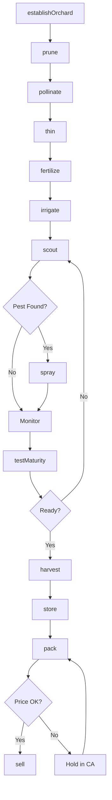
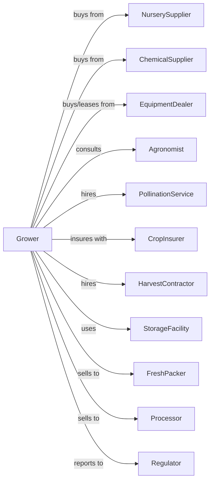

# Apple Orchards

> Business-as-Code definition for apple orchard operations. Models the complete production cycle from orchard establishment through harvest, controlled atmosphere storage, and sale.

## Overview

Apple orchard farming involves the cultivation of apple trees for fresh market consumption, processing into juice, sauce, and slices, and cider production. This definition exposes actions for managing high-density plantings, pollination, thinning, pest management, harvest timing by variety, and controlled atmosphere storage for year-round marketing.

## Actors

| Actor | Description |
|-------|-------------|
| NurserySupplier | Provides apple trees on selected rootstocks |
| EquipmentDealer | Sells and services orchard equipment and platforms |
| ChemicalSupplier | Provides fungicides, insecticides, and growth regulators |
| CropInsurer | Provides coverage for frost, hail, and wind damage |
| FreshPacker | Packs and markets apples to retail channels |
| Processor | Purchases apples for juice, sauce, or slices |
| StorageFacility | Provides controlled atmosphere storage |
| PollinationService | Supplies honeybees for bloom pollination |
| Agronomist | Advises on variety selection and IPM programs |
| HarvestContractor | Provides picking crews and equipment |
| Regulator | Oversees food safety and pesticide compliance |

## Roles

| Role | Description |
|------|-------------|
| OrchardOwner | Owns land and makes variety and investment decisions |
| OrchardManager | Coordinates seasonal operations and harvest |
| SprayOperator | Applies pesticides and growth regulators |
| ThinningCrew | Removes excess fruit for size optimization |
| HarvestCrewLead | Supervises picking and bin handling |
| StorageManager | Monitors CA rooms and inventory |
| Bookkeeper | Manages sales, storage fees, and compliance |
| Pruner | Trains and shapes trees during dormant season for optimal fruiting |

## Entities

| Entity | Description |
|--------|-------------|
| Orchard | Planted acreage of apple trees |
| Tree | Individual apple tree with variety and rootstock |
| Block | Section with uniform variety and planting system |
| Variety | Apple cultivar (Gala, Fuji, Honeycrisp, etc.) |
| Rootstock | Dwarfing or semi-dwarfing root system |
| Fruit | Apples at various maturity stages |
| Bin | Harvest container holding approximately 20 bushels |
| Storage | Controlled atmosphere room with specific gas levels |
| Contract | Sale agreement with variety and grade specs |
| Yield | Bins or bushels per acre |

## Actions

| Action | Description |
|--------|-------------|
| establishOrchard | Plant trees on trellis with selected rootstock |
| prune | Shape trees and manage fruiting wood |
| pollinate | Place bee hives during bloom period |
| thin | Remove excess fruit to optimize size and quality |
| fertilize | Apply nutrients based on leaf and soil analysis |
| irrigate | Apply water through drip or micro-sprinkler |
| scout | Monitor for scab, fire blight, and codling moth |
| spray | Apply fungicides, insecticides, or thinners |
| testMaturity | Sample fruit for starch, pressure, and brix |
| harvest | Pick fruit at optimal maturity by variety |
| store | Place in controlled atmosphere rooms |
| pack | Grade, sort, and package for market |
| sell | Execute sale to packer, processor, or direct |
| removeBlock | Remove unproductive plantings |

## Events

| Event | Description |
|-------|-------------|
| orchardEstablished | New planting completed |
| pruned | Winter or summer pruning completed |
| bloomed | Trees in full bloom |
| pollinated | Bee hives placed and active |
| thinned | Excess fruit removed |
| fertilized | Nutrients applied |
| irrigated | Water applied |
| pestDetected | Scab, moth, or other pest found |
| sprayed | Treatment applied |
| maturityTested | Harvest timing indicators assessed |
| harvested | Fruit picked and binned |
| stored | Apples placed in CA storage |
| packed | Fruit graded and packaged |
| sold | Sale transaction completed |

## Searches

| Search | Description |
|--------|-------------|
| findBlocks | List blocks by variety and harvest window |
| getContracts | Retrieve active sales contracts |
| checkWeather | Get frost, rain, and spray condition forecast |
| getPrice | Get current prices by variety and grade |
| findBuyers | List packers and processors with needs |
| getYieldHistory | Retrieve yields by block and variety |
| getStorageInventory | Check CA room inventory and conditions |
| getPestPressure | Get regional pest and disease forecasts |

## Workflow



## Actor Relationships



## Usage

### Calling Actions

```typescript
import { growApples } from '@headlessly/grow-apples'

const orchard = growApples()

// Check current prices by variety and grade
const pricing = await orchard.getPrice({ variety: 'Honeycrisp', grade: 'ExtraFancy' })

// Review CA storage inventory levels
const inventory = await orchard.getStorageInventory({ facility: 'ca-building-1' })

// Test maturity for Honeycrisp
const maturity = await orchard.testMaturity({
  blockId: 'honeycrisp-12',
  tests: ['starchIndex', 'pressure', 'brix', 'color']
})

// Harvest when ready
if (maturity.starchIndex >= 4 && maturity.pressure <= 16) {
  await orchard.harvest({
    blockId: 'honeycrisp-12',
    crew: 'team-a',
    binDestination: 'ca-room-3'
  })
}

// Thin Gala for size
await orchard.thin({
  blockId: 'gala-5',
  method: 'hand',
  targetLoad: 5,
  fruitSpacing: 6
})
```

### Event-Driven Automation

```typescript
// Auto-spray based on scab model
orchard.pestDetected(async ({ blockId, pest, infectionPeriod }) => {
  if (pest === 'appleScab' && infectionPeriod === 'heavy') {
    await orchard.spray({
      blockId,
      product: 'captan',
      rate: 3.0,
      timing: 'immediate'
    })
  }
})

// Auto-pack when market conditions improve
orchard.stored(async ({ binId, variety, storageWeeks }) => {
  const { perBushel } = await orchard.getPrice({ variety })
  const targetPrice = getTargetPrice(variety)

  if (perBushel >= targetPrice || storageWeeks >= 30) {
    await orchard.pack({
      binId,
      grades: ['ExtraFancy', 'Fancy'],
      sizes: ['80', '88', '100']
    })
  }
})

// Route packed fruit to best market
orchard.packed(async ({ lotId, variety, grade, size }) => {
  if (grade === 'ExtraFancy' && size === '80') {
    await orchard.sell({
      lotId,
      market: 'export',
      destination: 'asia'
    })
  } else if (grade === 'Fancy') {
    await orchard.sell({
      lotId,
      market: 'domestic-retail'
    })
  } else {
    await orchard.sell({
      lotId,
      market: 'processor'
    })
  }
})
```

## Related

- [Other Noncitrus Fruit Farming](./111339-OtherNoncitrusFruitFarming.mdx)
- [Fruit and Tree Nut Combination Farming](./111336-FruitAndTreeNutCombinationFarming.mdx)
