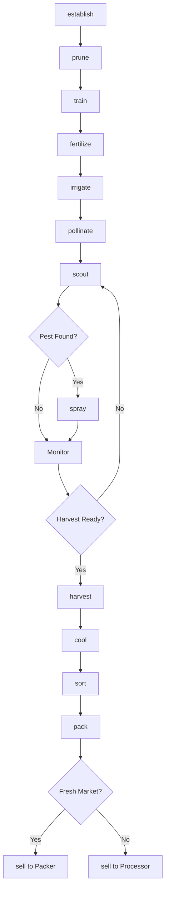
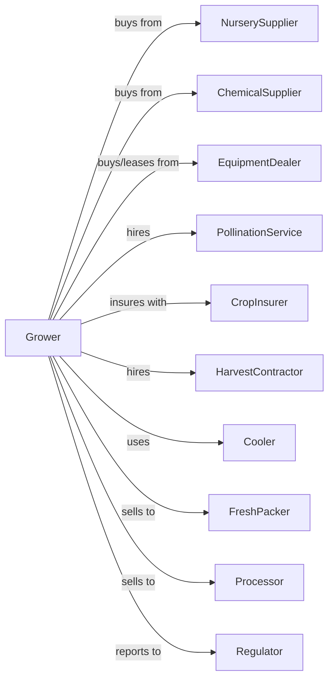

# Berry (except Strawberry) Farming

> Business-as-Code definition for non-strawberry berry production. Models the cultivation of blueberries, raspberries, blackberries, and cranberries from planting through harvest and sale.

## Overview

Berry farming encompasses the cultivation of blueberries, raspberries, blackberries, cranberries, and other small fruit crops for fresh market and processing. This definition exposes actions for managing perennial plantings, pruning systems, pollination, mechanical or hand harvest, and post-harvest handling specific to each berry type.

## Actors

| Actor | Description |
|-------|-------------|
| NurserySupplier | Provides certified berry plants and cuttings |
| EquipmentDealer | Sells and services harvesters, sprayers, and cooling equipment |
| ChemicalSupplier | Provides fungicides, herbicides, and fertilizers |
| CropInsurer | Provides coverage for frost, weather, and crop losses |
| FreshPacker | Packs and ships berries for retail distribution |
| Processor | Purchases berries for freezing, juice, or drying |
| PollinationService | Supplies bees for blueberry and cranberry pollination |
| HarvestContractor | Provides picking crews or mechanical harvest |
| Cooler | Provides rapid cooling and cold storage |
| Regulator | Oversees food safety and pesticide compliance |

## Roles

| Role | Description |
|------|-------------|
| FarmOwner | Owns land and makes variety and investment decisions |
| FarmManager | Coordinates seasonal operations and harvest |
| IrrigationManager | Schedules water for each berry type |
| SprayOperator | Applies pest control and nutrients |
| PruningCrew | Manages annual pruning for cane and bush types |
| HarvestCrewLead | Supervises picking operations |
| Bookkeeper | Manages sales, labor, and compliance |
| BogKeeper | Manages cranberry bog water levels for flood harvest and winter protection |

## Entities

| Entity | Description |
|--------|-------------|
| Field | Planted acreage of berry plants |
| Plant | Individual bush, cane, or vine |
| Block | Section with uniform variety and age |
| Variety | Berry cultivar with specific characteristics |
| Fruit | Berries at various maturity stages |
| Flat | Harvest container for hand-picked fruit |
| Lug | Bulk container for machine-harvested fruit |
| Cooler | Forced-air or hydro cooling facility |
| Contract | Sale agreement with quality specifications |
| Grade | Quality classification by size and condition |

## Actions

| Action | Description |
|--------|-------------|
| establish | Plant new berry field with proper spacing |
| prune | Remove old canes or shape bushes annually |
| train | Position canes on trellis for caneberries |
| fertilize | Apply nutrients based on tissue analysis |
| irrigate | Apply water through drip or overhead |
| pollinate | Place bee hives during bloom |
| scout | Monitor for mummy berry, SWD, and other pests |
| spray | Apply fungicides, insecticides, or herbicides |
| harvest | Pick fruit by hand or machine at peak ripeness |
| cool | Rapidly reduce temperature after harvest |
| sort | Remove damaged or underripe fruit |
| pack | Package in clamshells or bulk containers |
| sell | Execute sale to packer, processor, or direct |
| flood | Flood cranberry bogs for harvest or frost protection |

## Events

| Event | Description |
|-------|-------------|
| established | New planting completed |
| pruned | Annual pruning completed |
| trained | Canes positioned on trellis |
| fertilized | Nutrients applied |
| irrigated | Water applied |
| pollinated | Bee hives placed for bloom |
| pestDetected | SWD, mummy berry, or other pest found |
| sprayed | Treatment applied |
| harvestReady | Fruit reached optimal ripeness |
| harvested | Berries picked and collected |
| cooled | Temperature reduced to target |
| sorted | Quality sorting completed |
| packed | Fruit packaged for market |
| sold | Sale transaction completed |
| flooded | Cranberry bog flooded |

## Searches

| Search | Description |
|--------|-------------|
| findBlocks | List blocks by berry type and variety |
| getContracts | Retrieve active buyer contracts |
| checkWeather | Get frost and rain forecast |
| getPrice | Get current prices by berry type and grade |
| findBuyers | List packers and processors with needs |
| getYieldHistory | Retrieve yields by block and variety |
| getPestPressure | Get SWD and disease forecasts |
| getHarvestWindow | Calculate optimal harvest timing |

## Workflow



## Actor Relationships



## Usage

### Calling Actions

```typescript
import { growBerry } from '@headlessly/grow-berry'

const farm = growBerry()

// Check spotted wing drosophila and disease forecasts
const pest = await farm.getPestPressure({ region: 'pacific-northwest', pest: 'SWD' })

// Get optimal harvest window for blueberry blocks
const window = await farm.getHarvestWindow({ blockId: 'blueberry-a', berryType: 'blueberry' })

// Establish new blueberry planting
await farm.establish({
  fieldId: 'north-bog',
  berryType: 'blueberry',
  variety: 'duke',
  spacing: { inRow: 4, betweenRows: 10 },
  plants: 1200
})

// Schedule pollination
await farm.pollinate({
  blockId: 'blueberry-a',
  hives: 4,
  hivesPerAcre: 2,
  placement: 'perimeter'
})

// Harvest blueberries mechanically
await farm.harvest({
  blockId: 'blueberry-a',
  method: 'mechanical',
  harvester: 'over-row',
  destination: 'processor'
})
```

### Event-Driven Automation

```typescript
// Auto-spray for spotted wing drosophila
farm.pestDetected(async ({ blockId, pest, trapCount }) => {
  if (pest === 'SWD' && trapCount >= 5) {
    await farm.spray({
      blockId,
      product: 'spinosad',
      rate: 6.0,
      interval: 7
    })
  }
})

// Auto-cool based on field temperature
farm.harvested(async ({ lotId, fieldTemp, berryType }) => {
  const targetTemp = berryType === 'raspberry' ? 32 : 34

  await farm.cool({
    lotId,
    method: 'forced-air',
    targetTemp,
    maxHours: 2
  })
})

// Route fruit by quality and market
farm.sorted(async ({ lotId, berryType, grade, pounds }) => {
  if (grade === 'Fancy') {
    await farm.sell({
      lotId,
      market: 'fresh',
      packer: 'premium-berry-co'
    })
  } else {
    await farm.sell({
      lotId,
      market: 'frozen',
      processor: 'berry-processing-inc'
    })
  }
})
```

## Related

- [Strawberry Farming](./111333-StrawberryFarming.mdx)
- [Grape Vineyards](./111332-GrapeVineyards.mdx)
