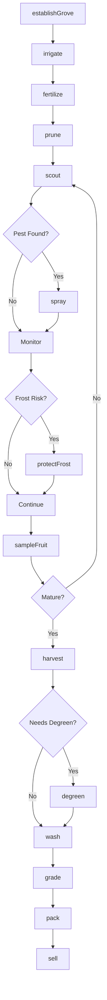
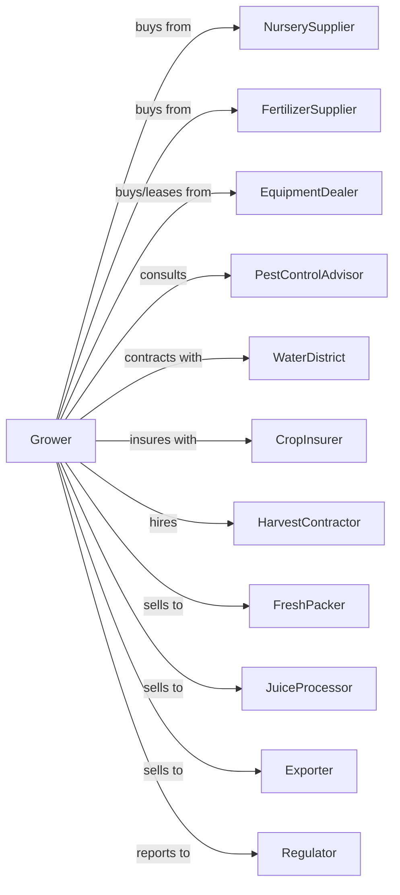

# Citrus (except Orange) Groves

> Business-as-Code definition for non-orange citrus grove operations. Models the cultivation of grapefruit, lemons, limes, tangerines, and mandarins from tree establishment through harvest and sale.

## Overview

Citrus grove farming encompasses the production of grapefruit, lemons, limes, tangerines, mandarins, and other citrus varieties for fresh market and processing. This definition exposes actions for managing diverse citrus types with varying harvest windows, frost sensitivity, and market specifications.

## Actors

| Actor | Description |
|-------|-------------|
| NurserySupplier | Provides certified disease-free citrus trees |
| EquipmentDealer | Sells and services grove equipment and sprayers |
| FertilizerSupplier | Provides citrus fertilizer programs |
| CropInsurer | Provides coverage for freeze and hurricane damage |
| FreshPacker | Packs and ships citrus for retail markets |
| JuiceProcessor | Purchases citrus for juice extraction |
| Exporter | Ships citrus to international markets |
| PestControlAdvisor | Advises on greening and pest management |
| WaterDistrict | Manages irrigation water allocations |
| Regulator | Oversees phytosanitary and food safety compliance |
| HarvestContractor | Provides picking crews and equipment |

## Roles

| Role | Description |
|------|-------------|
| GroveOwner | Owns land and makes variety and investment decisions |
| GroveManager | Coordinates grove operations and harvest timing |
| IrrigationTechnician | Manages water delivery systems |
| SprayOperator | Applies pesticides and nutrients |
| HarvestCrewLead | Supervises picking and packing crews |
| QualityInspector | Evaluates fruit maturity and grade |
| Bookkeeper | Manages sales, contracts, and compliance |
| DegreeDayTracker | Monitors heat accumulation to predict maturity and schedule harvest |

## Entities

| Entity | Description |
|--------|-------------|
| Grove | Planted acreage of citrus trees |
| Tree | Individual citrus tree with variety and rootstock |
| Block | Section with uniform variety and management |
| Variety | Citrus type (grapefruit, lemon, tangerine, etc.) |
| Fruit | Citrus at various maturity stages |
| Irrigation | Microjet or drip delivery system |
| Contract | Sale agreement with quality specifications |
| Yield | Cartons or field boxes per acre |
| Grade | Quality classification by size, color, and blemishes |
| Disease | Greening, canker, or other citrus diseases |

## Actions

| Action | Description |
|--------|-------------|
| establishGrove | Plant trees with selected rootstock and spacing |
| irrigate | Apply water based on evapotranspiration needs |
| fertilize | Apply nutrients on seasonal schedule |
| prune | Shape trees and remove deadwood |
| scout | Monitor for pests, disease, and nutrient status |
| spray | Apply insecticides, miticides, or fungicides |
| protectFrost | Activate wind machines or irrigation for freeze |
| sampleFruit | Test sugar, acid, and color development |
| harvest | Pick fruit at optimal maturity |
| degreen | Apply ethylene treatment for color development |
| wash | Clean and apply wax coating |
| grade | Sort by size, color, and external quality |
| pack | Package in cartons for shipping |
| sell | Execute sale to packer, processor, or exporter |

## Events

| Event | Description |
|-------|-------------|
| groveEstablished | New planting completed |
| irrigated | Water applied to blocks |
| fertilized | Nutrient application completed |
| pruned | Tree shaping completed |
| pestDetected | Pest or disease identified |
| sprayed | Treatment applied |
| frostWarning | Freeze event forecast |
| frostProtected | Protection measures activated |
| fruitSampled | Maturity test completed |
| harvested | Fruit picked from trees |
| degreened | Color treatment completed |
| washed | Cleaning and waxing completed |
| graded | Quality classification assigned |
| packed | Fruit packaged for shipment |
| sold | Sale transaction completed |

## Searches

| Search | Description |
|--------|-------------|
| findBlocks | List blocks by variety and harvest window |
| getContracts | Retrieve active sales contracts |
| checkWeather | Get freeze forecast and conditions |
| getPrice | Get current prices by variety and grade |
| findBuyers | List packers, processors, and exporters |
| getYieldHistory | Retrieve yields by block and season |
| getMaturityStatus | Check sugar and acid levels by block |
| getGreeningStatus | Check disease levels across grove |

## Workflow



## Actor Relationships



## Usage

### Calling Actions

```typescript
import { growCitrus } from '@headlessly/grow-citrus'

const grove = growCitrus()

// Sample grapefruit for maturity
const sample = await grove.sampleFruit({
  blockId: 'grapefruit-west',
  variety: 'ruby-red',
  tests: ['brix', 'acid', 'color', 'seedCount']
})

// Check if ready for premium market
if (sample.brix >= 10 && sample.colorIndex >= 8) {
  await grove.harvest({
    blockId: 'grapefruit-west',
    destination: 'fresh-packer',
    priority: 'high'
  })
}

// Manage lemon harvest timing
await grove.harvest({
  blockId: 'lemon-block-3',
  variety: 'eureka',
  colorSpec: 'silver',
  destination: 'export-packer'
})
```

### Event-Driven Automation

```typescript
// Auto-protect from frost
grove.frostWarning(async ({ blocks, forecastLow, duration }) => {
  const sensitiveBlocks = blocks.filter(b =>
    b.variety === 'lime' || b.variety === 'tangerine'
  )

  if (forecastLow <= 30) {
    await grove.protectFrost({
      blocks: sensitiveBlocks,
      method: 'microjet-irrigation',
      duration
    })
  }
})

// Auto-schedule degreening for tangerines
grove.harvested(async ({ lotId, variety, colorIndex }) => {
  if (variety === 'tangerine' && colorIndex < 7) {
    await grove.degreen({
      lotId,
      ethyleneRate: 5,
      temperature: 72,
      duration: 48
    })
  } else {
    await grove.wash({ lotId })
  }
})

// Route to best market based on grade
grove.graded(async ({ lotId, variety, grade, size }) => {
  if (grade === 'Fancy' && size === '48') {
    await grove.sell({
      lotId,
      market: 'export',
      destination: 'japan'
    })
  } else if (grade === 'Choice') {
    await grove.sell({
      lotId,
      market: 'domestic-fresh'
    })
  } else {
    await grove.sell({
      lotId,
      market: 'processor'
    })
  }
})
```

## Related

- [Orange Groves](./111310-OrangeGroves.mdx)
- [Fruit and Tree Nut Combination Farming](./111336-FruitAndTreeNutCombinationFarming.mdx)
