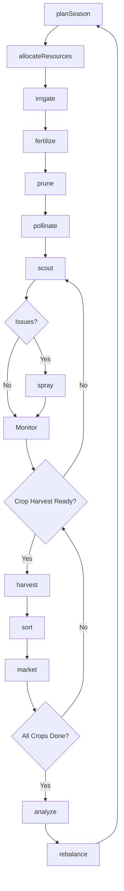
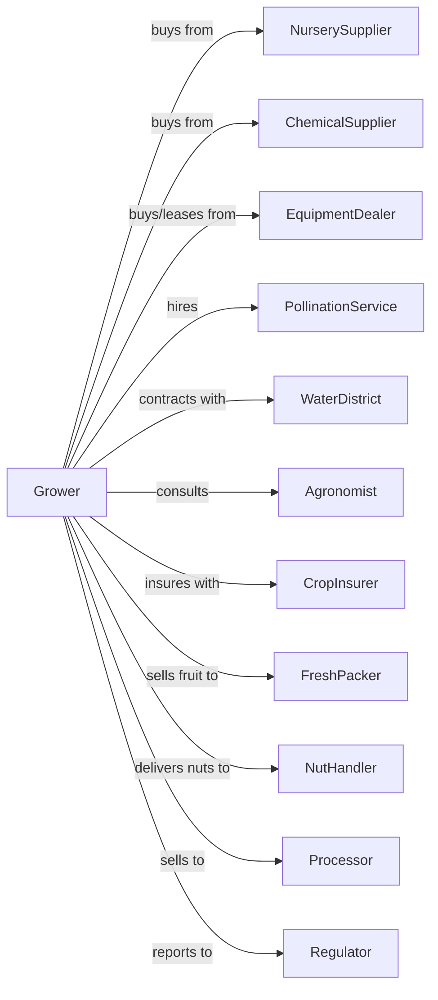

# Fruit and Tree Nut Combination Farming

> Business-as-Code definition for diversified fruit and tree nut operations. Models the management of multiple permanent crop types with varying harvest windows and market channels.

## Overview

Fruit and tree nut combination farming involves the cultivation of multiple permanent crops such as apples and walnuts, citrus and almonds, or stone fruit and pistachios on the same operation. This definition exposes actions for managing diverse crops with different seasonal requirements, optimizing shared equipment and labor, and coordinating sales across multiple commodity markets.

## Actors

| Actor | Description |
|-------|-------------|
| NurserySupplier | Provides trees for multiple crop types |
| EquipmentDealer | Sells and services multi-purpose orchard equipment |
| ChemicalSupplier | Provides crop-specific pest control products |
| CropInsurer | Provides multi-crop coverage |
| FreshPacker | Packs and ships fresh fruit |
| NutHandler | Receives and processes tree nuts |
| Processor | Purchases fruit or nuts for processing |
| PollinationService | Supplies bees for pollination-dependent crops |
| WaterDistrict | Provides irrigation water allocations |
| Agronomist | Advises on multi-crop management |
| Regulator | Oversees food safety across commodities |

## Roles

| Role | Description |
|------|-------------|
| FarmOwner | Owns land and manages diversified crop portfolio |
| FarmManager | Coordinates operations across all crop types |
| IrrigationManager | Schedules water for different crop requirements |
| SprayOperator | Applies crop-specific treatments |
| HarvestCoordinator | Sequences harvest across overlapping windows |
| MarketingManager | Manages sales relationships for each commodity |
| Bookkeeper | Tracks finances by crop and market channel |
| OrchardRehab | Removes and replants aging blocks to maintain production across diversified plantings |

## Entities

| Entity | Description |
|--------|-------------|
| Farm | Total operation with multiple crop blocks |
| Block | Section dedicated to single crop type |
| Crop | Individual fruit or nut species being grown |
| Tree | Permanent planting with variety and rootstock |
| Equipment | Shared machinery used across crops |
| Irrigation | Water delivery system serving multiple blocks |
| Contract | Sale agreement for specific commodity |
| Yield | Production by crop type and block |
| Revenue | Income tracked by commodity |
| Labor | Workforce allocated across crops |

## Actions

| Action | Description |
|--------|-------------|
| planSeason | Schedule operations across all crop types |
| allocateResources | Assign equipment and labor by crop priority |
| irrigate | Apply water based on each crop's needs |
| fertilize | Apply nutrients specific to each crop |
| prune | Shape trees according to crop-specific practices |
| pollinate | Coordinate bee placement across blooming crops |
| scout | Monitor all crops for pests and diseases |
| spray | Apply crop-appropriate treatments |
| harvest | Sequence harvest across overlapping windows |
| sort | Grade and sort each commodity type |
| market | Execute sales for each crop type |
| analyze | Compare performance across crops |
| rebalance | Adjust crop mix based on returns |

## Events

| Event | Description |
|-------|-------------|
| seasonPlanned | Annual operation schedule completed |
| resourcesAllocated | Equipment and labor assigned |
| irrigated | Water applied to block |
| fertilized | Nutrients applied |
| pruned | Pruning completed for crop |
| pollinated | Bees placed for blooming crop |
| pestDetected | Issue found in crop block |
| sprayed | Treatment applied |
| harvestStarted | Picking begun for crop |
| harvested | Crop collected and transported |
| sorted | Quality grading completed |
| marketed | Sale executed for commodity |
| analyzed | Performance comparison completed |
| rebalanced | Crop mix adjusted for next season |

## Searches

| Search | Description |
|--------|-------------|
| findBlocks | List blocks by crop type and status |
| getContracts | Retrieve contracts across all commodities |
| checkWeather | Get forecast affecting all crops |
| getPrices | Get current prices for all commodities |
| getResourceAvailability | Check equipment and labor status |
| getYieldHistory | Retrieve yields by crop and block |
| getCropCalendar | View operation timing across crops |
| getRevenueByComodity | Retrieve income breakdown |

## Workflow



## Actor Relationships



## Usage

### Calling Actions

```typescript
import { growFruitTree } from '@headlessly/grow-fruit-tree'

const farm = growFruitTree()

// Plan season across all crops
const plan = await farm.planSeason({
  crops: ['almond', 'walnut', 'cherry'],
  year: 2024,
  constraints: {
    waterAllocation: 1200,
    laborPool: 25
  }
})

// Allocate resources across crops
await farm.allocateResources({
  seasonPlan: plan.id,
  equipment: {
    shaker: ['almond-blocks', 'walnut-blocks'],
    harvester: ['cherry-blocks']
  },
  labor: {
    pruningCrew: ['all-blocks'],
    harvestCrew: ['cherry-blocks']
  }
})

// Coordinate overlapping harvests
await farm.harvest({
  crops: [
    { crop: 'cherry', blocks: ['cherry-a'], priority: 1 },
    { crop: 'almond', blocks: ['nonpareil-1'], priority: 2 }
  ],
  sequencing: 'by-maturity'
})
```

### Event-Driven Automation

```typescript
// Coordinate pollination across crops
farm.pollinated(async ({ crop, completion }) => {
  if (crop === 'almond' && completion >= 0.9) {
    // Move bees to cherry after almond bloom
    await farm.pollinate({
      crop: 'cherry',
      hives: 50,
      timing: 'immediate'
    })
  }
})

// Balance labor across harvests
farm.harvestStarted(async ({ crop, laborNeeded }) => {
  const available = await farm.getResourceAvailability({
    type: 'labor',
    date: new Date()
  })

  if (available.workers < laborNeeded) {
    await reallocateLabor({
      from: getLowerPriorityCrop(crop),
      to: crop,
      workers: laborNeeded - available.workers
    })
  }
})

// Analyze performance across commodities
farm.marketed(async ({ crop, revenue, yield: cropYield }) => {
  const prices = await farm.getPrices()

  await farm.analyze({
    crop,
    metrics: {
      revenue,
      yield: cropYield,
      pricePerUnit: revenue / cropYield,
      marketComparison: prices[crop].percentile
    }
  })
})
```

## Related

- [Apple Orchards](./111331-AppleOrchards.mdx)
- [Tree Nut Farming](./111335-TreeNutFarming.mdx)
- [Citrus Groves](./111320-CitrusExceptOrangeGroves.mdx)
