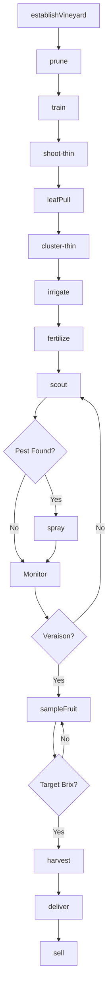
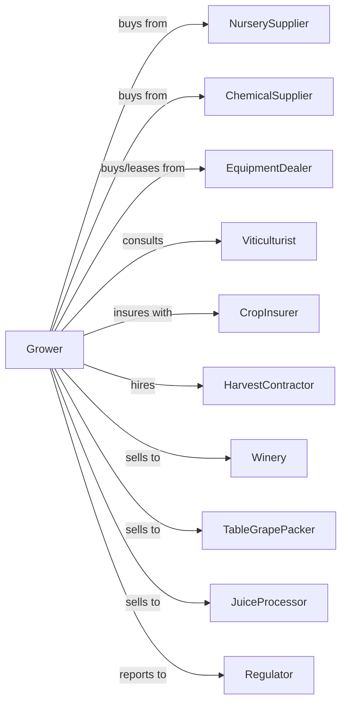

# Grape Vineyards

> Business-as-Code definition for grape vineyard operations. Models the cultivation of wine grapes, table grapes, and raisins from vine establishment through harvest and sale.

## Overview

Grape vineyard farming involves the cultivation of grapevines for wine production, fresh table grape markets, juice processing, and raisin production. This definition exposes actions for managing vine training, canopy management, irrigation, pest control, harvest timing based on brix and phenolic ripeness, and quality-based sales to wineries and packers.

## Actors

| Actor | Description |
|-------|-------------|
| NurserySupplier | Provides certified grapevines and rootstocks |
| EquipmentDealer | Sells and services tractors, sprayers, and harvesters |
| ChemicalSupplier | Provides fungicides, sulfur, and growth regulators |
| CropInsurer | Provides coverage for frost, hail, and smoke damage |
| Winery | Purchases wine grapes under contract or spot |
| TableGrapePacker | Packs and ships fresh grapes for retail |
| RaisinProcessor | Purchases grapes for drying or dry-on-vine |
| JuiceProcessor | Purchases grapes for juice production |
| Viticulturist | Advises on variety selection and canopy management |
| HarvestContractor | Provides picking crews or mechanical harvest |
| Regulator | Oversees pesticide use and labor compliance |

## Roles

| Role | Description |
|------|-------------|
| VineyardOwner | Owns land and makes variety and market decisions |
| VineyardManager | Coordinates seasonal operations and crew schedules |
| IrrigationManager | Schedules water application and deficit irrigation |
| SprayOperator | Applies fungicides and pest control materials |
| CropEstimator | Estimates yield for contracts and planning |
| HarvestCrewLead | Supervises picking operations |
| Bookkeeper | Manages contracts, payments, and compliance |
| CanopyManager | Positions shoots and removes leaves to optimize sun exposure and airflow |

## Entities

| Entity | Description |
|--------|-------------|
| Vineyard | Planted acreage of grapevines |
| Vine | Individual grapevine with variety and rootstock |
| Block | Section with uniform variety and clone |
| Variety | Grape cultivar (Cabernet, Chardonnay, Thompson, etc.) |
| Clone | Specific selection of a variety |
| Fruit | Grape clusters at various maturity stages |
| Brix | Sugar content measurement in degrees |
| Tonnage | Yield measured in tons per acre |
| Contract | Winery or packer purchase agreement |
| TrainingSystem | Trellis and pruning configuration |

## Actions

| Action | Description |
|--------|-------------|
| establishVineyard | Plant vines with trellis and irrigation |
| prune | Winter dormant pruning for bud load |
| train | Position shoots and manage canopy |
| shoot-thin | Remove excess shoots for vine balance |
| leafPull | Remove leaves for sun exposure and airflow |
| cluster-thin | Remove clusters to reduce yield for quality |
| irrigate | Apply water with deficit strategies |
| fertilize | Apply nutrients based on petiole analysis |
| scout | Monitor for mildew, mites, and other pests |
| spray | Apply sulfur, fungicides, or insecticides |
| sampleFruit | Test brix, pH, and phenolic ripeness |
| harvest | Pick grapes at optimal maturity |
| deliver | Transport fruit to winery or packer |
| sell | Execute sale based on quality metrics |

## Events

| Event | Description |
|-------|-------------|
| vineyardEstablished | New planting completed |
| pruned | Dormant pruning completed |
| budBreak | Buds beginning to open |
| trained | Shoot positioning completed |
| shootThinned | Excess shoots removed |
| leavesPulled | Leaf removal completed |
| clustersThinned | Excess clusters removed |
| irrigated | Water applied |
| fertilized | Nutrients applied |
| pestDetected | Mildew or pest pressure identified |
| sprayed | Treatment applied |
| veraison | Berries beginning color change |
| fruitSampled | Quality metrics tested |
| harvested | Grapes picked and binned |
| delivered | Fruit transported to buyer |
| sold | Sale transaction completed |

## Searches

| Search | Description |
|--------|-------------|
| findBlocks | List blocks by variety, clone, and appellation |
| getContracts | Retrieve active winery and packer contracts |
| checkWeather | Get frost, heat, and disease pressure forecast |
| getPrice | Get current prices by variety and quality tier |
| findBuyers | List wineries and packers seeking grapes |
| getYieldHistory | Retrieve yields by block and vintage |
| getSampleResults | Retrieve brix, pH, and TA by block |
| getHarvestWindow | Calculate optimal harvest timing |

## Workflow



## Actor Relationships



## Usage

### Calling Actions

```typescript
import { growGrapeVineyards } from '@headlessly/grow-grape-vineyards'

const vineyard = growGrapeVineyards()

// Sample wine grape maturity
const sample = await vineyard.sampleFruit({
  blockId: 'cabernet-block-7',
  tests: ['brix', 'pH', 'TA', 'anthocyanins']
})

// Harvest when quality targets met
if (sample.brix >= 24.5 && sample.pH <= 3.6) {
  await vineyard.harvest({
    blockId: 'cabernet-block-7',
    method: 'hand',
    binType: 'half-ton',
    destination: 'premium-winery'
  })
}

// Manage canopy for quality
await vineyard.leafPull({
  blockId: 'cabernet-block-7',
  side: 'morning-sun',
  timing: 'pre-veraison'
})
```

### Event-Driven Automation

```typescript
// Auto-spray for powdery mildew pressure
vineyard.pestDetected(async ({ blockId, pest, pressure }) => {
  if (pest === 'powderyMildew' && pressure >= 'moderate') {
    await vineyard.spray({
      blockId,
      product: 'sulfur',
      rate: 5.0,
      interval: 14
    })
  }
})

// Auto-notify winery when grapes ready
vineyard.fruitSampled(async ({ blockId, brix, pH, variety }) => {
  const contract = await vineyard.getContracts({ blockId })

  if (brix >= contract.targetBrix && pH >= contract.minPH) {
    await notifyWinery({
      winery: contract.winery,
      blockId,
      variety,
      estimatedTons: contract.estimatedYield,
      harvestWindow: '3-days'
    })
  }
})

// Calculate payment based on quality tiers
vineyard.delivered(async ({ lotId, brix, tons, variety }) => {
  const basePrice = await vineyard.getPrice({ variety })

  let bonus = 0
  if (brix >= 25) bonus += 50
  if (brix >= 26) bonus += 100

  await vineyard.sell({
    lotId,
    tons,
    pricePerTon: basePrice + bonus
  })
})
```

## Related

- [Berry (except Strawberry) Farming](./111334-BerryExceptStrawberryFarming.mdx)
- [Fruit and Tree Nut Combination Farming](./111336-FruitAndTreeNutCombinationFarming.mdx)
