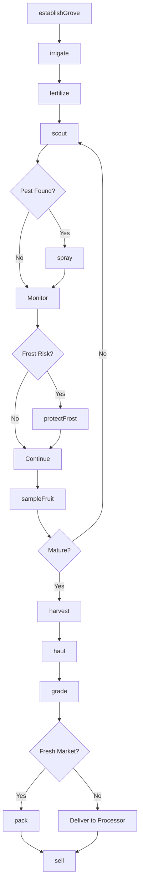
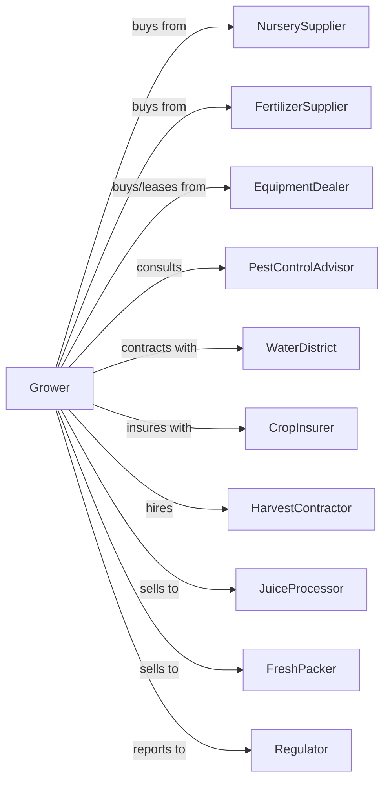

# Orange Groves

> Business-as-Code definition for orange grove operations. Models the complete production cycle from tree establishment through harvest, packing, and sale to processors and fresh markets.

## Overview

Orange grove farming involves the cultivation of citrus trees for fresh market oranges and juice processing. This definition exposes actions for managing grove establishment, irrigation, frost protection, pest management, harvest timing, and quality grading for varieties including Valencia, Navel, and Hamlin oranges.

## Actors

| Actor | Description |
|-------|-------------|
| NurserySupplier | Provides certified disease-free citrus trees |
| EquipmentDealer | Sells and services sprayers, harvesters, and irrigation |
| FertilizerSupplier | Provides citrus-specific fertilizer blends |
| CropInsurer | Provides coverage for freeze damage and hurricane loss |
| JuiceProcessor | Purchases oranges for concentrate and NFC juice |
| FreshPacker | Packs and ships oranges for retail markets |
| PestControlAdvisor | Advises on citrus greening and pest management |
| WaterDistrict | Provides irrigation water allocations |
| Regulator | Oversees citrus canker programs and food safety |
| HarvestContractor | Provides picking crews and equipment |

## Roles

| Role | Description |
|------|-------------|
| GroveOwner | Owns land and makes variety and marketing decisions |
| GroveManager | Coordinates irrigation, spraying, and harvest schedules |
| IrrigationTechnician | Manages drip or microjet systems |
| SprayOperator | Applies pesticides and foliar nutrients |
| HarvestCrewLead | Supervises picking operations |
| Bookkeeper | Manages contracts, pool settlements, and compliance |
| FrostProtectionOperator | Runs wind machines and heaters during freeze events |

## Entities

| Entity | Description |
|--------|-------------|
| Grove | Planted acreage of orange trees |
| Tree | Individual citrus tree with variety and age |
| Block | Section of grove with uniform variety and age |
| Irrigation | Microjet or drip water delivery system |
| Fruit | Oranges at various stages of maturity |
| Variety | Orange type (Valencia, Navel, Hamlin) |
| Contract | Forward sale or pool participation agreement |
| Yield | Boxes per acre or pounds solids per acre |
| Brix | Sugar content measurement for juice quality |
| Disease | Citrus greening, canker, or other threats |

## Actions

| Action | Description |
|--------|-------------|
| establishGrove | Plant new trees with proper spacing and rootstock |
| irrigate | Apply water through microjet or drip systems |
| fertilize | Apply citrus fertilizer blend on schedule |
| scout | Monitor for greening, pests, and nutrient deficiency |
| spray | Apply insecticides, fungicides, or foliar nutrients |
| protectFrost | Operate wind machines or heaters during freeze events |
| sampleFruit | Test Brix, acid ratio, and maturity |
| harvest | Pick fruit at optimal maturity for market |
| haul | Transport fruit from grove to packinghouse |
| grade | Sort fruit by size, color, and defects |
| pack | Place fruit in cartons for fresh market |
| deliver | Ship to processor or fresh market buyer |
| sell | Execute sale to processor, packer, or pool |
| removeTree | Remove diseased or unproductive trees |

## Events

| Event | Description |
|-------|-------------|
| groveEstablished | New trees planted and established |
| irrigated | Water applied to grove block |
| fertilized | Nutrients applied on schedule |
| pestDetected | Greening, psyllid, or other pest found |
| sprayed | Treatment applied to grove |
| frostWarning | Freeze event forecast for region |
| frostProtected | Frost protection measures activated |
| fruitSampled | Brix and maturity test completed |
| harvestReady | Fruit reached optimal maturity |
| harvested | Fruit picked and collected |
| hauled | Fruit transported to destination |
| graded | Quality classification completed |
| packed | Fruit packaged for shipment |
| sold | Sale transaction completed |
| treeRemoved | Diseased tree removed from grove |

## Searches

| Search | Description |
|--------|-------------|
| findBlocks | List blocks by variety, age, and yield history |
| getContracts | Retrieve active processor and packer contracts |
| checkWeather | Get freeze forecast and heat unit accumulation |
| getPrice | Get current prices by variety and grade |
| findBuyers | List processors and packers with needs |
| getYieldHistory | Retrieve yields by block and variety |
| getGreeningStatus | Check greening infection levels by block |
| getFrostRisk | Get freeze probability for grove location |

## Workflow



## Actor Relationships



## Usage

### Calling Actions

```typescript
import { growOranges } from '@headlessly/grow-oranges'

const grove = growOranges()

// Sample fruit for maturity
const sample = await grove.sampleFruit({
  blockId: 'block-12',
  variety: 'Valencia',
  tests: ['brix', 'acidRatio', 'color']
})

// Harvest when ready
if (sample.brix >= 11.5 && sample.acidRatio >= 13) {
  await grove.harvest({
    blockId: 'block-12',
    crew: 'harvest-team-a',
    destination: 'juice-processor'
  })
}

// Protect from frost
await grove.protectFrost({
  blocks: ['block-12', 'block-14'],
  method: 'wind-machine',
  triggerTemp: 32
})
```

### Event-Driven Automation

```typescript
// Auto-respond to frost warning
grove.frostWarning(async ({ blocks, forecastLow }) => {
  if (forecastLow <= 28) {
    await grove.protectFrost({
      blocks,
      method: 'wind-machine',
      duration: 'until-sunrise'
    })
  }
})

// Auto-harvest when maturity reached
grove.fruitSampled(async ({ blockId, brix, acidRatio, variety }) => {
  const targetBrix = variety === 'Valencia' ? 11.5 : 10.5

  if (brix >= targetBrix && acidRatio >= 12) {
    await grove.harvest({
      blockId,
      priority: 'high'
    })
  }
})

// Auto-sell to best market
grove.graded(async ({ lotId, grade, variety, boxes }) => {
  if (grade === 'Fancy') {
    await grove.sell({
      lotId,
      market: 'fresh',
      buyer: 'premium-packer'
    })
  } else {
    await grove.sell({
      lotId,
      market: 'juice',
      buyer: 'processor-pool'
    })
  }
})
```

## Related

- [Citrus (except Orange) Groves](./111320-CitrusExceptOrangeGroves.mdx)
- [Fruit and Tree Nut Combination Farming](./111336-FruitAndTreeNutCombinationFarming.mdx)
