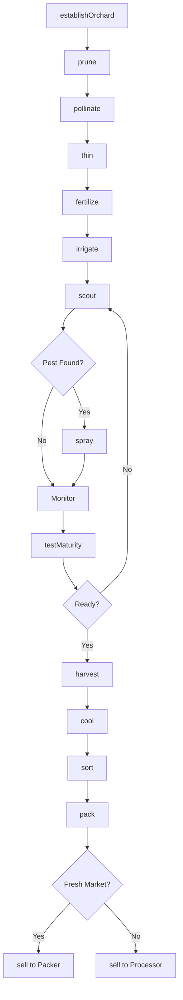
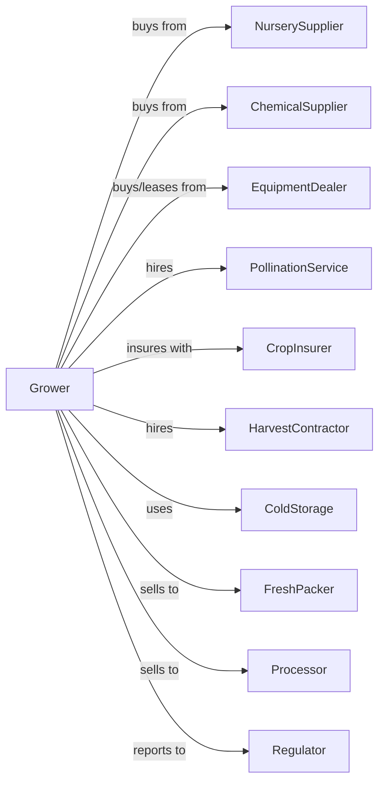

# Other Noncitrus Fruit Farming

> Business-as-Code definition for stone fruit and other noncitrus fruit production. Models the cultivation of peaches, cherries, plums, apricots, dates, figs, and tropical fruits.

## Overview

Other noncitrus fruit farming encompasses the production of stone fruits (peaches, cherries, plums, apricots, nectarines), tropical fruits (bananas, mangoes, papayas), and specialty fruits (dates, figs, kiwi, persimmons) for fresh market and processing. This definition exposes actions for managing diverse fruiting cycles, thinning, harvest timing, and post-harvest handling specific to each fruit type.

## Actors

| Actor | Description |
|-------|-------------|
| NurserySupplier | Provides fruit trees and rootstocks |
| EquipmentDealer | Sells and services orchard equipment and harvesters |
| ChemicalSupplier | Provides fungicides, insecticides, and growth regulators |
| CropInsurer | Provides coverage for frost, hail, and crop loss |
| FreshPacker | Packs and ships fruit for retail distribution |
| Processor | Purchases fruit for canning, drying, or freezing |
| PollinationService | Supplies bees for pollination-dependent crops |
| HarvestContractor | Provides picking crews and equipment |
| ColdStorage | Provides temperature-controlled storage |
| Regulator | Oversees food safety and pesticide compliance |

## Roles

| Role | Description |
|------|-------------|
| OrchardOwner | Owns land and makes variety and market decisions |
| OrchardManager | Coordinates seasonal operations and harvest |
| IrrigationManager | Schedules water for fruit development |
| SprayOperator | Applies pest control and growth regulators |
| ThinningCrew | Removes excess fruit for size and quality |
| HarvestCrewLead | Supervises picking operations |
| Bookkeeper | Manages sales, labor, and compliance |
| PackingLineSorter | Grades fruit by color, size, and defects on the packing line |

## Entities

| Entity | Description |
|--------|-------------|
| Orchard | Planted acreage of fruit trees |
| Tree | Individual fruit tree with variety and rootstock |
| Block | Section with uniform variety and age |
| Variety | Fruit cultivar with specific characteristics |
| Fruit | Product at various maturity stages |
| RootStock | Root system providing vigor and disease resistance |
| Contract | Sale agreement with quality specifications |
| Yield | Bins, lugs, or tons per acre |
| Grade | Quality classification by size, color, and condition |
| ChillHours | Accumulated cold needed for fruiting |

## Actions

| Action | Description |
|--------|-------------|
| establishOrchard | Plant trees with proper spacing and rootstock |
| prune | Shape trees and manage fruiting wood |
| pollinate | Place bee hives during bloom period |
| thin | Remove excess fruit for size and quality |
| fertilize | Apply nutrients based on leaf analysis |
| irrigate | Apply water for fruit development |
| scout | Monitor for brown rot, oriental fruit moth, and mites |
| spray | Apply fungicides, insecticides, or growth regulators |
| testMaturity | Sample fruit for firmness, sugar, and color |
| harvest | Pick fruit at optimal maturity stage |
| cool | Rapidly reduce temperature after harvest |
| sort | Grade fruit by size, color, and defects |
| pack | Package for fresh market or bulk for processor |
| sell | Execute sale to packer, processor, or direct |

## Events

| Event | Description |
|-------|-------------|
| orchardEstablished | New planting completed |
| pruned | Dormant pruning completed |
| bloomed | Trees in bloom |
| pollinated | Bee hives placed and active |
| thinned | Excess fruit removed |
| fertilized | Nutrients applied |
| irrigated | Water applied |
| pestDetected | Brown rot, moth, or other pest found |
| sprayed | Treatment applied |
| maturityTested | Harvest timing assessed |
| harvested | Fruit picked and collected |
| cooled | Temperature reduced to target |
| sorted | Quality grading completed |
| packed | Fruit packaged for market |
| sold | Sale transaction completed |

## Searches

| Search | Description |
|--------|-------------|
| findBlocks | List blocks by fruit type and variety |
| getContracts | Retrieve active buyer contracts |
| checkWeather | Get frost, rain, and harvest forecast |
| getPrice | Get current prices by fruit type and grade |
| findBuyers | List packers and processors with needs |
| getYieldHistory | Retrieve yields by block and variety |
| getChillHours | Check accumulated chill hours for region |
| getMaturityWindow | Calculate optimal harvest timing |

## Workflow



## Actor Relationships



## Usage

### Calling Actions

```typescript
import { growNoncitrusFruit } from '@headlessly/grow-noncitrus-fruit'

const orchard = growNoncitrusFruit()

// Test peach maturity
const maturity = await orchard.testMaturity({
  blockId: 'elberta-5',
  fruitType: 'peach',
  tests: ['firmness', 'brix', 'groundColor']
})

// Harvest when ready
if (maturity.firmness <= 14 && maturity.brix >= 11) {
  await orchard.harvest({
    blockId: 'elberta-5',
    crew: 'team-a',
    destination: 'fresh-packer'
  })
}

// Thin for premium size
await orchard.thin({
  blockId: 'elberta-5',
  method: 'hand',
  spacing: 6,
  timing: 'pit-hardening'
})
```

### Event-Driven Automation

```typescript
// Auto-spray for brown rot during wet weather
orchard.pestDetected(async ({ blockId, pest, conditions }) => {
  if (pest === 'brownRot' && conditions.wetHours >= 12) {
    await orchard.spray({
      blockId,
      product: 'captan',
      rate: 3.0,
      timing: 'immediate'
    })
  }
})

// Route fruit by quality and market
orchard.sorted(async ({ lotId, fruitType, grade, quantity }) => {
  if (grade === 'ExtraFancy') {
    await orchard.sell({
      lotId,
      market: 'premium-retail',
      packer: 'top-fruit-co'
    })
  } else if (grade === 'Choice') {
    await orchard.sell({
      lotId,
      market: 'foodservice'
    })
  } else {
    await orchard.sell({
      lotId,
      market: 'processor',
      buyer: 'canning-co'
    })
  }
})

// Track chill hour accumulation
orchard.chillHoursUpdated(async ({ location, accumulated, required }) => {
  if (accumulated >= required * 0.9) {
    await notifyManager({
      message: 'Chill hours nearly complete',
      accumulated,
      required
    })
  }
})
```

## Related

- [Apple Orchards](./111331-AppleOrchards.mdx)
- [Fruit and Tree Nut Combination Farming](./111336-FruitAndTreeNutCombinationFarming.mdx)
