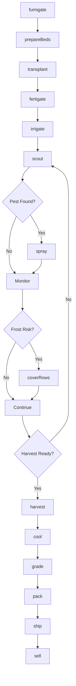
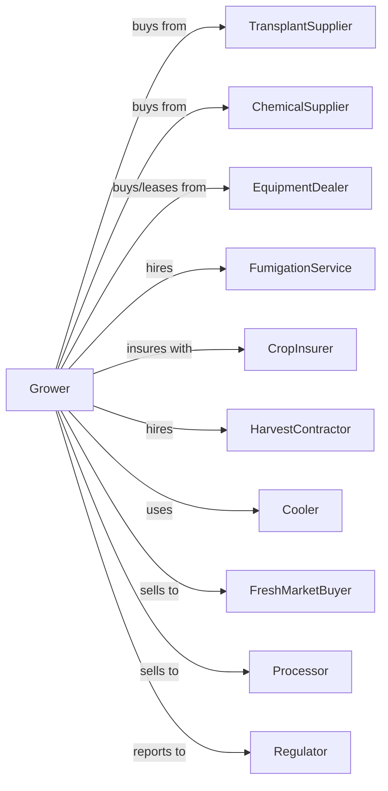

# Strawberry Farming

> Business-as-Code definition for strawberry production operations. Models the complete cycle from transplant setting through harvest, cooling, and sale to fresh and processing markets.

## Overview

Strawberry farming involves the intensive cultivation of strawberry plants for fresh market consumption and processing into frozen, pureed, and preserved products. This definition exposes actions for managing annual or perennial production systems, fumigation, transplanting, harvest scheduling with picking crews, and rapid cooling for quality preservation.

## Actors

| Actor | Description |
|-------|-------------|
| TransplantSupplier | Provides certified strawberry transplants |
| EquipmentDealer | Sells and services transplanters, sprayers, and coolers |
| FumigationService | Provides soil fumigation and plastic mulch application |
| ChemicalSupplier | Provides fungicides, insecticides, and fertilizers |
| CropInsurer | Provides coverage for weather and pest losses |
| FreshMarketBuyer | Purchases strawberries for retail distribution |
| Processor | Purchases fruit for freezing, pureeing, or preserving |
| Cooler | Provides forced-air cooling and cold storage |
| HarvestContractor | Provides picking crews and supervision |
| Regulator | Oversees food safety and labor compliance |

## Roles

| Role | Description |
|------|-------------|
| FarmOwner | Owns land and makes variety and market decisions |
| FarmManager | Coordinates planting schedules and harvest windows |
| IrrigationManager | Schedules water and fertigation application |
| SprayOperator | Applies pest control and foliar nutrients |
| HarvestCrewLead | Supervises picking and quality sorting |
| CoolerOperator | Manages rapid cooling and inventory |
| Bookkeeper | Manages labor, sales, and compliance records |
| FumigationOperator | Applies soil fumigants and manages plastic mulch beds before planting |

## Entities

| Entity | Description |
|--------|-------------|
| Crop | Strawberry variety being cultivated |
| Field | Production bed with plastic mulch and drip irrigation |
| Transplant | Certified plant material for field setting |
| Variety | Strawberry cultivar (short-day, day-neutral, etc.) |
| Bed | Raised row with plastic mulch and drip tape |
| Fruit | Strawberries at various maturity stages |
| Flat | Harvest container holding 8 pint clamshells |
| Cooler | Forced-air cooling facility |
| Contract | Sale agreement with quality and delivery specs |
| Grade | Quality classification by size, color, and condition |

## Actions

| Action | Description |
|--------|-------------|
| fumigate | Apply soil fumigant and install plastic mulch |
| prepareBeds | Form raised beds and install drip irrigation |
| transplant | Set plants at proper spacing and depth |
| fertigate | Apply nutrients through drip irrigation |
| irrigate | Apply water based on plant and weather needs |
| scout | Monitor for mites, botrytis, and other issues |
| spray | Apply fungicides, insecticides, or miticides |
| coverRows | Install frost protection tunnels or covers |
| harvest | Pick ripe fruit into clamshells or flats |
| cool | Rapidly reduce temperature with forced air |
| grade | Sort fruit by size, color, and defects |
| pack | Arrange clamshells on pallets for shipping |
| ship | Transport to buyer maintaining cold chain |
| sell | Execute sale to fresh market or processor |

## Events

| Event | Description |
|-------|-------------|
| fumigated | Soil treatment completed |
| bedsPrepared | Raised beds and drip installed |
| transplanted | Plants set in beds |
| fertigated | Nutrients applied through drip |
| irrigated | Water applied |
| pestDetected | Mites, botrytis, or other pest found |
| sprayed | Treatment applied |
| frostWarning | Freeze event forecast |
| rowsCovered | Frost protection deployed |
| harvestReady | Fruit reached optimal ripeness |
| harvested | Fruit picked and collected |
| cooled | Temperature reduced within target window |
| graded | Quality classification completed |
| packed | Pallets assembled for shipping |
| shipped | Product in transit |
| sold | Sale transaction completed |

## Searches

| Search | Description |
|--------|-------------|
| findFields | List fields by variety and production stage |
| getContracts | Retrieve active buyer contracts |
| checkWeather | Get frost and rain forecast |
| getPrice | Get current prices by grade and market |
| findBuyers | List fresh market and processor buyers |
| getYieldHistory | Retrieve yields by field and variety |
| getHarvestSchedule | Project daily picking volume |
| getCoolerInventory | Check cooled inventory by grade |

## Workflow



## Actor Relationships



## Usage

### Calling Actions

```typescript
import { growStrawberry } from '@headlessly/grow-strawberry'

const farm = growStrawberry()

// Prepare field with fumigation
await farm.fumigate({
  fieldId: 'block-a',
  fumigant: 'chloropicrin',
  rate: 300,
  mulchType: 'white-on-black'
})

// Transplant strawberries
await farm.transplant({
  fieldId: 'block-a',
  variety: 'camarosa',
  spacing: 12,
  rowsPerBed: 2,
  plantDate: '2024-10-15'
})

// Schedule harvest crew
await farm.harvest({
  fieldId: 'block-a',
  crew: 'team-alpha',
  targetFlats: 500,
  packStyle: 'clamshell-1lb'
})
```

### Event-Driven Automation

```typescript
// Auto-protect from frost
farm.frostWarning(async ({ fields, forecastLow }) => {
  if (forecastLow <= 32) {
    await farm.coverRows({
      fields,
      coverType: 'floating-row-cover',
      timing: 'before-sunset'
    })
  }
})

// Auto-spray for botrytis during wet weather
farm.pestDetected(async ({ fieldId, pest, conditions }) => {
  if (pest === 'botrytis' && conditions.humidity >= 80) {
    await farm.spray({
      fieldId,
      product: 'fenhexamid',
      rate: 1.5,
      timing: '10-bloom'
    })
  }
})

// Auto-route fruit by quality
farm.graded(async ({ lotId, grade, quantity }) => {
  if (grade === 'Fancy' && quantity >= 100) {
    await farm.sell({
      lotId,
      market: 'retail',
      buyer: 'premium-chain'
    })
  } else {
    await farm.sell({
      lotId,
      market: 'processor',
      buyer: 'frozen-fruit-co'
    })
  }
})
```

## Related

- [Berry (except Strawberry) Farming](./111334-BerryExceptStrawberryFarming.mdx)
- [Other Vegetable and Melon Farming](../1112-VegetableAndMelonFarming/111219-OtherVegetableExceptPotatoAndMelonFarming.mdx)
