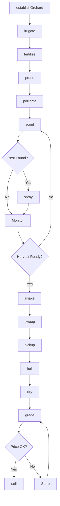
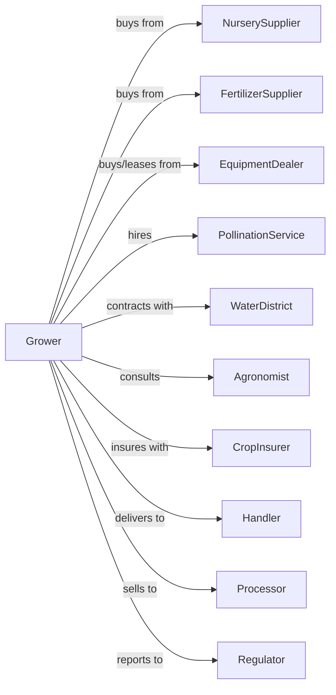

# Tree Nut Farming

> Business-as-Code definition for tree nut production operations. Models the cultivation of almonds, walnuts, pistachios, pecans, and hazelnuts from orchard establishment through harvest and sale.

## Overview

Tree nut farming involves the cultivation of permanent nut tree orchards for almonds, walnuts, pistachios, pecans, hazelnuts, and macadamia nuts. This definition exposes actions for orchard establishment, irrigation management, pollination, mechanical harvest, hulling, drying, and quality-based sales to handlers and processors.

## Actors

| Actor | Description |
|-------|-------------|
| NurserySupplier | Provides certified nut trees and rootstocks |
| EquipmentDealer | Sells and services shakers, sweepers, and harvesters |
| FertilizerSupplier | Provides nutrients and soil amendments |
| CropInsurer | Provides coverage for frost, disease, and yield losses |
| Handler | Purchases nuts and provides hulling, drying, and storage |
| Processor | Processes nuts for retail, food service, or export |
| PollinationService | Supplies honeybees for almond pollination |
| WaterDistrict | Provides irrigation water allocations |
| Agronomist | Advises on variety selection and orchard management |
| Regulator | Oversees food safety and marketing orders |

## Roles

| Role | Description |
|------|-------------|
| OrchardOwner | Owns land and makes variety and investment decisions |
| OrchardManager | Coordinates seasonal operations and harvest |
| IrrigationManager | Schedules water application using soil and plant data |
| SprayOperator | Applies pest control and foliar nutrients |
| HarvestCrewLead | Supervises shaking, sweeping, and pickup |
| Bookkeeper | Manages handler settlements and compliance |
| ShakerOperator | Drives tree shaker to dislodge mature nuts during harvest |

## Entities

| Entity | Description |
|--------|-------------|
| Orchard | Planted acreage of nut trees |
| Tree | Individual nut tree with variety and rootstock |
| Block | Section with uniform variety and age |
| Variety | Nut cultivar (Nonpareil, Chandler, Kerman, etc.) |
| Nut | Tree nuts at various maturity stages |
| Hull | Outer covering removed during processing |
| Shell | Hard covering protecting the kernel |
| Kernel | Edible nut meat sold for consumption |
| Contract | Handler or processor purchase agreement |
| Grade | Quality classification by size and defects |

## Actions

| Action | Description |
|--------|-------------|
| establishOrchard | Plant trees with proper spacing and pollinizers |
| irrigate | Apply water through microsprinkler or drip |
| fertilize | Apply nutrients based on leaf analysis |
| prune | Shape trees and manage canopy |
| pollinate | Place bee hives during almond bloom |
| scout | Monitor for navel orangeworm, mites, and disease |
| spray | Apply insecticides, fungicides, or growth regulators |
| shake | Use mechanical shaker to drop nuts from trees |
| sweep | Windrow nuts on orchard floor |
| pickup | Collect nuts with harvester for transport |
| hull | Remove outer hull from in-shell nuts |
| dry | Reduce moisture for safe storage |
| sell | Execute sale to handler or processor |
| grade | Assess kernel quality and defect levels |

## Events

| Event | Description |
|-------|-------------|
| orchardEstablished | New planting completed |
| irrigated | Water applied to orchard |
| fertilized | Nutrients applied |
| pruned | Tree shaping completed |
| bloomed | Trees in bloom period |
| pollinated | Bee hives placed and active |
| pestDetected | NOW, mites, or disease found |
| sprayed | Treatment applied |
| harvestReady | Hulls splitting and nuts mature |
| shaken | Nuts dropped from trees |
| swept | Nuts windrowed for pickup |
| pickedUp | Nuts collected and transported |
| hulled | Hulls removed from nuts |
| dried | Moisture reduced to target level |
| graded | Quality classification completed |
| sold | Sale transaction completed |

## Searches

| Search | Description |
|--------|-------------|
| findBlocks | List blocks by nut type and variety |
| getContracts | Retrieve active handler and processor contracts |
| checkWeather | Get frost, heat, and harvest condition forecast |
| getPrice | Get current prices by nut type and grade |
| findHandlers | List handlers with current pricing |
| getYieldHistory | Retrieve yields by block and variety |
| getWaterAllocation | Check irrigation water availability |
| getPestPressure | Get NOW and mite forecasts |

## Workflow



## Actor Relationships



## Usage

### Calling Actions

```typescript
import { growTreeNut } from '@headlessly/grow-tree-nut'

const orchard = growTreeNut()

// Schedule almond pollination
await orchard.pollinate({
  blocks: ['nonpareil-1', 'nonpareil-2', 'monterey-1'],
  hives: 200,
  hivesPerAcre: 2,
  timing: 'early-bloom'
})

// Harvest almonds
await orchard.shake({
  blockId: 'nonpareil-1',
  shaker: 'trunk-shake',
  crew: 'team-a'
})

await orchard.sweep({
  blockId: 'nonpareil-1',
  windrowPattern: 'center'
})

await orchard.pickup({
  blockId: 'nonpareil-1',
  destination: 'handler-facility'
})
```

### Event-Driven Automation

```typescript
// Auto-spray for navel orangeworm
orchard.pestDetected(async ({ blockId, pest, trapCount }) => {
  if (pest === 'NOW' && trapCount >= 10) {
    await orchard.spray({
      blockId,
      product: 'bifenthrin',
      rate: 12.0,
      timing: 'hull-split'
    })
  }
})

// Auto-irrigate based on soil moisture
orchard.irrigated(async ({ blockId, soilMoisture }) => {
  if (soilMoisture < 0.5) {
    await orchard.irrigate({
      blockId,
      hours: 12,
      frequency: 'weekly'
    })
  }
})

// Sell when market price reaches target
orchard.graded(async ({ lotId, nutType, grade, pounds }) => {
  const { perPound } = await orchard.getPrice({ nutType, grade })
  const targetPrice = getTargetPrice(nutType)

  if (perPound >= targetPrice) {
    await orchard.sell({
      lotId,
      handler: 'primary-handler',
      pounds,
      price: perPound
    })
  }
})
```

## Related

- [Fruit and Tree Nut Combination Farming](./111336-FruitAndTreeNutCombinationFarming.mdx)
- [Apple Orchards](./111331-AppleOrchards.mdx)
