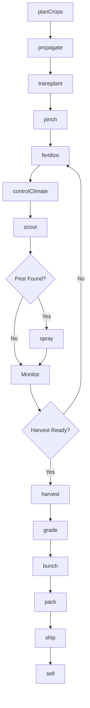
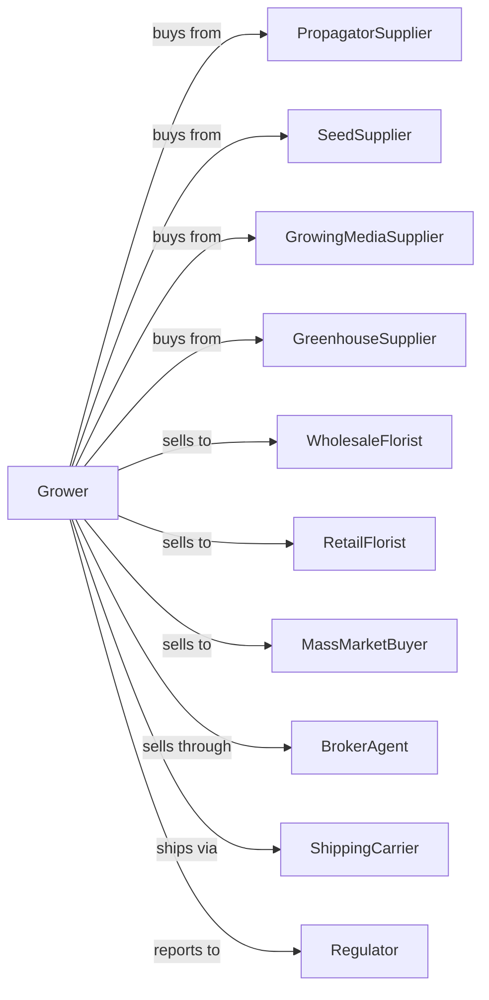

# Floriculture Production

> Business-as-Code definition for cut flower and potted plant production. Models greenhouse and field cultivation of roses, chrysanthemums, lilies, and flowering potted plants.

## Overview

Floriculture production involves the cultivation of cut flowers, cut greens, flowering potted plants, foliage plants, and bedding plants for wholesale and retail markets. This definition exposes actions for climate control, photoperiod management, timing for holiday markets, post-harvest handling, and quality grading for perishable floral products.

## Actors

| Actor | Description |
|-------|-------------|
| PropagatorSupplier | Provides cuttings, plugs, and young plants |
| SeedSupplier | Provides flower seeds and specialty varieties |
| GreenhouseSupplier | Sells and installs structures and equipment |
| GrowingMediaSupplier | Provides potting mixes and substrates |
| WholesaleFlorist | Purchases flowers for distribution |
| RetailFlorist | Purchases flowers for retail and event sales |
| MassMarketBuyer | Purchases for grocery and big-box retail |
| BrokerAgent | Facilitates sales between growers and buyers |
| ShippingCarrier | Provides temperature-controlled transport |
| Regulator | Oversees plant health and import compliance |

## Roles

| Role | Description |
|------|-------------|
| GreenhouseOwner | Owns facility and makes crop and market decisions |
| ProductionManager | Coordinates crop schedules for market timing |
| GrowingTechnician | Manages daily plant care and culture |
| ClimateOperator | Controls temperature, light, and humidity |
| HarvestCrew | Cuts flowers or harvests potted plants |
| PackingCrewLead | Oversees grading, bunching, and boxing |
| SalesCoordinator | Manages orders and customer relationships |
| Bookkeeper | Manages sales, costs, and compliance |
| PhotoperiodTechnician | Controls blackout curtains and supplemental lighting to trigger flowering |

## Entities

| Entity | Description |
|--------|-------------|
| Greenhouse | Controlled environment growing structure |
| Crop | Flower species or potted plant being grown |
| Cutting | Vegetative propagation material |
| Plug | Young plant for transplanting |
| Flower | Cut bloom ready for market |
| PottedPlant | Containerized flowering or foliage plant |
| Bunch | Grouped stems for wholesale |
| Box | Shipping container for cut flowers |
| Order | Customer purchase with delivery date |
| Holiday | Peak demand period (Valentine's, Mother's Day) |

## Actions

| Action | Description |
|--------|-------------|
| planCrops | Schedule plantings for target market dates |
| propagate | Root cuttings or germinate seeds |
| transplant | Move plugs to final growing position |
| pinch | Remove growing tip to promote branching |
| disbud | Remove side buds for single stem quality |
| fertilize | Apply nutrients for growth and bloom |
| controlClimate | Adjust temperature, light, and photoperiod |
| scout | Monitor for pests, disease, and quality issues |
| spray | Apply pest control or growth regulators |
| harvest | Cut flowers at target stage or finish potted plants |
| grade | Sort by stem length, bloom size, and quality |
| bunch | Group stems and sleeve for shipping |
| pack | Box flowers with cold chain materials |
| ship | Transport to buyers with temperature control |
| sell | Execute sale to florist, wholesaler, or retail |

## Events

| Event | Description |
|-------|-------------|
| cropsPlanned | Production schedule established |
| propagated | New plants started |
| transplanted | Plugs moved to production |
| pinched | Growing tips removed |
| disbudded | Side buds removed |
| fertilized | Nutrients applied |
| climateAdjusted | Environmental conditions changed |
| pestDetected | Pest or disease identified |
| sprayed | Treatment applied |
| harvestReady | Flowers at target stage |
| harvested | Cut or potted plants collected |
| graded | Quality sorting completed |
| bunched | Stems grouped for sale |
| packed | Product boxed for shipping |
| shipped | Product in transit |
| sold | Sale transaction completed |

## Searches

| Search | Description |
|--------|-------------|
| findCrops | List crops by species and market date |
| getOrders | Retrieve pending and confirmed orders |
| getInventory | Check available inventory by variety |
| getPrice | Get current wholesale prices |
| findBuyers | List florists and wholesalers |
| getProductionSchedule | View planting and harvest timeline |
| getHolidayCalendar | View peak demand periods |
| getQualityMetrics | Check grade distribution by variety |

## Workflow



## Actor Relationships



## Usage

### Calling Actions

```typescript
import { growFloriculture } from '@headlessly/grow-floriculture'

const greenhouse = growFloriculture()

// Plan Valentine's Day rose production
const plan = await greenhouse.planCrops({
  crop: 'rose',
  variety: 'freedom-red',
  targetDate: '2024-02-14',
  quantity: 50000,
  stemLength: '60cm'
})

// Control photoperiod for chrysanthemum
await greenhouse.controlClimate({
  cropId: 'mum-crop-1',
  dayLength: 10,
  nightTemp: 62,
  dayTemp: 72,
  blackCloth: true
})

// Grade and bunch cut flowers
await greenhouse.grade({
  harvestId: 'harvest-123',
  grades: ['Premium', 'Select', 'Standard'],
  stemLengths: ['70cm', '60cm', '50cm']
})
```

### Event-Driven Automation

```typescript
// Auto-adjust photoperiod for bloom timing
greenhouse.transplanted(async ({ cropId, targetBloomDate }) => {
  const vegetativeDays = calculateVegDays(targetBloomDate)

  await schedulePhotoperiodChange({
    cropId,
    shortDayStart: addDays(new Date(), vegetativeDays),
    dayLength: 10
  })
})

// Auto-pack for orders
greenhouse.graded(async ({ harvestId, grades, stems }) => {
  const orders = await greenhouse.getOrders({
    status: 'pending',
    variety: grades[0].variety
  })

  for (const order of orders) {
    if (stems >= order.quantity) {
      await greenhouse.pack({
        harvestId,
        orderId: order.id,
        quantity: order.quantity,
        boxType: order.packSpec
      })
    }
  }
})

// Auto-ship before holiday deadline
greenhouse.packed(async ({ orderId, deadline }) => {
  const hoursToDeadline = differenceInHours(deadline, new Date())

  if (hoursToDeadline <= 48) {
    await greenhouse.ship({
      orderId,
      carrier: 'overnight',
      priority: 'high'
    })
  }
})
```

## Related

- [Nursery and Tree Production](./111421-NurseryAndTreeProduction.mdx)
- [Other Food Crops Grown Under Cover](./111419-OtherFoodCropsGrownUnderCover.mdx)
