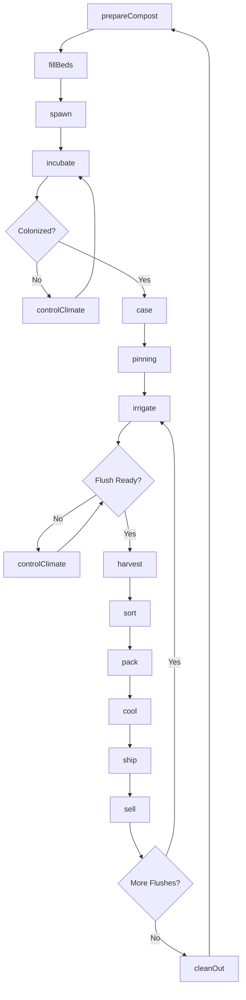
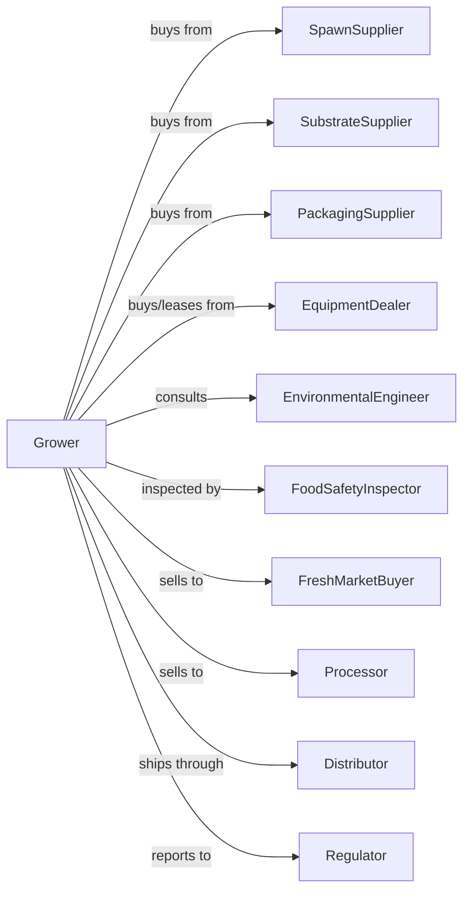

# Mushroom Production

> Business-as-Code definition for commercial mushroom cultivation. Models the controlled environment production of button, cremini, portobello, shiitake, and specialty mushrooms.

## Overview

Mushroom production involves the cultivation of edible fungi in controlled indoor environments including climate-controlled growing houses, caves, and specialized facilities. This definition exposes actions for substrate preparation, spawning, environmental control, flushing cycles, harvest scheduling, and quality grading for fresh and processed mushroom markets.

## Actors

| Actor | Description |
|-------|-------------|
| SpawnSupplier | Provides mushroom spawn (mycelium cultures) |
| SubstrateSupplier | Provides composted growing medium |
| EquipmentDealer | Sells and services climate control and harvest equipment |
| PackagingSupplier | Provides containers, overwrap, and packaging materials |
| FreshMarketBuyer | Purchases mushrooms for retail distribution |
| Processor | Purchases mushrooms for canning, drying, or freezing |
| Distributor | Handles logistics and distribution |
| EnvironmentalEngineer | Designs and maintains climate systems |
| FoodSafetyInspector | Certifies facility compliance |
| Regulator | Oversees food safety and labor compliance |

## Roles

| Role | Description |
|------|-------------|
| FacilityOwner | Owns growing facility and makes production decisions |
| ProductionManager | Coordinates growing cycles and harvest scheduling |
| EnvironmentalTechnician | Monitors and adjusts temperature, humidity, and CO2 |
| CompostManager | Oversees substrate preparation and quality |
| HarvestCrew | Picks mushrooms by hand at optimal size |
| PackingCrewLead | Supervises sorting, grading, and packaging |
| QualityManager | Ensures food safety and product standards |
| Bookkeeper | Manages sales, costs, and compliance records |
| SpawnMaker | Inoculates sterilized grain with mycelium culture for spawn production |

## Entities

| Entity | Description |
|--------|-------------|
| GrowingHouse | Controlled environment room for cultivation |
| Bed | Growing surface holding substrate |
| Substrate | Composted material for mushroom growth |
| Spawn | Mushroom mycelium used to inoculate substrate |
| Mushroom | Fruiting body at various stages of development |
| Flush | Harvest cycle producing multiple pickings |
| Climate | Temperature, humidity, and CO2 levels |
| Package | Container for retail or foodservice |
| Contract | Sale agreement with quality specifications |
| Grade | Quality classification by size and condition |

## Actions

| Action | Description |
|--------|-------------|
| prepareCompost | Create pasteurized growing substrate |
| fillBeds | Load substrate into growing beds |
| spawn | Inoculate substrate with mushroom mycelium |
| incubate | Maintain conditions for mycelium colonization |
| case | Apply casing layer to trigger fruiting |
| pinning | Manage conditions for pin formation |
| controlClimate | Adjust temperature, humidity, and CO2 |
| irrigate | Apply water misting for humidity |
| harvest | Pick mushrooms at target size |
| sort | Grade mushrooms by size and quality |
| pack | Package for retail or bulk |
| cool | Maintain cold chain for shelf life |
| ship | Transport to buyers |
| sell | Execute sale to buyer or distributor |
| cleanOut | Remove spent substrate and sanitize |

## Events

| Event | Description |
|-------|-------------|
| compostPrepared | Substrate ready for use |
| bedsFilled | Growing beds loaded with substrate |
| spawned | Mycelium inoculated into substrate |
| colonized | Mycelium fully grown through substrate |
| cased | Casing layer applied |
| pinned | Mushroom pins formed |
| climateAdjusted | Environmental settings changed |
| irrigated | Misting applied |
| flushMatured | Mushrooms reached harvest stage |
| harvested | Mushrooms picked |
| sorted | Quality grading completed |
| packed | Product packaged |
| cooled | Temperature reduced for storage |
| shipped | Product in transit |
| sold | Sale transaction completed |
| cleanedOut | Room sanitized for next cycle |

## Searches

| Search | Description |
|--------|-------------|
| findRooms | List growing rooms by cycle stage |
| getContracts | Retrieve active buyer contracts |
| getClimateStatus | Check environmental conditions by room |
| getPrice | Get current prices by mushroom type and grade |
| findBuyers | List fresh market and processor buyers |
| getYieldHistory | Retrieve yields by room and spawn |
| getFlushSchedule | Project harvest timing and volumes |
| getInventory | Check packed inventory by grade |

## Workflow



## Actor Relationships



## Usage

### Calling Actions

```typescript
import { growMushroom } from '@headlessly/grow-mushroom'

const farm = growMushroom()

// Check flush schedule and projected harvest volumes
const schedule = await farm.getFlushSchedule({ roomId: 'house-3' })

// Get climate conditions across growing rooms
const climate = await farm.getClimateStatus({ rooms: ['house-1', 'house-2', 'house-3'] })

// Start new growing cycle
await farm.prepareCompost({
  batch: 'batch-2024-01',
  ingredients: ['wheat-straw', 'horse-manure', 'gypsum'],
  pasteurizationTemp: 140,
  duration: 72
})

await farm.spawn({
  roomId: 'house-3',
  spawnType: 'white-button',
  rate: 1.5,
  method: 'through-mix'
})

// Control climate for pinning
await farm.controlClimate({
  roomId: 'house-3',
  temperature: 62,
  humidity: 90,
  co2: 800,
  airChanges: 6
})
```

### Event-Driven Automation

```typescript
// Auto-adjust climate based on growth stage
farm.colonized(async ({ roomId }) => {
  await farm.case({
    roomId,
    casingDepth: 1.5,
    material: 'peat-lime'
  })

  await farm.controlClimate({
    roomId,
    temperature: 64,
    humidity: 92,
    co2: 1000
  })
})

// Auto-schedule harvest based on pin development
farm.pinned(async ({ roomId, pinCount, daysToFlush }) => {
  await scheduleHarvest({
    roomId,
    estimatedDate: addDays(new Date(), daysToFlush),
    crew: 'harvest-team-a',
    estimatedPounds: calculateYield(pinCount)
  })
})

// Auto-sell based on quality grade
farm.sorted(async ({ lotId, mushroom, grade, pounds }) => {
  if (grade === 'Premium' && pounds >= 500) {
    await farm.sell({
      lotId,
      buyer: 'premium-retailer',
      price: 'contract'
    })
  } else {
    await farm.sell({
      lotId,
      buyer: 'foodservice-distributor',
      price: 'market'
    })
  }
})
```

## Related

- [Other Food Crops Grown Under Cover](./111419-OtherFoodCropsGrownUnderCover.mdx)
- [Nursery and Tree Production](./111421-NurseryAndTreeProduction.mdx)
