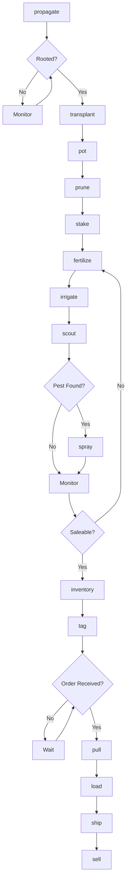
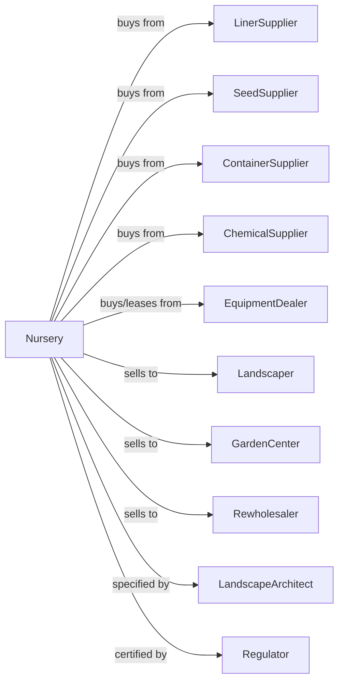

# Nursery and Tree Production

> Business-as-Code definition for ornamental nursery and tree production. Models the propagation and cultivation of trees, shrubs, perennials, and nursery stock.

## Overview

Nursery and tree production involves the propagation and growing of ornamental trees, shrubs, perennials, groundcovers, and container stock for landscape, retail, and wholesale markets. This definition exposes actions for propagation, transplanting, container management, field production, inventory control, and sales to landscapers, garden centers, and direct consumers.

## Actors

| Actor | Description |
|-------|-------------|
| LinerSupplier | Provides propagated liners and seedlings |
| SeedSupplier | Provides seeds for propagation |
| ContainerSupplier | Provides pots, containers, and growing media |
| EquipmentDealer | Sells and services nursery equipment |
| ChemicalSupplier | Provides fertilizers, pesticides, and growth regulators |
| Landscaper | Purchases plants for installation projects |
| GardenCenter | Retails plants to consumers |
| Rewholesaler | Distributes plants to regional markets |
| LandscapeArchitect | Specifies plants for projects |
| Regulator | Oversees plant health certification |

## Roles

| Role | Description |
|------|-------------|
| NurseryOwner | Owns facility and makes production decisions |
| ProductionManager | Coordinates growing schedules and inventory |
| PropagationTechnician | Manages cutting, seeding, and grafting |
| GrowingTechnician | Cares for plants in containers and fields |
| IrrigationManager | Schedules water and fertigation |
| SalesManager | Coordinates orders and customer relationships |
| ShippingCoordinator | Manages logistics and plant transport |
| Bookkeeper | Manages sales, inventory, and compliance |
| Grafter | Performs bud and graft unions to create desired rootstock-scion combinations |

## Entities

| Entity | Description |
|--------|-------------|
| Plant | Individual tree, shrub, or perennial |
| Container | Pot holding individual plant |
| Field | In-ground production area |
| Block | Section with uniform species and size |
| Liner | Small plant for growing on |
| Cutting | Vegetative propagation material |
| Rootstock | Root system for grafted plants |
| Inventory | Plants available by species and size |
| Order | Customer purchase request |
| Certificate | Plant health inspection documentation |

## Actions

| Action | Description |
|--------|-------------|
| propagate | Create new plants from seeds, cuttings, or grafts |
| transplant | Move plants to larger containers or fields |
| pot | Place plants in containers with growing media |
| prune | Shape plants for form and branching |
| stake | Support trees for straight trunk development |
| fertilize | Apply nutrients for growth |
| irrigate | Apply water based on plant needs |
| scout | Monitor for pests, diseases, and nutrient issues |
| spray | Apply pesticides or growth regulators |
| inventory | Count and categorize available stock |
| tag | Apply identification and pricing labels |
| pull | Select plants for customer orders |
| load | Prepare plants for shipment |
| ship | Transport plants to customers |
| sell | Execute sale to buyer |

## Events

| Event | Description |
|-------|-------------|
| propagated | New plants created |
| rooted | Cuttings developed root systems |
| transplanted | Plants moved to new containers |
| potted | Plants placed in containers |
| pruned | Plant shaping completed |
| staked | Support installed |
| fertilized | Nutrients applied |
| irrigated | Water applied |
| pestDetected | Pest or disease identified |
| sprayed | Treatment applied |
| inventoried | Stock count completed |
| tagged | Labels applied |
| orderReceived | Customer order placed |
| pulled | Plants selected for order |
| loaded | Shipment prepared |
| shipped | Plants in transit |
| sold | Sale transaction completed |

## Searches

| Search | Description |
|--------|-------------|
| findInventory | List available plants by species and size |
| getOrders | Retrieve pending and confirmed orders |
| checkAvailability | Verify stock for specific request |
| getPrice | Get pricing by species, size, and quantity |
| findCustomers | List landscapers, retailers, and wholesalers |
| getProductionSchedule | View transplant and potting timelines |
| getPropagationStatus | Check cutting and liner progress |
| getSalesHistory | Retrieve sales by customer and species |

## Workflow



## Actor Relationships



## Usage

### Calling Actions

```typescript
import { growNurseryTree } from '@headlessly/grow-nursery-tree'

const nursery = growNurseryTree()

// Propagate new crop of maples
await nursery.propagate({
  species: 'acer-rubrum',
  method: 'softwood-cutting',
  quantity: 5000,
  stockPlant: 'october-glory',
  timing: 'june'
})

// Transplant rooted liners to containers
await nursery.transplant({
  source: 'propagation-house',
  destination: 'container-yard-a',
  containerSize: '3-gallon',
  species: 'acer-rubrum',
  quantity: 2500
})

// Check inventory for customer inquiry
const available = await nursery.findInventory({
  species: 'acer-rubrum',
  minSize: '15-gallon',
  minCaliper: 2.0,
  minQuantity: 50
})
```

### Event-Driven Automation

```typescript
// Auto-transplant when liners are rooted
nursery.rooted(async ({ propagationId, species, rootedCount }) => {
  if (rootedCount >= 100) {
    await nursery.transplant({
      source: propagationId,
      species,
      quantity: rootedCount,
      containerSize: '1-gallon'
    })
  }
})

// Auto-pull orders when inventory available
nursery.orderReceived(async ({ orderId, items }) => {
  for (const item of items) {
    const available = await nursery.checkAvailability({
      species: item.species,
      size: item.size,
      quantity: item.quantity
    })

    if (available.sufficient) {
      await nursery.pull({
        orderId,
        item,
        location: available.locations[0]
      })
    }
  }
})

// Auto-ship when order is complete
nursery.pulled(async ({ orderId, complete }) => {
  if (complete) {
    await nursery.load({
      orderId,
      truckId: assignTruck(orderId)
    })

    await nursery.ship({
      orderId,
      carrier: 'nursery-fleet',
      deliveryDate: calculateDelivery(orderId)
    })
  }
})
```

## Related

- [Floriculture Production](./111422-FloricultureProduction.mdx)
- [Support Activities for Forestry](../../115-SupportActivitiesForAgricultureAndForestry/1153-SupportActivitiesForForestry/115310-SupportActivitiesForForestry.mdx)
