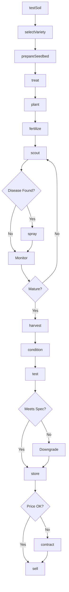
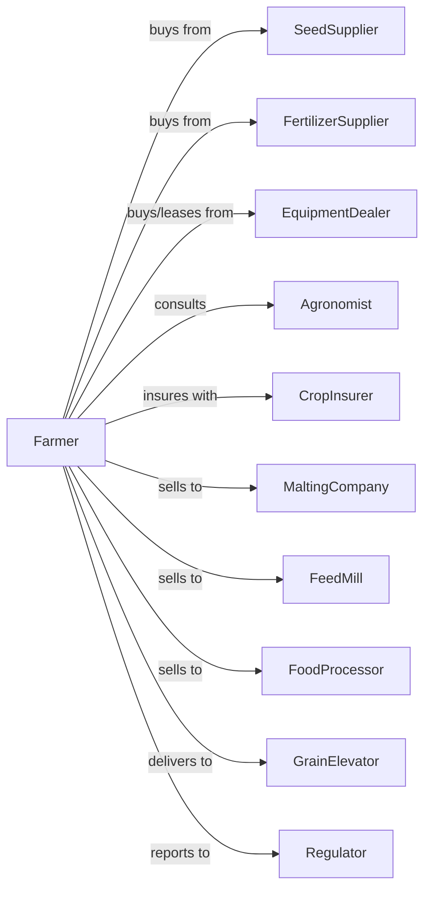

# All Other Grain Farming

> Business-as-Code definition for specialty grain production operations. Models the cultivation of barley, oats, sorghum, millet, rye, and wild rice.

## Overview

All other grain farming encompasses the production of cereal grains outside of wheat, corn, and rice, including barley for malting and feed, oats for food and livestock, grain sorghum for feed and ethanol, millet, rye, and wild rice. This definition exposes actions for managing specialty grain markets, malt barley quality specifications, and niche market access.

## Actors

| Actor | Description |
|-------|-------------|
| SeedSupplier | Provides certified seed for specialty grains |
| EquipmentDealer | Sells and services grain drills and combines |
| FertilizerSupplier | Provides nutrients for specialty grain needs |
| CropInsurer | Provides coverage for yield and quality losses |
| MaltingCompany | Purchases barley meeting malt specifications |
| FeedMill | Purchases grains for livestock feed production |
| FoodProcessor | Purchases oats, millet, or wild rice for food |
| GrainElevator | Receives and stores specialty grains |
| Agronomist | Advises on variety selection and management |
| Regulator | Oversees grain standards and farm programs |

## Roles

| Role | Description |
|------|-------------|
| FarmOwner | Owns land and selects specialty grain markets |
| FarmManager | Coordinates planting and harvest timing |
| EquipmentOperator | Operates drills, sprayers, and combines |
| Scout | Monitors for fusarium, smut, and other diseases |
| Bookkeeper | Tracks contracts and quality premiums |
| MaltBarleyGrader | Tests barley for plumpness, protein, and germination to meet malting specs |

## Entities

| Entity | Description |
|--------|-------------|
| Crop | Specialty grain being cultivated (barley, oats, etc.) |
| Field | Land parcel with soil type and rotation history |
| Seed | Certified variety with germination and purity specs |
| Soil | Growing medium with nutrient profile |
| Equipment | Drills and combines configured for grain type |
| Contract | Forward sale with quality specifications |
| Yield | Bushels or pounds per acre produced |
| Quality | Protein, plumpness, or other market specifications |
| Disease | Fusarium, smut, or other grain diseases |
| Input | Fertilizers, fungicides, and seed treatments |

## Actions

| Action | Description |
|--------|-------------|
| testSoil | Analyze nutrient levels and pH |
| selectVariety | Choose grain type and variety for market |
| prepareSeedbed | Till or manage residue for seed placement |
| treat | Apply seed treatment for disease protection |
| plant | Drill seed at proper depth and rate |
| fertilize | Apply nitrogen and other nutrients |
| scout | Monitor for disease, insects, and lodging risk |
| spray | Apply fungicides or herbicides as needed |
| harvest | Combine grain at optimal moisture |
| condition | Clean and dry grain to specification |
| test | Assess quality for market classification |
| store | Place grain in bins or deliver to buyer |
| sell | Execute sale to maltster, feed mill, or processor |
| contract | Secure forward sale with quality premiums |

## Events

| Event | Description |
|-------|-------------|
| soilTested | Nutrient analysis results received |
| varietySelected | Grain type and variety chosen |
| planted | Seed drilled into field |
| emerged | Seedlings visible above ground |
| fertilized | Nutrients applied |
| diseaseDetected | Fungal or other disease identified |
| sprayed | Treatment applied to field |
| harvested | Grain combined and collected |
| conditioned | Grain cleaned and dried |
| qualityTested | Market specifications assessed |
| stored | Grain placed in storage |
| sold | Sale transaction completed |
| contracted | Forward sale agreement secured |
| qualityRejected | Lot failed market specifications |

## Searches

| Search | Description |
|--------|-------------|
| findFields | List fields by grain history and soil type |
| getContracts | Retrieve active forward contracts |
| checkWeather | Get forecast for harvest windows |
| getPrice | Get cash price by grain type and grade |
| findBuyers | List maltsters, mills, and processors with bids |
| getYieldHistory | Retrieve yields by field and variety |
| getQualitySpecs | Retrieve buyer quality specifications |
| getMaltPremiums | Get malting barley premium schedules |

## Workflow



## Actor Relationships



## Usage

### Calling Actions

```typescript
import { farmGrain } from '@headlessly/farm-grain'

const farm = farmGrain()

// Test soil for barley production
const soilResults = await farm.testSoil({
  fieldId: 'creek-bottom',
  tests: ['nitrogen', 'phosphorus', 'pH', 'sulfur']
})

// Select malting barley variety
const variety = await farm.selectVariety({
  grain: 'barley',
  market: 'malting',
  traits: ['sixRow', 'lowProtein'],
  targetProtein: 12.5
})

// Plant at optimal rate
await farm.plant({
  fieldId: 'creek-bottom',
  varietyId: variety.id,
  seedingRate: 96,
  depth: 1.5,
  rowSpacing: 7
})
```

### Event-Driven Automation

```typescript
// Auto-respond to disease detection
farm.diseaseDetected(async ({ fieldId, disease, severity }) => {
  if (disease === 'fusarium' && severity >= 'moderate') {
    await farm.spray({
      fieldId,
      product: 'metconazole',
      rate: 4.0,
      timing: 'early-head'
    })
  }
})

// Auto-sell when quality meets malt specs
farm.qualityTested(async ({ lotId, grain, protein, plumpness }) => {
  if (grain === 'barley' && protein <= 13.5 && plumpness >= 80) {
    const { maltPremium } = await farm.getMaltPremiums()

    await farm.sell({
      lotId,
      buyer: 'malting-company',
      grade: 'select-malt',
      premium: maltPremium
    })
  }
})
```

## Related

- [Wheat Farming](./111140-WheatFarming.mdx)
- [Oilseed and Grain Combination Farming](./111191-OilseedAndGrainCombinationFarming.mdx)
