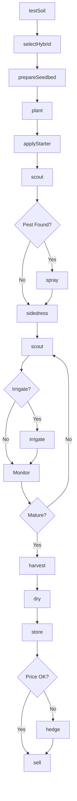
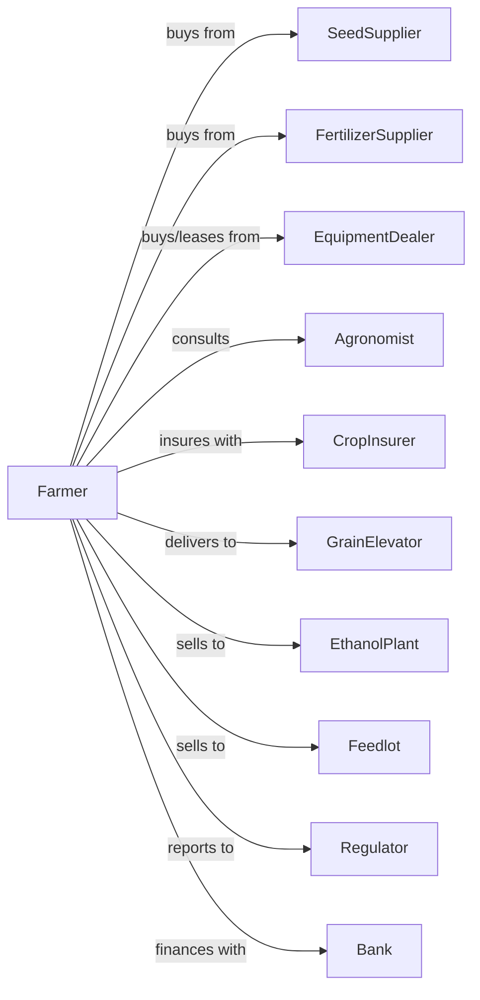

# Corn Farming

> Business-as-Code definition for field corn production operations. Models the complete crop lifecycle from hybrid selection through drying, storage, and sale.

## Overview

Corn farming involves the cultivation of field corn (grain corn) for livestock feed, ethanol production, food processing, and export. This definition exposes actions for managing hybrid selection, plant population, nitrogen management, and grain moisture optimization across the growing season.

## Actors

| Actor | Description |
|-------|-------------|
| SeedSupplier | Provides hybrid corn seed with trait packages |
| EquipmentDealer | Sells and services planters, sprayers, and combines |
| FertilizerSupplier | Provides nitrogen, phosphorus, potassium, and starter |
| CropInsurer | Provides coverage for yield and revenue losses |
| GrainElevator | Receives, dries, and stores corn |
| EthanolPlant | Purchases corn for ethanol production |
| Feedlot | Purchases corn for livestock feed |
| Agronomist | Advises on hybrid selection and fertility programs |
| Regulator | Oversees farm programs and biotechnology compliance |
| Bank | Provides operating loans and grain marketing tools |

## Roles

| Role | Description |
|------|-------------|
| FarmOwner | Owns land and makes hybrid and marketing decisions |
| FarmManager | Coordinates planting, application timing, and harvest |
| EquipmentOperator | Operates planters, sprayers, and combines |
| Scout | Monitors for rootworm, corn borer, and disease |
| Bookkeeper | Manages contracts, storage records, and hedging |
| GrainDryerOperator | Manages continuous-flow dryers and monitors kernel moisture removal |

## Entities

| Entity | Description |
|--------|-------------|
| Crop | Field corn with specific hybrid characteristics |
| Field | Land parcel with yield history and drainage |
| Hybrid | Seed variety with maturity rating and trait stack |
| Soil | Growing medium with nutrient holding capacity |
| Equipment | Planters, sprayers, combines, and grain carts |
| Contract | Forward sale or basis contract with buyer |
| Yield | Bushels per acre at standard moisture |
| Moisture | Water content percentage in harvested grain |
| Pest | Insects, diseases, or weeds affecting yield |
| Input | Fertilizers, seed treatments, and crop protection |

## Actions

| Action | Description |
|--------|-------------|
| testSoil | Analyze nutrient levels and recommend fertility |
| selectHybrid | Choose variety based on maturity, traits, and yield |
| prepareSeedbed | Till or strip-till for optimal planting conditions |
| plant | Place seed at target population and depth |
| applyStarter | Apply in-furrow or 2x2 starter fertilizer |
| sidedress | Apply nitrogen at V6 growth stage |
| scout | Monitor for insects, disease, and nutrient stress |
| spray | Apply herbicides, fungicides, or insecticides |
| irrigate | Apply water during critical growth stages |
| harvest | Combine corn and manage grain cart logistics |
| dry | Reduce moisture for safe storage |
| store | Place corn in bins with aeration and monitoring |
| sell | Execute sale to elevator, ethanol plant, or feedlot |
| hedge | Use futures and options to manage price risk |

## Events

| Event | Description |
|-------|-------------|
| soilTested | Nutrient analysis results received |
| hybridSelected | Corn hybrid chosen for field |
| planted | Seed placed in ground at target population |
| emerged | Corn seedlings visible in rows |
| starterApplied | In-furrow fertilizer applied |
| sidedressed | Nitrogen application completed |
| pestDetected | Insect or disease pressure identified |
| sprayed | Crop protection product applied |
| irrigated | Water applied to field |
| harvested | Corn combined and collected |
| dried | Moisture reduced to storage level |
| stored | Corn placed in storage bin |
| sold | Sale transaction completed |
| hedged | Futures or options position established |

## Searches

| Search | Description |
|--------|-------------|
| findFields | List fields by yield potential and drainage |
| getContracts | Retrieve active forward and basis contracts |
| checkWeather | Get forecast and growing degree days |
| getPrice | Get cash price, basis, and futures quotes |
| findBuyers | List elevators, ethanol plants, and feedlots |
| getYieldHistory | Retrieve yields by field and hybrid |
| getPestAlerts | Get regional pest and disease advisories |
| getDryingCosts | Calculate drying charges by moisture level |

## Workflow



## Actor Relationships



## Usage

### Calling Actions

```typescript
import { farmCorn } from '@headlessly/farm-corn'

const farm = farmCorn()

// Find fields by drainage and yield potential
const fields = await farm.findFields({ drainage: 'tiled', minYieldPotential: 200 })

// Check growing degree day forecast
const forecast = await farm.checkWeather({ location: 'river-bottom', metric: 'gdd' })

// Test soil for fertility needs
const soilResults = await farm.testSoil({
  fieldId: 'river-bottom',
  tests: ['nitrogen', 'phosphorus', 'potassium', 'zinc']
})

// Select appropriate hybrid
const hybrid = await farm.selectHybrid({
  maturity: 108,
  traits: ['rootwormResistant', 'droughtTolerant'],
  yieldEnvironment: 'high'
})

// Plant at optimal population
await farm.plant({
  fieldId: 'river-bottom',
  hybridId: hybrid.id,
  population: 34000,
  rowSpacing: 30,
  depth: 2.0
})
```

### Event-Driven Automation

```typescript
// Auto-respond to pest detection
farm.pestDetected(async ({ fieldId, pest, pressure }) => {
  if (pest === 'westernCornRootworm' && pressure === 'high') {
    await farm.spray({
      fieldId,
      product: 'bifenthrin',
      rate: 2.1,
      timing: 'beetle-emergence'
    })
  }
})

// Auto-sell when basis improves
farm.dried(async ({ binId, bushels, moisture }) => {
  const { cashPrice, basis } = await farm.getPrice()

  if (basis >= -0.15 && moisture <= 15) {
    await farm.sell({
      binId,
      quantity: bushels,
      deliveryPoint: 'local-elevator',
      deliveryWindow: '2-weeks'
    })
  }
})
```

## Related

- [Soybean Farming](./111110-SoybeanFarming.mdx)
- [Wheat Farming](./111140-WheatFarming.mdx)
