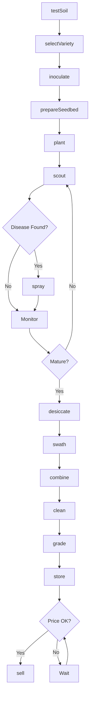
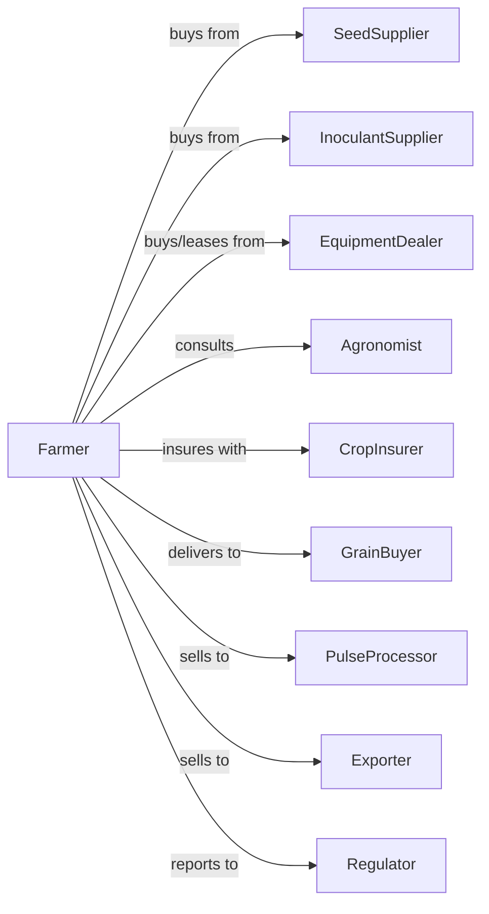

# Dry Pea and Bean Farming

> Business-as-Code definition for pulse crop production operations. Models the complete lifecycle from field preparation through processing and sale of dry peas, lentils, and beans.

## Overview

Dry pea and bean farming involves the cultivation of pulse crops including field peas, lentils, chickpeas, dry beans, and other legumes for human consumption, animal feed, and export markets. This definition exposes actions for nitrogen-fixing crop management, quality grading, and specialty market access.

## Actors

| Actor | Description |
|-------|-------------|
| SeedSupplier | Provides certified pulse seed varieties and inoculants |
| EquipmentDealer | Sells and services seeders, sprayers, and pulse-ready combines |
| InoculantSupplier | Provides rhizobium bacteria for nitrogen fixation |
| CropInsurer | Provides coverage for weather and yield losses |
| PulseProcessor | Cleans, splits, and packages pulses for market |
| Exporter | Purchases pulses for international markets |
| Agronomist | Advises on variety selection and disease management |
| GrainBuyer | Purchases raw pulses at delivery points |
| Regulator | Oversees food safety and organic certification |

## Roles

| Role | Description |
|------|-------------|
| FarmOwner | Owns land and decides on crop rotation |
| FarmManager | Coordinates planting, scouting, and harvest timing |
| EquipmentOperator | Operates air seeders, sprayers, and combines |
| Scout | Monitors for ascochyta, root rot, and weed pressure |
| Bookkeeper | Manages contracts, payments, and compliance records |
| SeedInoculator | Applies rhizobium culture to seed for nitrogen fixation |

## Entities

| Entity | Description |
|--------|-------------|
| Crop | The pulse species being grown (peas, lentils, beans) |
| Field | Land parcel with rotation history and soil characteristics |
| Seed | Certified seed with variety, size, and germination rate |
| Inoculant | Rhizobium bacteria applied to seed for nitrogen fixation |
| Soil | Growing medium with residual nitrogen and disease history |
| Equipment | Machinery configured for delicate pulse harvest |
| Contract | Forward sale agreement with grade and delivery specifications |
| Yield | Production in bushels or pounds per acre |
| Grade | Quality classification based on size, color, and damage |
| Disease | Fungal or bacterial threats like ascochyta or root rot |

## Actions

| Action | Description |
|--------|-------------|
| testSoil | Analyze residual nitrogen and disease pressure |
| selectVariety | Choose pulse type based on market demand and rotation |
| inoculate | Apply rhizobium bacteria to seed before planting |
| prepareSeedbed | Create firm, level seedbed for uniform emergence |
| plant | Seed at proper depth and rate for stand establishment |
| scout | Monitor for disease, insects, and weed competition |
| spray | Apply fungicides for ascochyta or herbicides for weeds |
| desiccate | Apply pre-harvest desiccant for uniform dry-down |
| swath | Cut crop into windrows for field drying |
| combine | Harvest dried crop with gentle cylinder settings |
| clean | Remove splits, foreign material, and off-grade seed |
| store | Place in aerated bins at safe moisture levels |
| sell | Execute sale to processor, exporter, or buyer |
| grade | Assess quality based on size, color, and damage factors |

## Events

| Event | Description |
|-------|-------------|
| soilTested | Soil analysis results received |
| varietySelected | Pulse type and variety chosen for season |
| inoculated | Seed treated with rhizobium bacteria |
| planted | Seeds placed in ground at target population |
| diseaseDetected | Scouting identified disease requiring treatment |
| sprayed | Fungicide or herbicide application completed |
| desiccated | Pre-harvest desiccant applied |
| swathed | Crop cut and placed in windrows |
| combined | Pulse crop harvested and collected |
| cleaned | Foreign material and splits removed |
| stored | Pulses placed in storage facility |
| sold | Sale transaction completed |
| graded | Quality classification assigned |
| exported | Shipment cleared for international delivery |

## Searches

| Search | Description |
|--------|-------------|
| findFields | List fields with pulse rotation history and disease risk |
| getContracts | Retrieve active forward contracts and delivery schedules |
| checkWeather | Get forecast and precipitation for harvest planning |
| getPrice | Get current prices by grade and delivery point |
| findBuyers | List processors and exporters with current bids |
| getYieldHistory | Retrieve historical yields by field and variety |
| getDiseaseAlerts | Get regional disease advisories for pulse crops |
| getGradeSpecs | Retrieve grade standards and tolerance levels |

## Workflow



## Actor Relationships



## Usage

### Calling Actions

```typescript
import { farmDryPea } from '@headlessly/farm-dry-pea'

const farm = farmDryPea()

// Test soil for residual nitrogen
const soilResults = await farm.testSoil({
  fieldId: 'east-160',
  tests: ['nitrogen', 'pH', 'diseaseHistory']
})

// Select variety and inoculate
const variety = await farm.selectVariety({
  crop: 'lentil',
  type: 'red',
  maturityDays: 95
})

await farm.inoculate({
  seedLot: variety.seedLot,
  inoculant: 'granular-rhizobium',
  rate: 4.5
})

// Plant with proper settings
await farm.plant({
  fieldId: 'east-160',
  varietyId: variety.id,
  seedingRate: 88,
  depth: 1.5,
  rowSpacing: 9
})
```

### Event-Driven Automation

```typescript
// Auto-respond to disease detection
farm.diseaseDetected(async ({ fieldId, disease, severity }) => {
  if (disease === 'ascochyta' && severity >= 'moderate') {
    await farm.spray({
      fieldId,
      product: 'chlorothalonil',
      rate: 1.5,
      timing: 'early-flower'
    })
  }
})

// Auto-sell at target price and grade
farm.graded(async ({ lotId, grade, quantity }) => {
  const { perBushel } = await farm.getPrice({ crop: 'lentil', grade })

  if (grade === '1CAN' && perBushel >= 0.32) {
    await farm.sell({
      lotId,
      quantity,
      buyer: 'pulse-processor',
      deliveryWindow: '60-days'
    })
  }
})
```

## Related

- [All Other Grain Farming](./111199-AllOtherGrainFarming.mdx)
- [Oilseed and Grain Combination Farming](./111191-OilseedAndGrainCombinationFarming.mdx)
