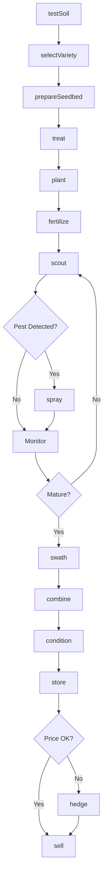
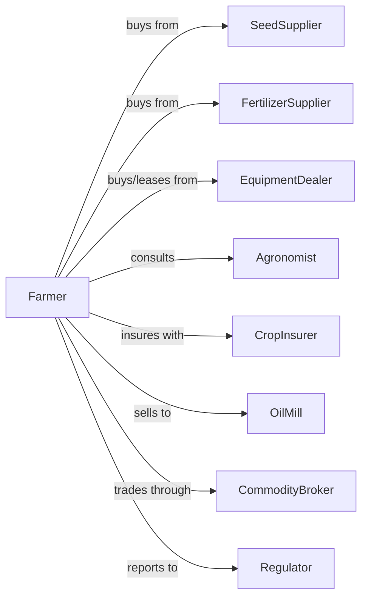

# Oilseed (except Soybean) Farming

> Business-as-Code definition for non-soybean oilseed production operations. Models the complete crop lifecycle from field preparation through oil extraction or seed sale.

## Overview

Oilseed farming encompasses the cultivation of sunflower, canola, safflower, flax, sesame, and rapeseed for oil extraction, food products, and industrial applications. This definition exposes actions for each phase of production, events for workflow automation, and searches for market and agronomic data retrieval.

## Actors

| Actor | Description |
|-------|-------------|
| SeedSupplier | Provides certified oilseed varieties and hybrid selections |
| EquipmentDealer | Sells and services planting, spraying, and harvesting equipment |
| FertilizerSupplier | Provides nitrogen, phosphorus, sulfur, and micronutrients |
| CropInsurer | Provides coverage against weather events and yield losses |
| OilMill | Purchases oilseeds for crushing and oil extraction |
| CommodityBroker | Facilitates futures trading and forward contracts |
| Agronomist | Advises on variety selection, pest management, and fertility |
| Regulator | Oversees food safety, organic certification, and farm programs |
| Bank | Provides operating capital and equipment financing |

## Roles

| Role | Description |
|------|-------------|
| FarmOwner | Owns land and makes strategic cropping decisions |
| FarmManager | Coordinates planting schedules, input purchases, and marketing |
| EquipmentOperator | Operates seeders, sprayers, swathers, and combines |
| Scout | Monitors fields for insects, disease, and weed pressure |
| Bookkeeper | Tracks expenses, revenue, and compliance documentation |
| SwatherOperator | Cuts and windrows canola and sunflower for field drying before combine |

## Entities

| Entity | Description |
|--------|-------------|
| Crop | The oilseed species being cultivated (canola, sunflower, etc.) |
| Field | A parcel of land with defined boundaries and soil characteristics |
| Seed | Planting material including variety, treatment, and germination rate |
| Soil | Growing medium with organic matter, pH, and nutrient profile |
| Equipment | Machinery for tillage, planting, application, and harvest |
| Contract | Forward sale agreement specifying price, quality, and delivery |
| Yield | Production quantity measured in bushels or pounds per acre |
| OilContent | Percentage of extractable oil in harvested seed |
| Pest | Insects, diseases, or weeds threatening crop health |
| Input | Fertilizers, herbicides, fungicides, and seed treatments |

## Actions

| Action | Description |
|--------|-------------|
| testSoil | Analyze nutrient levels, pH, and organic matter content |
| selectVariety | Choose oilseed type and hybrid based on climate and market |
| prepareSeedbed | Till or apply residue management for optimal germination |
| treat | Apply seed treatment for disease and insect protection |
| plant | Place seeds at proper depth, spacing, and population |
| fertilize | Apply nitrogen, phosphorus, sulfur, and boron as needed |
| scout | Monitor for flea beetles, sclerotinia, blackleg, and weeds |
| spray | Apply herbicides, fungicides, or insecticides |
| swath | Cut mature crop and lay in windrows for drying |
| combine | Harvest dried crop and separate seed from chaff |
| condition | Clean, dry, and prepare seed for storage or sale |
| store | Place harvested oilseed in bins with aeration |
| sell | Execute sale to crusher, exporter, or end user |
| hedge | Use futures or options to manage price risk |

## Events

| Event | Description |
|-------|-------------|
| soilTested | Soil analysis results received from laboratory |
| varietySelected | Oilseed type and hybrid chosen for season |
| seedbedPrepared | Field ready for planting operations |
| planted | Seeds placed in ground at target population |
| fertilized | Nutrients applied according to recommendations |
| pestDetected | Scouting identified actionable pest pressure |
| sprayed | Crop protection product applied to field |
| swathed | Crop cut and placed in windrows |
| combined | Seed harvested and collected in grain cart |
| conditioned | Seed cleaned and dried to safe moisture |
| stored | Oilseed placed in storage facility |
| sold | Sale transaction completed with buyer |
| hedged | Futures or options position established |
| qualityGraded | Oil content and damage factors assessed |

## Searches

| Search | Description |
|--------|-------------|
| findFields | List fields filtered by crop history, soil type, or size |
| getContracts | Retrieve active forward contracts and delivery schedules |
| checkWeather | Get forecast and accumulated heat units for locations |
| getPrice | Get current cash price and futures basis for oilseeds |
| findBuyers | List crushers, exporters, and processors with bids |
| getYieldHistory | Retrieve historical yields by field and variety |
| getPestAlerts | Get regional pest and disease advisories |
| getOilPremiums | Retrieve premiums for high-oleic or specialty varieties |

## Workflow



## Actor Relationships



## Usage

### Calling Actions

```typescript
import { farmOilseed } from '@headlessly/farm-oilseed'

const farm = farmOilseed()

// Test soil before planting
const soilResults = await farm.testSoil({
  fieldId: 'west-quarter',
  tests: ['nitrogen', 'phosphorus', 'sulfur', 'pH']
})

// Select appropriate variety
const variety = await farm.selectVariety({
  crop: 'canola',
  traitProfile: ['herbicideTolerant', 'clubrootResistant'],
  maturityDays: 105
})

// Plant when conditions are right
await farm.plant({
  fieldId: 'west-quarter',
  varietyId: variety.id,
  seedingRate: 5.5,
  rowSpacing: 10,
  depth: 0.75
})
```

### Event-Driven Automation

```typescript
// Auto-respond to pest detection
farm.pestDetected(async ({ fieldId, pestType, threshold }) => {
  if (threshold === 'economic') {
    await farm.spray({
      fieldId,
      product: recommendProduct(pestType),
      rate: getLabelRate(pestType)
    })
  }
})

// Auto-sell at target price
farm.combined(async ({ bushels, oilContent }) => {
  const { perBushel } = await farm.getPrice({ crop: 'canola' })

  if (perBushel >= 16.00 && oilContent >= 44) {
    await farm.sell({
      quantity: bushels,
      deliveryPoint: 'local-crusher',
      deliveryWindow: '30-days'
    })
  }
})
```

## Related

- [Soybean Farming](./111110-SoybeanFarming.mdx)
- [Oilseed and Grain Combination Farming](./111191-OilseedAndGrainCombinationFarming.mdx)
