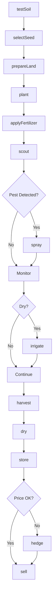
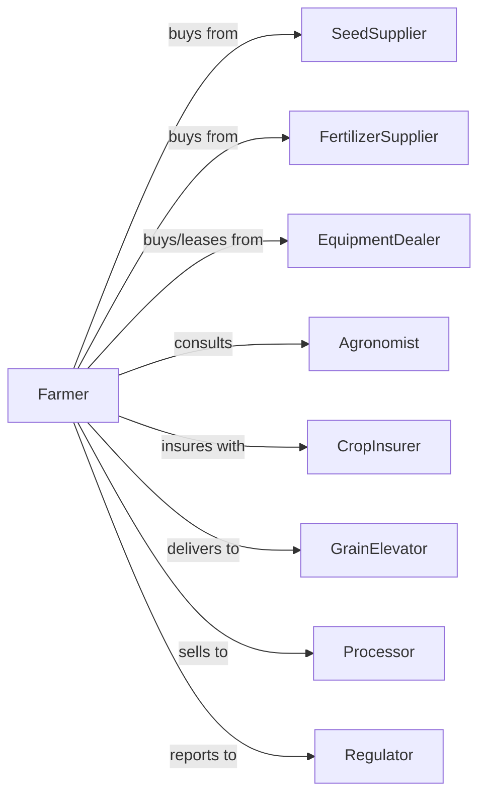

# Soybean Farming

> Business-as-Code definition for soybean production operations. Models the complete crop lifecycle from soil preparation through sale.

## Overview

Soybean farming in the grain belt involves oilseed production for food processing, animal feed, and biodiesel. This definition exposes actions for each phase of the growing season, events for workflow automation, and searches for data retrieval.

## Actors

| Actor | Description |
|-------|-------------|
| SeedSupplier | Provides certified seeds and seed treatments |
| EquipmentDealer | Sells and services farming machinery |
| FertilizerSupplier | Provides nutrients and soil amendments |
| CropInsurer | Provides coverage against crop loss and weather events |
| GrainElevator | Receives, stores, and trades harvested grain |
| Processor | Purchases grain for processing into oil, meal, or food products |
| Agronomist | Provides crop consulting and soil management advice |
| Regulator | Oversees farming practices and administers subsidies |
| Bank | Provides operating loans and land financing |

## Roles

| Role | Description |
|------|-------------|
| FarmOwner | Owns the land and makes strategic decisions |
| FarmManager | Oversees daily operations and coordinates activities |
| EquipmentOperator | Operates tractors, combines, and other machinery |
| FieldWorker | Performs manual labor including scouting and maintenance |
| Bookkeeper | Manages financial records, payroll, and tax reporting |
| SeedTreater | Applies inoculant and fungicide coatings to seed before planting |

## Entities

| Entity | Description |
|--------|-------------|
| Crop | The cultivated plant being grown |
| Field | A parcel of land used for cultivation |
| Seed | Planting material with specific variety and traits |
| Soil | The growing medium with specific composition and health |
| Equipment | Machinery used for planting, cultivating, and harvesting |
| Contract | Agreement for future delivery at set price |
| Yield | Quantity produced per acre |
| Weather | Environmental conditions affecting growth |
| Pest | Insects or diseases that threaten crop health |
| Input | Fertilizers, chemicals, and other applied materials |

## Actions

| Action | Description |
|--------|-------------|
| testSoil | Analyze soil composition, pH, and nutrient levels before planting |
| selectSeed | Choose variety based on climate, soil, and market demand |
| prepareLand | Till, level, and condition fields for planting |
| plant | Place seeds at optimal depth and spacing |
| applyFertilizer | Apply nutrients based on soil test recommendations |
| scout | Monitor for pest pressure, disease, and growth stage |
| irrigate | Apply water during dry periods |
| spray | Apply pest or weed control products |
| harvest | Combine mature crop and collect in grain cart |
| dry | Reduce moisture content for safe storage |
| store | Place harvested grain in bins or deliver to elevator |
| sell | Execute sale to buyer at current or contracted price |
| hedge | Use futures contracts to lock in selling price |
| fileClaim | Report crop loss and request insurance payout |

## Events

| Event | Description |
|-------|-------------|
| soilTested | Soil analysis results are available |
| seedSelected | Variety has been chosen for the season |
| landPrepared | Fields are ready for planting |
| planted | Seeds have been placed in the ground |
| fertilizerApplied | Nutrients have been applied to fields |
| pestDetected | Scouting identified pest or disease pressure |
| irrigated | Water has been applied to crops |
| sprayed | Treatment completed |
| harvested | Crop has been combined and collected |
| dried | Moisture reduced to storage-safe levels |
| stored | Grain placed in storage facility |
| sold | Sale transaction completed |
| hedged | Futures position established |
| claimFiled | Loss report submitted to insurer |

## Searches

| Search | Description |
|--------|-------------|
| findFields | List fields with filters for size, soil type, or history |
| getContracts | Retrieve active delivery contracts and terms |
| checkWeather | Get forecast and historical weather for locations |
| getPrice | Get current market price and basis |
| findBuyers | List potential buyers and current bids |
| getYieldHistory | Retrieve historical yields by field and variety |
| getPestAlerts | Get current pest and disease warnings for region |

## Workflow



## Actor Relationships



## Usage

### Calling Actions

```typescript
import { farmSoybean } from '@headlessly/farm-soybean'

const farm = farmSoybean()

// Test soil before planting
const soilResults = await farm.testSoil({
  fieldId: 'north-40',
  tests: ['pH', 'nitrogen', 'phosphorus', 'potassium']
})

// Select appropriate variety
const seed = await farm.selectSeed({
  maturityGroup: 2.5,
  traits: ['herbicideTolerant', 'nematodeResistant'],
  targetYield: 55
})

// Plant when conditions are right
await farm.plant({
  fieldId: 'north-40',
  seedId: seed.id,
  population: 140000,
  rowSpacing: 30,
  depth: 1.5
})
```

### Event-Driven Automation

```typescript
// Auto-respond to pest detection
farm.pestDetected(async ({ fieldId, pestType, severity }) => {
  if (severity === 'high') {
    await farm.spray({
      fieldId,
      product: recommendProduct(pestType),
      rate: getRate(pestType, severity)
    })
  }
})

// Auto-sell at target price
farm.harvested(async ({ bushels }) => {
  const { perBushel } = await farm.getPrice()

  if (perBushel >= 14.00) {
    await farm.sell({
      quantity: bushels,
      deliveryWindow: '2-weeks'
    })
  }
})
```

## Related

- [Corn Farming](./111150-CornFarming.mdx)
- [Wheat Farming](./111140-WheatFarming.mdx)
