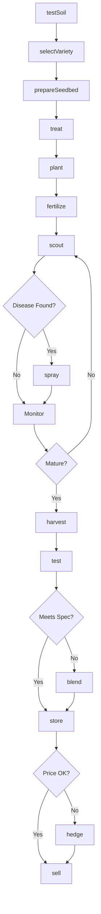
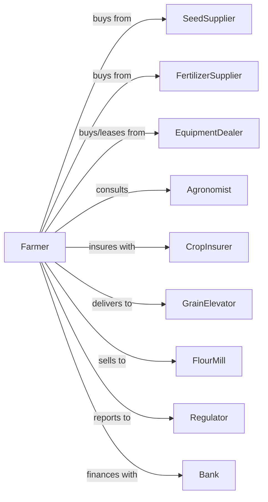

# Wheat Farming

> Business-as-Code definition for wheat production operations. Models the complete crop lifecycle from variety selection through milling quality assessment and sale.

## Overview

Wheat farming involves the cultivation of winter and spring wheat varieties for flour milling, feed, and export markets. This definition exposes actions for managing protein content, test weight optimization, and class-specific quality standards for hard red, soft red, hard white, and durum wheat.

## Actors

| Actor | Description |
|-------|-------------|
| SeedSupplier | Provides certified seed of registered wheat varieties |
| EquipmentDealer | Sells and services drills, sprayers, and combines |
| FertilizerSupplier | Provides nitrogen, phosphorus, and micronutrients |
| CropInsurer | Provides coverage for weather events and yield losses |
| GrainElevator | Receives, grades, and stores wheat by class |
| FlourMill | Purchases wheat meeting milling specifications |
| Agronomist | Advises on variety selection and nitrogen management |
| Regulator | Oversees grades, standards, and farm programs |
| Bank | Provides operating loans and marketing assistance |

## Roles

| Role | Description |
|------|-------------|
| FarmOwner | Owns land and selects wheat class for rotation |
| FarmManager | Coordinates planting timing, inputs, and harvest |
| EquipmentOperator | Operates grain drills, sprayers, and combines |
| Scout | Monitors for rust, fusarium, and insect pressure |
| Bookkeeper | Tracks contracts, premiums, and delivery schedules |
| GrainGrader | Assesses protein content, test weight, and falling number at delivery |

## Entities

| Entity | Description |
|--------|-------------|
| Crop | Wheat class being grown (HRW, HRS, SRW, durum) |
| Field | Land parcel with soil type and rotation history |
| Seed | Certified variety with disease resistance package |
| Soil | Growing medium with nitrogen credits and pH level |
| Equipment | Drills, sprayers, and combines for wheat harvest |
| Contract | Forward sale with protein and grade specifications |
| Yield | Bushels per acre produced |
| Protein | Percentage protein content affecting milling value |
| TestWeight | Density measurement in pounds per bushel |
| Disease | Fungal threats like rust, fusarium, or tan spot |

## Actions

| Action | Description |
|--------|-------------|
| testSoil | Analyze nitrogen, phosphorus, and pH levels |
| selectVariety | Choose wheat class and variety for market and region |
| prepareSeedbed | Till or manage residue for optimal seed placement |
| treat | Apply fungicide seed treatment for early disease |
| plant | Drill seed at proper depth, rate, and timing |
| fertilize | Apply nitrogen at planting and as topdress |
| scout | Monitor for disease, insects, and weed pressure |
| spray | Apply fungicides for rust or herbicides for weeds |
| harvest | Combine mature wheat at optimal moisture |
| test | Assess protein, test weight, and falling number |
| store | Aerate and condition wheat in bins |
| sell | Execute sale based on class, protein, and grade |
| hedge | Use futures to lock in price before harvest |
| blend | Combine lots to achieve target protein levels |

## Events

| Event | Description |
|-------|-------------|
| soilTested | Nutrient analysis results received |
| varietySelected | Wheat class and variety chosen |
| planted | Seed drilled into prepared seedbed |
| emerged | Wheat seedlings visible above ground |
| fertilized | Nitrogen application completed |
| diseaseDetected | Rust, fusarium, or other disease identified |
| sprayed | Fungicide or herbicide applied |
| harvested | Wheat combined and collected |
| tested | Protein and test weight results available |
| graded | Official grade assigned to lot |
| stored | Wheat placed in storage facility |
| sold | Sale transaction completed |
| hedged | Futures position established |
| blended | Lots combined for target specifications |

## Searches

| Search | Description |
|--------|-------------|
| findFields | List fields by wheat class history and soil type |
| getContracts | Retrieve active contracts with protein premiums |
| checkWeather | Get forecast for planting and harvest windows |
| getPrice | Get cash price by class, protein, and location |
| findBuyers | List elevators and mills with current bids |
| getYieldHistory | Retrieve yields by field and variety |
| getDiseaseAlerts | Get rust and fusarium risk advisories |
| getProteinPremiums | Retrieve current protein premium schedules |

## Workflow



## Actor Relationships



## Usage

### Calling Actions

```typescript
import { farmWheat } from '@headlessly/farm-wheat'

const farm = farmWheat()

// Check protein premium schedules for hard red winter
const premiums = await farm.getProteinPremiums({ wheatClass: 'hardRedWinter' })

// Find fields with wheat rotation history
const fields = await farm.findFields({ wheatClass: 'hardRedWinter', soilType: 'silt-loam' })

// Test soil for nitrogen needs
const soilResults = await farm.testSoil({
  fieldId: 'south-80',
  tests: ['nitrogen', 'phosphorus', 'pH', 'organicMatter']
})

// Select appropriate variety
const variety = await farm.selectVariety({
  wheatClass: 'hardRedWinter',
  diseasePackage: ['stripe-rust', 'fusarium'],
  targetProtein: 12.5
})

// Plant at optimal timing
await farm.plant({
  fieldId: 'south-80',
  varietyId: variety.id,
  seedingRate: 1200000,
  depth: 1.5,
  rowSpacing: 7.5
})
```

### Event-Driven Automation

```typescript
// Auto-spray for rust detection
farm.diseaseDetected(async ({ fieldId, disease, growthStage }) => {
  if (disease === 'stripeRust' && growthStage <= 'flag-leaf') {
    await farm.spray({
      fieldId,
      product: 'propiconazole',
      rate: 4.0
    })
  }
})

// Auto-sell when protein and price align
farm.tested(async ({ lotId, protein, testWeight }) => {
  const { perBushel, proteinPremium } = await farm.getPrice({
    wheatClass: 'hardRedWinter',
    protein
  })

  const effectivePrice = perBushel + proteinPremium

  if (protein >= 12.0 && testWeight >= 60 && effectivePrice >= 7.50) {
    await farm.sell({
      lotId,
      deliveryPoint: 'terminal-elevator',
      deliveryWindow: '30-days'
    })
  }
})
```

## Related

- [Corn Farming](./111150-CornFarming.mdx)
- [Oilseed and Grain Combination Farming](./111191-OilseedAndGrainCombinationFarming.mdx)
