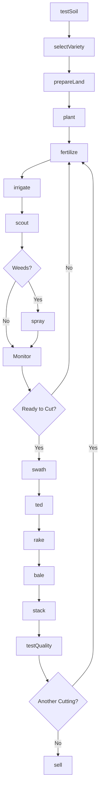
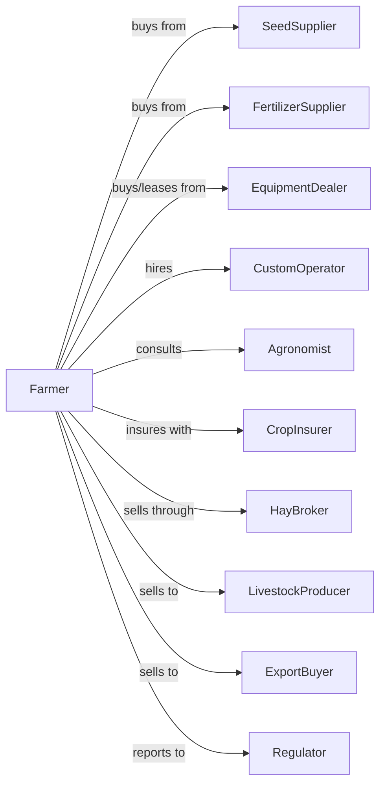

# Hay Farming

> Business-as-Code definition for hay production operations. Models the cultivation and harvesting of alfalfa, grass, and mixed hay from establishment through baling and sale.

## Overview

Hay farming involves the production of dried forage crops including alfalfa, timothy, bermudagrass, and mixed hay for livestock feed and export markets. This definition exposes actions for stand establishment, cutting schedule optimization, curing management, baling operations, and quality testing for protein content and relative feed value.

## Actors

| Actor | Description |
|-------|-------------|
| SeedSupplier | Provides certified hay and forage seed varieties |
| EquipmentDealer | Sells and services swathers, balers, and rakes |
| FertilizerSupplier | Provides nitrogen, phosphorus, and sulfur |
| CropInsurer | Provides coverage for weather and yield losses |
| HayBroker | Connects producers with regional and export buyers |
| LivestockProducer | Purchases hay for cattle, horses, and dairy |
| ExportBuyer | Purchases compressed hay for overseas markets |
| CustomOperator | Provides cutting, raking, and baling services |
| Agronomist | Advises on variety selection and fertility |
| Regulator | Oversees hay export certification and weights |

## Roles

| Role | Description |
|------|-------------|
| FarmOwner | Owns land and makes variety and marketing decisions |
| FarmManager | Coordinates cutting schedules and harvest timing |
| EquipmentOperator | Operates swathers, rakes, and balers |
| FieldWorker | Monitors windrows and assists with stacking |
| Bookkeeper | Manages sales, inventory, and compliance |
| BalerOperator | Runs round or square baler and monitors bale density and moisture |

## Entities

| Entity | Description |
|--------|-------------|
| Crop | Hay species being cultivated (alfalfa, grass, mixed) |
| Field | Land parcel for hay production |
| Stand | Established hay planting with measured density |
| Cutting | Harvest event numbered sequentially per season |
| Windrow | Swathed hay drying in the field |
| Bale | Packaged hay unit (small square, large round, etc.) |
| Moisture | Water content percentage affecting storage |
| Protein | Crude protein percentage indicating feed quality |
| RFV | Relative feed value quality metric |
| Contract | Forward sale agreement with buyer |

## Actions

| Action | Description |
|--------|-------------|
| testSoil | Analyze nutrient levels and pH |
| selectVariety | Choose hay type for climate and market |
| prepareLand | Till and level fields for seeding |
| plant | Establish hay stand with seed drill |
| fertilize | Apply nutrients for growth and protein |
| irrigate | Apply water for optimal yield |
| scout | Monitor stand density and weed pressure |
| spray | Apply herbicides for weed control |
| swath | Cut hay and form into windrows |
| ted | Spread windrows to speed drying |
| rake | Form windrows for baling |
| bale | Package dried hay into bales |
| stack | Move bales to storage location |
| testQuality | Analyze protein, moisture, and RFV |
| sell | Execute sale to buyer |

## Events

| Event | Description |
|-------|-------------|
| soilTested | Nutrient analysis results available |
| varietySelected | Hay type chosen |
| planted | Stand established |
| fertilized | Nutrients applied |
| irrigated | Water applied |
| sprayed | Herbicide treatment completed |
| swathed | Hay cut and in windrows |
| tedded | Windrows spread for drying |
| raked | Windrows formed for baling |
| baled | Hay packaged into bales |
| stacked | Bales moved to storage |
| qualityTested | Protein and RFV results available |
| sold | Sale transaction completed |

## Searches

| Search | Description |
|--------|-------------|
| findFields | List fields by hay type and cutting number |
| getContracts | Retrieve active buyer contracts |
| checkWeather | Get forecast for cutting and curing |
| getPrice | Get current prices by quality grade |
| findBuyers | List livestock producers and brokers |
| getYieldHistory | Retrieve yields by field and cutting |
| getQualityHistory | Retrieve RFV and protein by cutting |
| getInventory | Check available bale inventory |

## Workflow



## Actor Relationships



## Usage

### Calling Actions

```typescript
import { farmHay } from '@headlessly/farm-hay'

const farm = farmHay()

// Establish new alfalfa stand
await farm.plant({
  fieldId: 'meadow-20',
  variety: 'hi-gest-360',
  type: 'alfalfa',
  seedRate: 20,
  method: 'drill'
})

// Cut at optimal stage
await farm.swath({
  fieldId: 'meadow-20',
  cutting: 2,
  stage: '10-percent-bloom',
  stubbleHeight: 3
})

// Bale when moisture is right
await farm.bale({
  fieldId: 'meadow-20',
  cutting: 2,
  baleType: 'large-square',
  targetMoisture: 14
})
```

### Event-Driven Automation

```typescript
// Auto-rake based on moisture
farm.swathed(async ({ fieldId, cutting }) => {
  const weather = await farm.checkWeather({ fieldId })
  const curingHours = calculateCuringTime(weather)

  await scheduleRaking({
    fieldId,
    cutting,
    targetTime: addHours(new Date(), curingHours)
  })
})

// Test quality after baling
farm.baled(async ({ fieldId, cutting, baleCount }) => {
  await farm.testQuality({
    fieldId,
    cutting,
    sampleSize: Math.ceil(baleCount * 0.05),
    tests: ['moisture', 'protein', 'rfv', 'adf', 'ndf']
  })
})

// Auto-price based on quality
farm.qualityTested(async ({ fieldId, cutting, protein, rfv }) => {
  const contracts = await farm.getContracts({ minRfv: rfv })

  if (contracts.length > 0 && protein >= 20) {
    await farm.sell({
      fieldId,
      cutting,
      contractId: contracts[0].id,
      pricePerTon: calculatePremium(protein, rfv)
    })
  }
})
```

## Related

- [All Other Miscellaneous Crop Farming](./111998-AllOtherMiscellaneousCropFarming.mdx)
- [Support Activities for Crop Production](../../115-SupportActivitiesForAgricultureAndForestry/1151-SupportActivitiesForCropProduction/115112-SoilPreparationPlantingAndCultivating.mdx)
