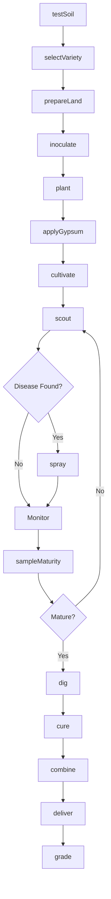
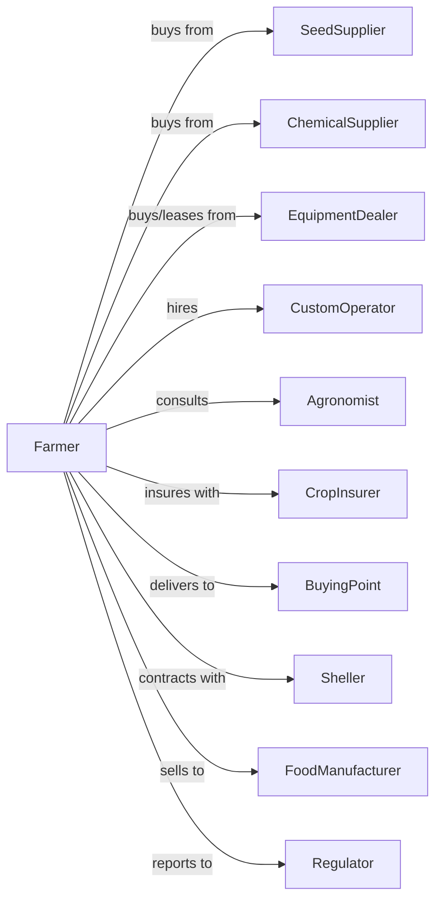

# Peanut Farming

> Business-as-Code definition for peanut production operations. Models the cultivation of runner, virginia, spanish, and valencia peanuts from planting through curing and sale.

## Overview

Peanut farming involves the cultivation of peanuts as a legume crop harvested for food processing, peanut butter manufacturing, and oil extraction. This definition exposes actions for soil inoculation, disease management for leaf spot and white mold, digging timing optimization, windrow curing, combining operations, and quality grading for aflatoxin and damage levels.

## Actors

| Actor | Description |
|-------|-------------|
| SeedSupplier | Provides certified peanut seed stock |
| EquipmentDealer | Sells and services diggers, inverters, and combines |
| ChemicalSupplier | Provides fungicides, herbicides, and gypsum |
| CropInsurer | Provides coverage for weather and quality losses |
| BuyingPoint | Purchases and grades farmer stock peanuts |
| Sheller | Processes peanuts for food manufacturers |
| FoodManufacturer | Produces peanut butter and confections |
| Agronomist | Advises on variety selection and disease control |
| Regulator | Oversees peanut marketing and grading standards |
| CustomOperator | Provides digging and combining services |

## Roles

| Role | Description |
|------|-------------|
| FarmOwner | Owns land and makes variety and marketing decisions |
| FarmManager | Coordinates planting, spraying, and harvest timing |
| EquipmentOperator | Operates planters, diggers, and combines |
| Scout | Monitors for leaf spot, tomato spotted wilt, and maturity |
| Bookkeeper | Manages sales, grades, and compliance records |
| DiggerOperator | Times digging based on hull scrape maturity profile and inverts vines for curing |

## Entities

| Entity | Description |
|--------|-------------|
| Crop | Peanut type being cultivated (runner, virginia, etc.) |
| Field | Land parcel for peanut production |
| Seed | Certified planting stock with variety traits |
| Peg | Reproductive structure that enters soil |
| Pod | Underground fruit containing kernels |
| Windrow | Inverted plants drying in field |
| FarmerStock | Harvested peanuts before shelling |
| Grade | Quality classification (SMK, damage, aflatoxin) |
| Loan | USDA marketing assistance loan |
| Contract | Forward sale agreement with sheller |

## Actions

| Action | Description |
|--------|-------------|
| testSoil | Analyze calcium, pH, and nutrient levels |
| selectVariety | Choose peanut type for market and region |
| prepareLand | Till and form beds for planting |
| inoculate | Apply rhizobium bacteria for nitrogen fixation |
| plant | Place seed at optimal depth and spacing |
| applyGypsum | Apply calcium for pod development |
| cultivate | Control weeds mechanically |
| scout | Monitor for leaf spot, white mold, and maturity |
| spray | Apply fungicides or herbicides |
| sampleMaturity | Check pod mesocarp color for harvest timing |
| dig | Invert plants with digger-inverter |
| cure | Dry peanuts in windrows |
| combine | Harvest cured peanuts from windrows |
| deliver | Transport to buying point |
| grade | Receive quality assessment and payment |

## Events

| Event | Description |
|-------|-------------|
| soilTested | Calcium and nutrient results available |
| varietySelected | Peanut type chosen |
| planted | Seed placed in ground |
| emerged | Plants visible above ground |
| gypsumApplied | Calcium applied at pegging |
| cultivated | Mechanical weed control completed |
| diseaseDetected | Leaf spot or white mold found |
| sprayed | Fungicide treatment applied |
| maturitySampled | Pod color profile determined |
| dug | Plants inverted in windrows |
| cured | Peanuts dried to target moisture |
| combined | Peanuts harvested from windrows |
| delivered | Peanuts at buying point |
| graded | Quality and payment determined |

## Searches

| Search | Description |
|--------|-------------|
| findFields | List fields by variety and rotation |
| getContracts | Retrieve active sheller contracts |
| checkWeather | Get forecast for digging and curing |
| getPrice | Get current prices by grade and type |
| findBuyers | List buying points and shellers |
| getYieldHistory | Retrieve yields by field and variety |
| getGradeHistory | Retrieve SMK and damage history |
| getMaturityProfile | Check pod color distribution |

## Workflow



## Actor Relationships



## Usage

### Calling Actions

```typescript
import { farmPeanut } from '@headlessly/farm-peanut'

const farm = farmPeanut()

// Check maturity profile for digging timing
const maturityProfile = await farm.getMaturityProfile({ fieldId: 'sandy-bottom-8' })

// Find buying points and current prices
const buyers = await farm.findBuyers({ type: 'runner', region: 'southeast' })

// Plant runner peanuts
await farm.plant({
  fieldId: 'sandy-bottom-8',
  variety: 'georgia-06g',
  type: 'runner',
  seedRate: 6,
  rowSpacing: 36,
  depth: 2
})

// Apply gypsum at pegging
await farm.applyGypsum({
  fieldId: 'sandy-bottom-8',
  rate: 1000,
  timing: 'early-pegging'
})

// Sample maturity for digging decision
const maturity = await farm.sampleMaturity({
  fieldId: 'sandy-bottom-8',
  samplePoints: 10,
  method: 'hull-scrape'
})
```

### Event-Driven Automation

```typescript
// Auto-spray for leaf spot
farm.diseaseDetected(async ({ fieldId, disease, severity }) => {
  if (disease === 'leafSpot' && severity >= 3) {
    await farm.spray({
      fieldId,
      product: 'chlorothalonil',
      rate: 1.5,
      interval: 14
    })
  }
})

// Auto-schedule digging based on maturity
farm.maturitySampled(async ({ fieldId, blackPct, brownPct, orangePct }) => {
  const optimalBlack = blackPct >= 20 && blackPct <= 30
  const totalMature = blackPct + brownPct

  if (optimalBlack && totalMature >= 70) {
    const weather = await farm.checkWeather({ fieldId })
    if (weather.rainChance < 30) {
      await farm.dig({
        fieldId,
        estimatedMoisture: 45
      })
    }
  }
})

// Process grade and settlement
farm.graded(async ({ loadId, pounds, smk, damage, foreignMaterial }) => {
  const basePrice = await farm.getPrice({ type: 'runner' })
  const premium = calculatePremium(smk, damage, foreignMaterial)

  await recordSale({
    loadId,
    pounds,
    smkPct: smk,
    damagePct: damage,
    pricePerPound: basePrice + premium
  })
})
```

## Related

- [All Other Miscellaneous Crop Farming](./111998-AllOtherMiscellaneousCropFarming.mdx)
- [Oilseed (except Soybean) Farming](../../1111-OilseedAndGrainFarming/111120-OilseedExceptSoybeanFarming.mdx)
