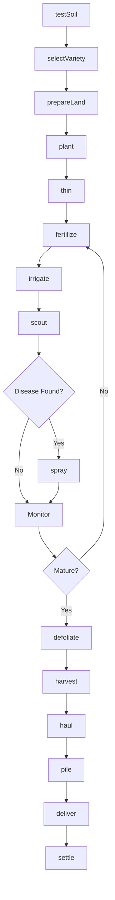
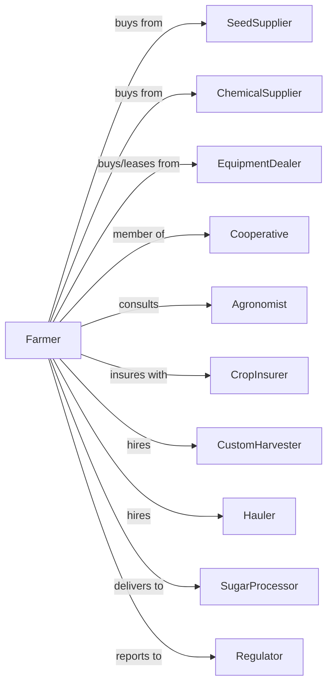

# Sugar Beet Farming

> Business-as-Code definition for sugar beet production operations. Models the cultivation of sugar beets from planting through harvest and delivery to processing facilities.

## Overview

Sugar beet farming involves the cultivation of beets for sugar extraction at regional processing plants. This definition exposes actions for precision planting, disease management for cercospora and rhizomania, thinning operations, harvest scheduling coordination with factories, and payment based on sugar content and tare weight deductions.

## Actors

| Actor | Description |
|-------|-------------|
| SeedSupplier | Provides pelleted, treated sugar beet seed |
| EquipmentDealer | Sells and services planters, cultivators, and harvesters |
| ChemicalSupplier | Provides herbicides, fungicides, and fertilizers |
| CropInsurer | Provides coverage for weather and disease losses |
| SugarProcessor | Operates beet processing factory |
| Cooperative | Grower-owned organization managing contracts |
| CustomHarvester | Provides beet lifting and hauling services |
| Agronomist | Advises on variety selection and disease management |
| Regulator | Oversees sugar programs and quotas |
| Hauler | Provides truck transport to piling grounds |

## Roles

| Role | Description |
|------|-------------|
| FarmOwner | Owns land and holds factory delivery shares |
| FarmManager | Coordinates planting, spraying, and harvest |
| EquipmentOperator | Operates planters, sprayers, and harvesters |
| Scout | Monitors for disease, insects, and nutrient status |
| Bookkeeper | Manages factory settlements and compliance |
| BeetPilerOperator | Stacks beets at piling grounds and manages ventilation to prevent spoilage |

## Entities

| Entity | Description |
|--------|-------------|
| Crop | Sugar beet variety being cultivated |
| Field | Land parcel for beet production |
| Seed | Pelleted, monogerm planting material |
| Stand | Established plant population per acre |
| Root | Harvested beet containing sucrose |
| Sucrose | Sugar content measured as percentage |
| Tare | Soil and debris deducted at factory |
| Pile | Temporary storage at receiving station |
| Contract | Factory delivery agreement with shares |
| Payment | Settlement based on sugar content |

## Actions

| Action | Description |
|--------|-------------|
| testSoil | Analyze nutrient levels and nematode pressure |
| selectVariety | Choose variety for disease package and yield |
| prepareLand | Till and form beds for precision planting |
| plant | Place pelleted seed at exact spacing |
| thin | Remove excess plants to target population |
| fertilize | Apply nitrogen and other nutrients |
| scout | Monitor for cercospora, aphids, and weevils |
| spray | Apply fungicides, insecticides, or herbicides |
| irrigate | Apply water during root development |
| defoliate | Remove tops before harvest |
| harvest | Lift beets with mechanical harvester |
| haul | Transport beets to piling grounds |
| pile | Store beets at receiving station |
| deliver | Transport to factory during campaign |
| settle | Receive payment based on quality |

## Events

| Event | Description |
|-------|-------------|
| soilTested | Nutrient and nematode results available |
| varietySelected | Beet variety chosen |
| planted | Seed placed in ground |
| emerged | Plants visible above ground |
| thinned | Population adjusted to target |
| fertilized | Nutrients applied |
| diseaseDetected | Cercospora or other disease found |
| sprayed | Treatment applied |
| irrigated | Water applied |
| defoliated | Tops removed |
| harvested | Beets lifted and collected |
| hauled | Beets transported to pile |
| piled | Beets at receiving station |
| delivered | Beets received at factory |
| settled | Payment received |

## Searches

| Search | Description |
|--------|-------------|
| findFields | List fields by variety and rotation history |
| getContracts | Retrieve active factory delivery shares |
| checkWeather | Get forecast for planting and harvest |
| getFactorySchedule | Check factory campaign and delivery slots |
| getSugarTest | Retrieve pre-harvest sugar content samples |
| getYieldHistory | Retrieve yields by field and variety |
| getTareHistory | Retrieve tare deduction history |
| getPaymentHistory | Retrieve factory settlement statements |

## Workflow



## Actor Relationships



## Usage

### Calling Actions

```typescript
import { farmSugarBeet } from '@headlessly/farm-sugar-beet'

const farm = farmSugarBeet()

// Plant with precision spacing
await farm.plant({
  fieldId: 'river-bottom-12',
  variety: 'betaseed-8765',
  rowSpacing: 22,
  inRowSpacing: 4.5,
  depth: 1.0
})

// Scout for cercospora
const scoutReport = await farm.scout({
  fieldId: 'river-bottom-12',
  targets: ['cercospora', 'aphids', 'curlyTop']
})

if (scoutReport.cercospora.severity > 2) {
  await farm.spray({
    fieldId: 'river-bottom-12',
    product: 'triazole-fungicide',
    rate: 6
  })
}
```

### Event-Driven Automation

```typescript
// Auto-schedule harvest with factory
farm.defoliated(async ({ fieldId, defoliationDate }) => {
  const factorySlot = await farm.getFactorySchedule({
    preferredDate: addDays(defoliationDate, 3)
  })

  await scheduleHarvest({
    fieldId,
    date: factorySlot.deliveryDate,
    crew: 'harvest-team-b'
  })
})

// Auto-coordinate hauling
farm.harvested(async ({ fieldId, tons, pileLocation }) => {
  await farm.haul({
    fieldId,
    tons,
    destination: pileLocation,
    trucksNeeded: Math.ceil(tons / 25)
  })
})

// Process factory settlement
farm.delivered(async ({ loadId, grossTons, tare, sucrose }) => {
  const netTons = grossTons * (1 - tare / 100)
  const sugarTons = netTons * (sucrose / 100)

  await recordSettlement({
    loadId,
    grossTons,
    tarePct: tare,
    sucrosePct: sucrose,
    sugarTons,
    payment: sugarTons * await farm.getPrice()
  })
})
```

## Related

- [Sugarcane Farming](./111930-SugarcaneFarming.mdx)
- [All Other Miscellaneous Crop Farming](./111998-AllOtherMiscellaneousCropFarming.mdx)
