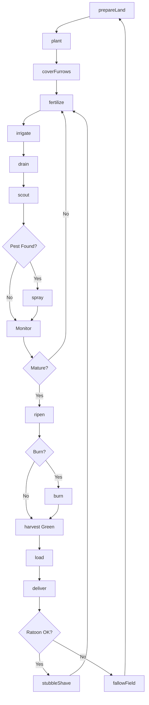
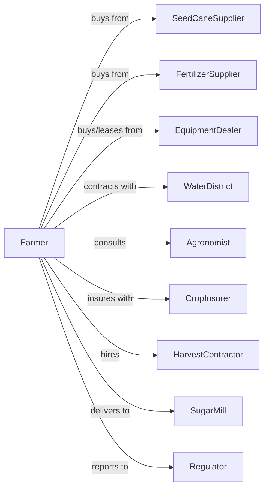

# Sugarcane Farming

> Business-as-Code definition for sugarcane production operations. Models the cultivation of sugarcane from planting through harvest and delivery to sugar mills.

## Overview

Sugarcane farming involves the cultivation of sugarcane as a perennial crop harvested annually for sugar and ethanol production. This definition exposes actions for managing seed cane planting, ratoon crop management, water management, ripening programs, harvest scheduling coordination with mills, and payment based on sugar content.

## Actors

| Actor | Description |
|-------|-------------|
| SeedCaneSupplier | Provides certified disease-free seed cane |
| EquipmentDealer | Sells and services harvesters, loaders, and wagons |
| FertilizerSupplier | Provides nitrogen, phosphorus, and potassium |
| CropInsurer | Provides coverage for freeze and hurricane damage |
| SugarMill | Processes cane into raw sugar and molasses |
| WaterDistrict | Manages irrigation and drainage systems |
| HarvestContractor | Provides cutting and loading services |
| Agronomist | Advises on variety selection and ripening |
| Regulator | Oversees sugar marketing programs |

## Roles

| Role | Description |
|------|-------------|
| FarmOwner | Owns land and holds mill delivery contracts |
| FarmManager | Coordinates planting, cultivation, and harvest |
| IrrigationManager | Controls water delivery and drainage |
| EquipmentOperator | Operates tractors, harvesters, and wagons |
| FieldWorker | Performs planting and field maintenance |
| Bookkeeper | Manages mill settlements and compliance |
| CaneBurner | Conducts controlled pre-harvest burns to remove leaf trash before cutting |

## Entities

| Entity | Description |
|--------|-------------|
| Field | Land parcel for sugarcane production |
| Crop | Sugarcane stand (plant cane or ratoon) |
| Variety | Sugarcane cultivar with specific characteristics |
| SeedCane | Vegetative planting material (billets or stalks) |
| Ratoon | Regrowth crop from previous harvest stubble |
| Stalk | Harvested sugarcane stalk |
| Sucrose | Sugar content measured as CCS or TSAI |
| Contract | Mill delivery agreement with quota |
| Yield | Tons of cane per acre |
| RecoverableSugar | Payment basis calculated from cane quality |

## Actions

| Action | Description |
|--------|-------------|
| prepareLand | Till, level, and form furrows for planting |
| plant | Place seed cane billets in furrows |
| coverFurrows | Cover planted billets with soil |
| fertilize | Apply nutrients at key growth stages |
| irrigate | Apply water for crop establishment and growth |
| drain | Remove excess water from fields |
| cultivate | Control weeds mechanically |
| scout | Monitor for borers, rust, and nutrient status |
| spray | Apply herbicides or ripener chemicals |
| ripen | Apply ripener to maximize sucrose |
| burn | Pre-harvest burning where permitted |
| harvest | Cut cane with mechanical harvester |
| load | Transfer cane to transport wagons |
| deliver | Transport cane to mill within quality window |
| stubbleShave | Prepare ratoon crop after harvest |
| fallowField | Rest field between cane cycles |

## Events

| Event | Description |
|-------|-------------|
| landPrepared | Field ready for planting |
| planted | Seed cane placed in furrows |
| emerged | Shoots visible above ground |
| fertilized | Nutrients applied |
| irrigated | Water applied |
| drained | Excess water removed |
| pestDetected | Borer or disease identified |
| sprayed | Treatment applied |
| ripenerApplied | Chemical ripener applied |
| burned | Pre-harvest burn completed |
| harvested | Cane cut and collected |
| loaded | Cane transferred to transport |
| delivered | Cane received at mill |
| millProcessed | Sugar extracted and measured |
| stubbleShaved | Ratoon prepared |
| sucroseTestCompleted | Pre-harvest sugar content analysis has been performed |
| fieldFallowed | Field taken out of production |

## Searches

| Search | Description |
|--------|-------------|
| findFields | List fields by variety and crop year |
| getContracts | Retrieve active mill delivery contracts |
| checkWeather | Get freeze and harvest condition forecast |
| getMillSchedule | Check mill grinding schedule and capacity |
| getSucroseTest | Retrieve pre-harvest sugar content tests |
| getYieldHistory | Retrieve yields by field and variety |
| getHarvestSchedule | View cutting order and timing |
| getPaymentHistory | Retrieve mill settlement statements |

## Workflow



## Actor Relationships



## Usage

### Calling Actions

```typescript
import { farmSugarcane } from '@headlessly/farm-sugarcane'

const farm = farmSugarcane()

// Check mill grinding schedule and available capacity
const millSlots = await farm.getMillSchedule({ mill: 'south-florida-mill' })

// Get pre-harvest sucrose test results
const sucrose = await farm.getSucroseTest({ fieldId: 'block-42' })

// Prepare and plant new field
await farm.prepareLand({
  fieldId: 'block-42',
  method: 'conventional',
  furrowSpacing: 5
})

await farm.plant({
  fieldId: 'block-42',
  variety: 'CP-89-2143',
  billetRate: 8,
  method: 'whole-stalk'
})

// Apply ripener before harvest
await farm.ripen({
  fieldId: 'block-42',
  product: 'glyphosate',
  rate: 0.5,
  weeksBeforeHarvest: 3
})

// Schedule harvest with mill
const millSchedule = await farm.getMillSchedule()
await farm.harvest({
  fieldId: 'block-42',
  method: 'green-chopper',
  deliverySlot: millSchedule.nextAvailable
})
```

### Event-Driven Automation

```typescript
// Auto-ripen based on sucrose testing
farm.sucroseTestCompleted(async ({ fieldId, sucrose, targetSucrose }) => {
  if (sucrose >= targetSucrose * 0.85) {
    await farm.ripen({
      fieldId,
      product: 'glyphosate',
      rate: 0.5
    })
  }
})

// Coordinate harvest with mill capacity
farm.ripenerApplied(async ({ fieldId, applicationDate }) => {
  const optimalHarvest = addDays(applicationDate, 21)
  const millSlot = await farm.getMillSchedule({
    preferredDate: optimalHarvest
  })

  await scheduleHarvest({
    fieldId,
    date: millSlot.date,
    crew: 'harvest-team-a'
  })
})

// Process mill settlement
farm.millProcessed(async ({ deliveryId, tons, sucrose, trash }) => {
  const payment = calculatePayment({
    tons,
    sucrose,
    trash,
    basePrice: await farm.getPrice()
  })

  await recordSettlement({
    deliveryId,
    grossTons: tons,
    recoverableSugar: sucrose,
    payment
  })
})
```

## Related

- [Sugar Beet Farming](./111991-SugarBeetFarming.mdx)
- [All Other Miscellaneous Crop Farming](./111998-AllOtherMiscellaneousCropFarming.mdx)
