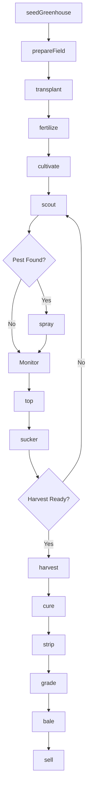
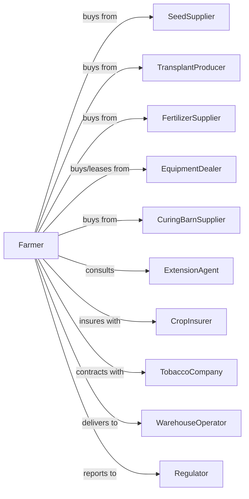

# Tobacco Farming

> Business-as-Code definition for tobacco production operations. Models the cultivation of burley, flue-cured, and dark tobacco from transplant through curing and sale.

## Overview

Tobacco farming involves the cultivation of various tobacco types including flue-cured, burley, and dark tobacco for cigarette, cigar, and smokeless tobacco manufacturing. This definition exposes actions for greenhouse transplant production, field management, topping and suckering, harvest timing, barn curing, and quality grading for contract sales to tobacco companies.

## Actors

| Actor | Description |
|-------|-------------|
| SeedSupplier | Provides certified tobacco seed varieties |
| TransplantProducer | Grows tobacco transplants in greenhouses |
| EquipmentDealer | Sells and services transplanters, toppers, and harvesters |
| FertilizerSupplier | Provides tobacco-specific fertilizer blends |
| CropInsurer | Provides coverage for weather and disease losses |
| TobaccoCompany | Purchases cured tobacco under contract |
| WarehouseOperator | Receives, grades, and auctions tobacco |
| CuringBarnSupplier | Provides curing barns and heating systems |
| ExtensionAgent | Provides production and curing guidance |
| Regulator | Oversees tobacco marketing and programs |

## Roles

| Role | Description |
|------|-------------|
| FarmOwner | Owns land and holds production contracts |
| FarmManager | Coordinates seasonal operations |
| GreenhouseManager | Oversees transplant production |
| FieldWorker | Performs transplanting, topping, and harvest |
| CuringManager | Controls barn temperature and humidity |
| Bookkeeper | Manages contracts, labor, and compliance |
| Topper | Removes flower heads to redirect plant energy into leaf growth |

## Entities

| Entity | Description |
|--------|-------------|
| Crop | Tobacco type being cultivated |
| Field | Land parcel for tobacco production |
| Transplant | Seedling grown for field setting |
| Variety | Tobacco cultivar with specific characteristics |
| Leaf | Harvested tobacco at various positions |
| CuringBarn | Facility for drying and curing tobacco |
| Contract | Purchase agreement with tobacco company |
| Grade | Quality classification affecting price |
| Quota | Historical production allotment |
| BaleorSheet | Packaged cured tobacco for sale |

## Actions

| Action | Description |
|--------|-------------|
| seedGreenhouse | Start transplant production in greenhouse |
| prepareField | Till and prepare beds for transplanting |
| transplant | Set plants in field at proper spacing |
| fertilize | Apply nitrogen and potassium on schedule |
| cultivate | Control weeds and manage soil |
| scout | Monitor for blue mold, aphids, and hornworm |
| spray | Apply fungicides or insecticides |
| top | Remove flower head to redirect growth |
| sucker | Remove axillary shoots after topping |
| harvest | Prime leaves by stalk position or cut stalk |
| cure | Dry and cure leaves in barn |
| strip | Remove cured leaves from stalk |
| grade | Sort leaves by color, body, and quality |
| bale | Package graded tobacco for sale |
| sell | Deliver to warehouse or company |

## Events

| Event | Description |
|-------|-------------|
| greenhouseSeeded | Transplant production started |
| fieldPrepared | Land ready for transplanting |
| transplanted | Plants set in field |
| fertilized | Nutrients applied |
| cultivated | Cultivation completed |
| pestDetected | Blue mold, aphids, or other pest found |
| sprayed | Treatment applied |
| topped | Flower heads removed |
| suckered | Axillary shoots removed |
| harvested | Leaves primed or stalks cut |
| cured | Drying and curing completed |
| stripped | Leaves removed from stalks |
| graded | Quality sorting completed |
| baled | Tobacco packaged for sale |
| sold | Sale transaction completed |

## Searches

| Search | Description |
|--------|-------------|
| findFields | List fields by tobacco type and rotation |
| getContracts | Retrieve active company contracts |
| checkWeather | Get forecast for curing and field work |
| getPrice | Get current prices by grade and type |
| getBarnStatus | Check curing progress and conditions |
| getYieldHistory | Retrieve yields by field and variety |
| getBlueMoldAlerts | Get regional disease advisories |
| getGradeDistribution | View grade breakdown for season |

## Workflow



## Actor Relationships



## Usage

### Calling Actions

```typescript
import { farmTobacco } from '@headlessly/farm-tobacco'

const farm = farmTobacco()

// Check regional blue mold disease advisories
const moldAlerts = await farm.getBlueMoldAlerts({ region: 'piedmont' })

// Get curing barn status and availability
const barns = await farm.getBarnStatus({ barnType: 'bulk-cure' })

// Start transplant production
await farm.seedGreenhouse({
  variety: 'NC-196',
  type: 'flue-cured',
  trays: 500,
  seedDate: '2024-02-15'
})

// Transplant to field
await farm.transplant({
  fieldId: 'bottom-land',
  variety: 'NC-196',
  spacing: { inRow: 22, betweenRows: 48 },
  plants: 6000
})

// Top at proper timing
await farm.top({
  fieldId: 'bottom-land',
  timing: '50-percent-button',
  applySucker: 'fatty-alcohol'
})
```

### Event-Driven Automation

```typescript
// Auto-spray for blue mold
farm.pestDetected(async ({ fieldId, pest, severity }) => {
  if (pest === 'blueMold') {
    await farm.spray({
      fieldId,
      product: 'mancozeb',
      rate: 2.0,
      interval: 7
    })
  }
})

// Auto-control curing barn
farm.harvested(async ({ barnId, tobaccoType, leafPosition }) => {
  const curingSchedule = getCuringSchedule(tobaccoType, leafPosition)

  await farm.cure({
    barnId,
    yellowing: curingSchedule.yellowing,
    leafDrying: curingSchedule.leafDrying,
    stemDrying: curingSchedule.stemDrying
  })
})

// Auto-sell when grade meets contract
farm.graded(async ({ lotId, grades, pounds }) => {
  const contract = await farm.getContracts({ type: 'flue-cured' })

  for (const grade of grades) {
    if (contract.grades.includes(grade.code)) {
      await farm.sell({
        lotId,
        grade: grade.code,
        pounds: grade.pounds,
        contractId: contract.id
      })
    }
  }
})
```

## Related

- [Cotton Farming](./111920-CottonFarming.mdx)
- [All Other Miscellaneous Crop Farming](./111998-AllOtherMiscellaneousCropFarming.mdx)
