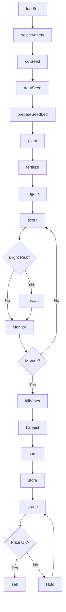
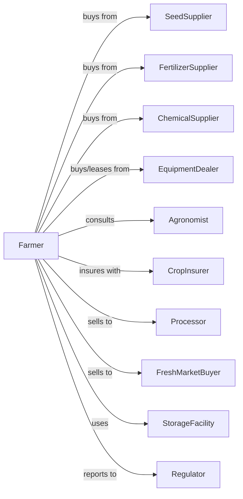

# Potato Farming

> Business-as-Code definition for potato production operations. Models the complete crop lifecycle from seed cutting through storage, grading, and sale to processors and fresh markets.

## Overview

Potato farming involves the cultivation of potatoes for fresh market, processing (chips, fries, dehydration), and seed production. This definition exposes actions for managing seed piece preparation, disease control, vine kill timing, harvest scheduling, and storage conditions to maximize tuber quality and minimize defects.

## Actors

| Actor | Description |
|-------|-------------|
| SeedSupplier | Provides certified disease-free seed potatoes |
| EquipmentDealer | Sells and services planters, harvesters, and storage equipment |
| FertilizerSupplier | Provides nitrogen, phosphorus, potassium, and micronutrients |
| CropInsurer | Provides coverage for weather and disease losses |
| Processor | Purchases potatoes for chips, fries, or dehydration |
| FreshMarketBuyer | Purchases potatoes for retail distribution |
| ChemicalSupplier | Provides fungicides, herbicides, and vine desiccants |
| Agronomist | Advises on variety selection and disease management |
| StorageFacility | Provides controlled atmosphere storage |
| Regulator | Oversees food safety and seed certification |

## Roles

| Role | Description |
|------|-------------|
| FarmOwner | Owns land and makes variety and market decisions |
| FarmManager | Coordinates planting, irrigation, and harvest schedules |
| EquipmentOperator | Operates planters, sprayers, and harvesters |
| StorageManager | Monitors temperature, humidity, and ventilation |
| Scout | Monitors for late blight, early blight, and insects |
| Bookkeeper | Manages contracts, storage costs, and settlements |
| SeedCutter | Cuts whole seed potatoes into planting pieces with proper eye count |

## Entities

| Entity | Description |
|--------|-------------|
| Crop | Potato variety being cultivated |
| Field | Land parcel with soil type and disease history |
| SeedPiece | Cut and treated seed potato for planting |
| Soil | Growing medium with tilth and drainage characteristics |
| Equipment | Planters, sprayers, harvesters, and conveyors |
| Contract | Forward sale with variety and quality specifications |
| Yield | Hundredweight (cwt) per acre produced |
| Grade | Quality classification by size, shape, and defects |
| Disease | Late blight, early blight, or other potato diseases |
| Storage | Controlled environment for post-harvest holding |

## Actions

| Action | Description |
|--------|-------------|
| testSoil | Analyze nutrients and test for soil-borne diseases |
| selectVariety | Choose variety based on market and storage needs |
| cutSeed | Cut seed potatoes into pieces with adequate eyes |
| treatSeed | Apply fungicide to cut seed pieces |
| prepareSeedbed | Till and form beds or hills for planting |
| plant | Place seed pieces at proper depth and spacing |
| fertilize | Apply nutrients at planting and during season |
| irrigate | Apply water for consistent soil moisture |
| scout | Monitor for disease, insects, and nutrient deficiency |
| spray | Apply fungicides, insecticides, or herbicides |
| killVines | Desiccate vines to set skin before harvest |
| harvest | Dig potatoes and transport to storage |
| cure | Hold at warm temperature to heal wounds |
| store | Maintain temperature and humidity for holding |
| grade | Sort by size, shape, and defect level |
| sell | Execute sale to processor or fresh market |

## Events

| Event | Description |
|-------|-------------|
| soilTested | Soil analysis and disease test results received |
| varietySelected | Potato variety chosen for season |
| seedCut | Seed pieces prepared for planting |
| seedTreated | Fungicide applied to seed pieces |
| planted | Seed pieces placed in prepared beds |
| emerged | Plants visible above soil surface |
| fertilized | Nutrient application completed |
| irrigated | Water applied to field |
| diseaseDetected | Late blight or other disease identified |
| sprayed | Crop protection product applied |
| vinesKilled | Desiccation completed |
| harvested | Potatoes dug and transported |
| cured | Wound healing period completed |
| stored | Potatoes placed in controlled storage |
| graded | Quality classification completed |
| sold | Sale transaction completed |

## Searches

| Search | Description |
|--------|-------------|
| findFields | List fields by disease history and soil type |
| getContracts | Retrieve active processor and fresh market contracts |
| checkWeather | Get forecast and late blight risk advisories |
| getPrice | Get current prices by variety and grade |
| findBuyers | List processors and buyers with current needs |
| getYieldHistory | Retrieve yields by field and variety |
| getBlightAlerts | Get late blight spore forecasts for region |
| getStorageStatus | Check temperature and inventory by bin |

## Workflow



## Actor Relationships



## Usage

### Calling Actions

```typescript
import { growPotato } from '@headlessly/grow-potato'

const farm = growPotato()

// Test soil for disease history
const soilResults = await farm.testSoil({
  fieldId: 'irrigated-circle',
  tests: ['nutrients', 'nematodes', 'verticillium']
})

// Select variety for processing market
const variety = await farm.selectVariety({
  market: 'french-fry',
  variety: 'Russet Burbank',
  storageDuration: 'long-term'
})

// Cut and treat seed
await farm.cutSeed({
  seedLot: variety.seedLot,
  pieceSize: 2.0,
  eyesPerPiece: 2
})

await farm.treatSeed({
  seedLot: variety.seedLot,
  treatment: 'mancozeb',
  rate: 0.5
})

// Plant at proper spacing
await farm.plant({
  fieldId: 'irrigated-circle',
  varietyId: variety.id,
  spacing: 10,
  rowWidth: 36,
  depth: 4
})
```

### Event-Driven Automation

```typescript
// Auto-spray for late blight risk
farm.diseaseDetected(async ({ fieldId, disease, severity }) => {
  if (disease === 'lateBlight') {
    await farm.spray({
      fieldId,
      product: 'chlorothalonil',
      rate: 1.5,
      interval: 7
    })
  }
})

// Auto-sell when grade and price align
farm.graded(async ({ binId, variety, grade, cwt }) => {
  const { perCwt } = await farm.getPrice({ variety, grade })

  if (grade === 'US-1' && perCwt >= 9.50) {
    await farm.sell({
      binId,
      quantity: cwt,
      buyer: 'processor',
      deliveryWindow: '2-weeks'
    })
  }
})
```

## Related

- [Other Vegetable Farming](./111219-OtherVegetableExceptPotatoAndMelonFarming.mdx)
- [Vegetable and Melon Farming](./111219-OtherVegetableExceptPotatoAndMelonFarming.mdx)
