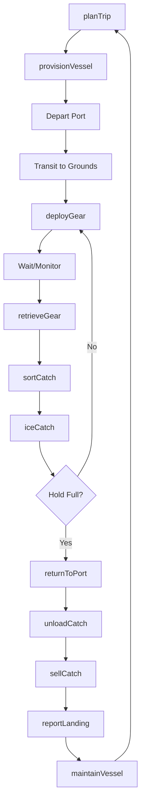
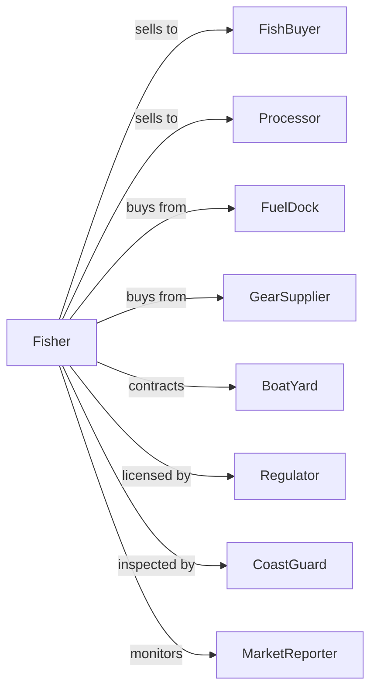

# Finfish Fishing

> Business-as-Code definition for commercial finfish fishing operations. Models the complete fishing cycle from trip planning through catch delivery including gear deployment, species targeting, and market coordination.

## Overview

Finfish fishing involves the commercial harvest of fish species including tuna, salmon, cod, halibut, and other market fish from oceans, lakes, and rivers. Operations deploy various gear types including nets, lines, and traps to target specific species within quota allocations and seasonal regulations. This definition exposes actions for fishing operations, catch handling, and market sales with events for automation and searches for production analytics.

## Actors

| Actor | Description |
|-------|-------------|
| FishBuyer | Purchases catch at dock or auction |
| Processor | Purchases fish for processing and packaging |
| FuelDock | Provides fuel and supplies for vessels |
| GearSupplier | Sells and repairs fishing gear |
| BoatYard | Provides vessel maintenance and repair |
| Regulator | Manages quotas, seasons, and fishing permits |
| CoastGuard | Oversees vessel safety and compliance |
| MarketReporter | Tracks fish prices and market conditions |

## Roles

| Role | Description |
|------|-------------|
| VesselOwner | Owns fishing boat and holds permits |
| Captain | Commands vessel and directs fishing operations |
| Deckhand | Works gear and handles catch |
| Engineer | Maintains vessel engines and systems |
| FishProcessor | Cleans and ices catch on board |
| OfficeManager | Handles permits, sales, and accounting |
| NetMender | Repairs and maintains trawl nets, gillnets, and seines between trips |

## Entities

| Entity | Description |
|--------|-------------|
| Vessel | Boat equipped for commercial fishing |
| Gear | Equipment for catching fish (nets, lines, traps) |
| Catch | Fish harvested during trip |
| Quota | Allocated amount allowed to harvest |
| Permit | License to fish specific species or areas |
| Trip | Single fishing voyage |
| Landing | Delivery of catch to port |
| Hold | Refrigerated storage on vessel |
| VMS | Vessel monitoring system for tracking |
| Logbook | Record of fishing activity |

## Actions

| Action | Description |
|--------|-------------|
| planTrip | Schedule voyage and target species |
| provisionVessel | Load fuel, ice, bait, and supplies |
| deployGear | Set nets, lines, or traps |
| retrieveGear | Haul and collect catch |
| sortCatch | Separate species and sizes |
| iceCatch | Preserve fish in hold |
| returnToPort | Navigate back to dock |
| unloadCatch | Offload fish at landing |
| sellCatch | Complete transaction with buyer |
| reportLanding | Submit catch data to regulator |
| maintainVessel | Perform repairs and upkeep |
| renewPermits | Update fishing licenses |

## Events

| Event | Description |
|-------|-------------|
| tripStarted | Vessel departed for fishing grounds |
| gearDeployed | Fishing equipment set |
| gearRetrieved | Catch collected from gear |
| catchSorted | Species separation complete |
| vesselReturning | Heading back to port |
| catchLanded | Fish unloaded at dock |
| catchSold | Sale completed |
| landingReported | Data submitted to authorities |
| quotaReached | Allocation exhausted |
| weatherAlert | Conditions requiring response |
| mechanicalIssue | Vessel or gear problem |

## Searches

| Search | Description |
|--------|-------------|
| getQuotaBalance | Check remaining allocation by species |
| getTripHistory | Retrieve past voyage records |
| getMarketPrices | Query current fish prices |
| findBuyers | List active fish purchasers |
| getWeatherForecast | Check conditions for trip planning |
| getVesselStatus | Check maintenance and inspection status |
| getPermitStatus | Verify license validity |
| getRegulationUpdates | Check for season or rule changes |

## Workflow



## Actor Relationships



## Usage

### Calling Actions

```typescript
import { catchFinfish } from '@headlessly/catch-finfish'

const fishing = catchFinfish()

// Check remaining quota for target species
const quota = await fishing.getQuotaBalance({ species: 'yellowfin-tuna' })

// Get current dock prices for trip planning
const prices = await fishing.getMarketPrices({ port: 'new-bedford', species: 'yellowfin-tuna' })

// Plan multi-day trip for tuna
const trip = await fishing.planTrip({
  vesselId: 'vessel-blue-horizon',
  targetSpecies: ['yellowfin-tuna', 'bigeye-tuna'],
  fishingGrounds: 'gulf-stream-east',
  duration: 5, // days
  departureDate: new Date()
})

// Provision vessel for voyage
await fishing.provisionVessel({
  tripId: trip.id,
  fuel: 2000, // gallons
  ice: 10000, // pounds
  bait: 500, // pounds
  supplies: ['food', 'safety-gear']
})

// Sell catch at dock
const sale = await fishing.sellCatch({
  tripId: trip.id,
  buyerId: 'fresh-catch-seafood',
  species: 'yellowfin-tuna',
  weight: 2500, // pounds
  grade: 'sashimi'
})
```

### Event-Driven Automation

```typescript
// Auto-report landing to regulator
fishing.catchSold(async ({ tripId, species, weight, buyerId }) => {
  await fishing.reportLanding({
    tripId,
    species,
    weight,
    buyerId,
    landingDate: new Date(),
    port: 'home-port'
  })
})

// Alert on quota approaching limit
fishing.gearRetrieved(async ({ tripId, species, weight }) => {
  const quota = await fishing.getQuotaBalance({ species })

  if (quota.remaining - weight < quota.warningThreshold) {
    await notifyCaptain({
      alert: 'quotaWarning',
      species,
      remaining: quota.remaining - weight,
      message: 'Approaching quota limit'
    })
  }
})
```

## Related

- [Shellfish Fishing](./114112-ShellfishFishing.mdx)
- [Other Marine Fishing](./114119-OtherMarineFishing.mdx)
- [Finfish Farming and Fish Hatcheries](../../112-AnimalProductionAndAquaculture/1125-Aquaculture/112511-FinfishFarmingAndFishHatcheries.mdx)
