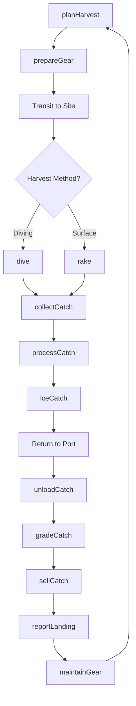
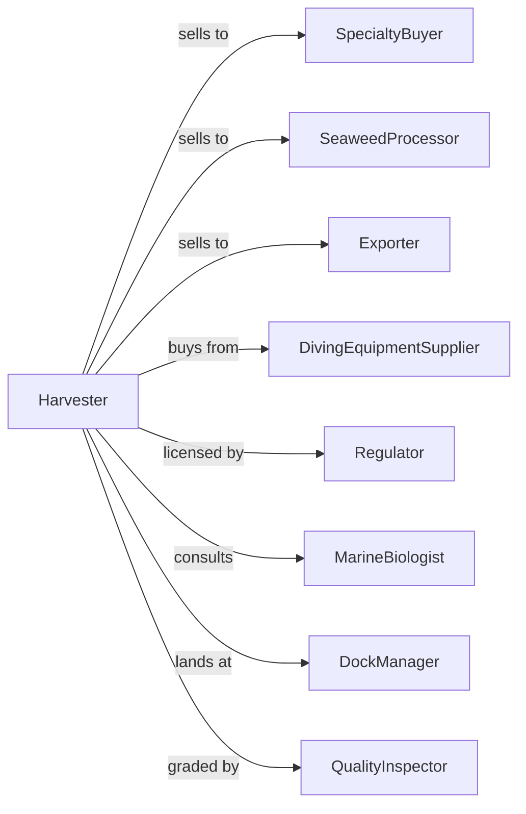

# Other Marine Fishing

> Business-as-Code definition for specialty marine harvesting operations. Models the commercial catch of sea urchins, kelp, seaweed, sponges, and other marine animals and plants not classified elsewhere.

## Overview

Other marine fishing involves the commercial harvest of marine species beyond finfish and shellfish, including sea urchins for roe, kelp and seaweed for food and products, sea cucumbers, jellyfish, sponges, and marine worms. Operations use diving, raking, and specialized gear to target niche species for specialty markets. This definition exposes actions for harvest operations, product handling, and market coordination with events for automation and searches for production analytics.

## Actors

| Actor | Description |
|-------|-------------|
| SpecialtyBuyer | Purchases sea urchin roe and marine products |
| SeaweedProcessor | Purchases kelp and seaweed for processing |
| Exporter | Ships marine products to international markets |
| DivingEquipmentSupplier | Provides SCUBA and harvesting gear |
| Regulator | Manages permits, quotas, and seasonal closures |
| MarineBiologist | Conducts stock assessments |
| DockManager | Operates landing facility |
| QualityInspector | Grades marine products |

## Roles

| Role | Description |
|------|-------------|
| VesselOwner | Owns boat and holds harvesting permits |
| Captain | Commands vessel and directs operations |
| Diver | Harvests underwater using SCUBA |
| DeckHand | Handles surface gear and catch |
| Processor | Cleans and prepares products on board |
| Bookkeeper | Manages permits, sales, and compliance |
| UniCracker | Opens and grades sea urchin roe quality and color at dockside |

## Entities

| Entity | Description |
|--------|-------------|
| SeaUrchin | Spiny echinoderm harvested for roe (uni) |
| Kelp | Large brown seaweed harvested for food and products |
| SeaCucumber | Marine animal harvested for Asian food markets |
| Sponge | Marine organism harvested for cleaning products |
| Jellyfish | Cnidarian harvested for food export |
| Roe | Edible eggs from sea urchin |
| Vessel | Boat equipped for specialty harvesting |
| DivingGear | SCUBA equipment for underwater harvest |
| Permit | License for specific species and areas |
| Quota | Allocated harvest amount |

## Actions

| Action | Description |
|--------|-------------|
| planHarvest | Schedule trip targeting specific species |
| prepareGear | Ready diving and harvesting equipment |
| dive | Conduct underwater harvest operations |
| rake | Harvest kelp or seaweed from surface |
| collectCatch | Gather harvested species |
| processCatch | Clean, grade, or prepare products |
| iceCatch | Preserve products for transport |
| unloadCatch | Deliver products at dock |
| gradeCatch | Sort by quality and size |
| sellCatch | Complete transaction with buyer |
| reportLanding | Submit catch data to regulator |
| maintainGear | Service diving and harvest equipment |

## Events

| Event | Description |
|-------|-------------|
| tripStarted | Harvest operation begun |
| diveCompleted | Underwater harvest finished |
| catchCollected | Products brought to surface |
| catchProcessed | Preparation completed |
| catchLanded | Products delivered to dock |
| catchGraded | Quality assessment finished |
| catchSold | Sale completed |
| landingReported | Data submitted to regulator |
| quotaAlert | Approaching harvest limit |
| closureIssued | Harvesting prohibited |
| weatherAlert | Conditions affecting diving safety |

## Searches

| Search | Description |
|--------|-------------|
| getQuotaBalance | Check remaining allocation |
| getHarvestHistory | Retrieve past catch records |
| getMarketPrices | Query specialty product prices |
| findBuyers | List active purchasers |
| getClosureStatus | Check area restrictions |
| getPermitStatus | Verify license validity |
| getDiveConditions | Check water visibility and currents |
| getStockAssessment | Review population surveys |

## Workflow



## Actor Relationships



## Usage

### Calling Actions

```typescript
import { catchMarineSpecies } from '@headlessly/catch-marine-species'

const fishing = catchMarineSpecies()

// Plan sea urchin harvest trip
const trip = await fishing.planHarvest({
  vesselId: 'vessel-pacific-diver',
  targetSpecies: 'red-sea-urchin',
  harvestArea: 'channel-islands-zone-3',
  method: 'diving',
  date: new Date()
})

// Conduct diving harvest
const dive = await fishing.dive({
  tripId: trip.id,
  diverId: 'diver-mike',
  bottomTime: 120, // minutes
  depth: 40 // feet
})

// Process and grade catch
await fishing.processCatch({
  tripId: trip.id,
  species: 'red-sea-urchin',
  processing: 'crack-for-roe'
})

const grading = await fishing.gradeCatch({
  tripId: trip.id,
  grades: ['A', 'B', 'C'],
  criteria: ['color', 'size', 'freshness']
})

// Sell to specialty buyer
await fishing.sellCatch({
  tripId: trip.id,
  buyerId: 'uni-export-japan',
  grade: 'A',
  weight: 150 // pounds of roe
})
```

### Event-Driven Automation

```typescript
// Auto-report landing after sale
fishing.catchSold(async ({ tripId, species, weight, buyerId }) => {
  await fishing.reportLanding({
    tripId,
    species,
    weight,
    buyerId,
    landingDate: new Date()
  })
})

// Safety alert for diving conditions
fishing.weatherAlert(async ({ area, conditions, severity }) => {
  if (severity === 'high' || conditions.includes('strong-currents')) {
    await notifyDivers({
      alert: 'divingHazard',
      area,
      conditions,
      recommendation: 'Postpone diving operations'
    })
  }
})
```

## Related

- [Finfish Fishing](./114111-FinfishFishing.mdx)
- [Shellfish Fishing](./114112-ShellfishFishing.mdx)
- [Other Aquaculture](../../112-AnimalProductionAndAquaculture/1125-Aquaculture/112519-OtherAquaculture.mdx)
