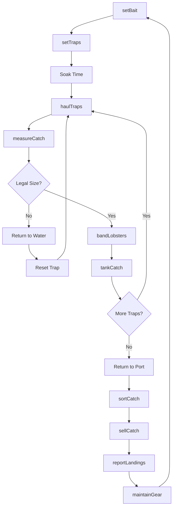
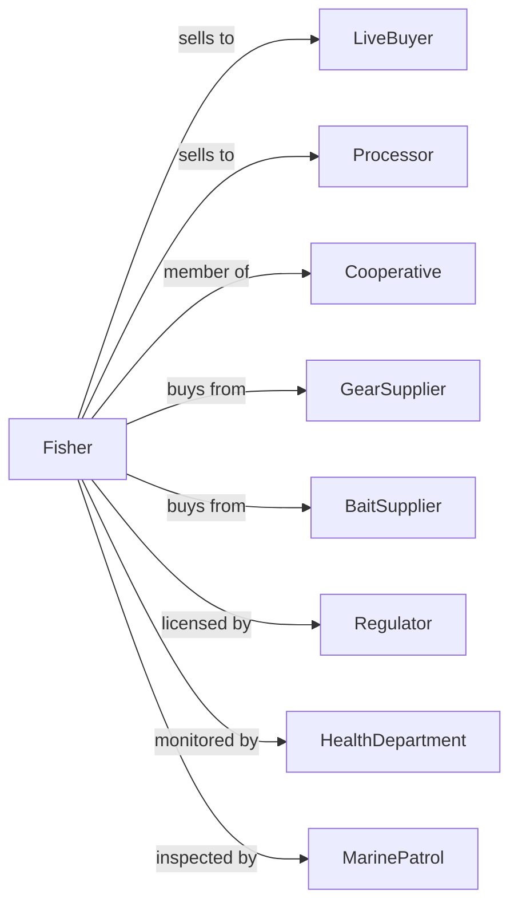

# Shellfish Fishing

> Business-as-Code definition for commercial shellfish fishing operations. Models the complete fishing cycle from trap setting through catch delivery including lobster, crab, shrimp, and clam harvesting.

## Overview

Shellfish fishing involves the commercial harvest of crustaceans and mollusks including lobsters, crabs, shrimp, clams, and oysters from wild populations. Operations deploy traps, pots, dredges, and trawls to capture shellfish within licensed areas and seasons. This definition exposes actions for gear operations, catch handling, and live market sales with events for automation and searches for production analytics.

## Actors

| Actor | Description |
|-------|-------------|
| LiveBuyer | Purchases live shellfish at dock |
| Processor | Purchases shellfish for processing |
| Cooperative | Pools and markets member catches |
| GearSupplier | Sells traps, pots, and fishing gear |
| BaitSupplier | Provides bait for trap fishing |
| Regulator | Manages licenses, quotas, and seasons |
| HealthDepartment | Oversees shellfish sanitation and closures |
| MarinePatrol | Enforces fishing regulations |

## Roles

| Role | Description |
|------|-------------|
| VesselOwner | Owns boat and holds fishing licenses |
| Captain | Commands vessel and directs operations |
| Sternman | Works gear and handles catch |
| ShoreCrew | Assists with landing and maintenance |
| TankManager | Maintains live holding facilities |
| Bookkeeper | Manages licenses, sales, and records |
| TrapBuilder | Constructs and repairs wire or wooden lobster and crab traps |

## Entities

| Entity | Description |
|--------|-------------|
| Vessel | Boat equipped for shellfish harvesting |
| Trap | Baited cage for catching lobster or crab |
| Pot | Alternative term for shellfish trap |
| Dredge | Drag gear for harvesting clams or oysters |
| Trawl | Net for catching shrimp |
| Catch | Shellfish harvested during trip |
| License | Permit to fish specific areas or species |
| Territory | Geographic area with trap allocations |
| HoldingTank | System for keeping shellfish alive |
| Gauge | Tool for measuring legal size |

## Actions

| Action | Description |
|--------|-------------|
| setBait | Prepare bait for traps |
| setTraps | Deploy traps in fishing territory |
| haulTraps | Retrieve and empty traps |
| measureCatch | Check shellfish against size limits |
| bandLobsters | Apply rubber bands to lobster claws |
| tankCatch | Place live shellfish in holding system |
| trawlShrimp | Deploy and retrieve shrimp nets |
| dredgeClams | Harvest clams with drag gear |
| sortCatch | Separate by species, size, and grade |
| sellCatch | Complete sale to buyer |
| reportLandings | Submit catch data to regulator |
| maintainGear | Repair and prepare traps |

## Events

| Event | Description |
|-------|-------------|
| trapsSet | Gear deployed in territory |
| trapsHauled | Gear retrieved and catch collected |
| catchMeasured | Size compliance checked |
| catchTanked | Live shellfish placed in holding |
| catchSorted | Grading completed |
| catchSold | Sale completed |
| landingsReported | Data submitted to regulator |
| closureIssued | Harvesting prohibited |
| closureLifted | Harvesting resumed |
| gearLost | Traps missing or damaged |
| quotaThresholdReached | Catch quota approached or reached limit |

## Searches

| Search | Description |
|--------|-------------|
| getTrapLocations | Map trap positions in territory |
| getCatchHistory | Retrieve past harvest records |
| getMarketPrices | Query current shellfish prices |
| findBuyers | List active purchasers |
| getClosureStatus | Check harvest area restrictions |
| getLicenseStatus | Verify permits and tags |
| getQuotaBalance | Check remaining allocation |
| getWeatherForecast | Check conditions for operations |

## Workflow



## Actor Relationships



## Usage

### Calling Actions

```typescript
import { catchShellfish } from '@headlessly/catch-shellfish'

const fishing = catchShellfish()

// Check harvest area closure status before heading out
const closures = await fishing.getClosureStatus({ zone: 'zone-f' })

// Get current lobster prices by grade
const prices = await fishing.getMarketPrices({ species: 'american-lobster', port: 'portland' })

// Set lobster traps in territory
await fishing.setTraps({
  vesselId: 'vessel-sea-queen',
  territory: 'zone-f',
  trapCount: 100,
  baitType: 'herring',
  positions: generateTrapGrid('zone-f', 100)
})

// Haul and process catch
const haul = await fishing.haulTraps({
  vesselId: 'vessel-sea-queen',
  trapIds: getTodayTraps(),
  date: new Date()
})

// Measure for compliance
const measured = await fishing.measureCatch({
  haulId: haul.id,
  gauge: 'standard-3.25',
  species: 'american-lobster'
})

// Sell live lobsters
await fishing.sellCatch({
  haulId: haul.id,
  buyerId: 'harbor-lobster-co',
  grade: 'select',
  weight: measured.legalWeight
})
```

### Event-Driven Automation

```typescript
// Auto-report landings after sale
fishing.catchSold(async ({ haulId, species, weight, buyerId }) => {
  await fishing.reportLandings({
    haulId,
    species,
    weight,
    buyerId,
    landingDate: new Date()
  })
})

// Alert on closure status change
fishing.closureIssued(async ({ area, reason, effectiveDate }) => {
  await notifyCrew({
    alert: 'closureIssued',
    area,
    reason,
    effectiveDate,
    action: 'Do not harvest from this area'
  })

  // Check if any traps in closed area
  const traps = await fishing.getTrapLocations({ area })
  if (traps.length > 0) {
    await notifyCaptain({
      alert: 'trapsInClosedArea',
      trapCount: traps.length,
      message: 'Relocate traps before closure takes effect'
    })
  }
})
```

## Related

- [Finfish Fishing](./114111-FinfishFishing.mdx)
- [Other Marine Fishing](./114119-OtherMarineFishing.mdx)
- [Shellfish Farming](../../112-AnimalProductionAndAquaculture/1125-Aquaculture/112512-ShellfishFarming.mdx)
