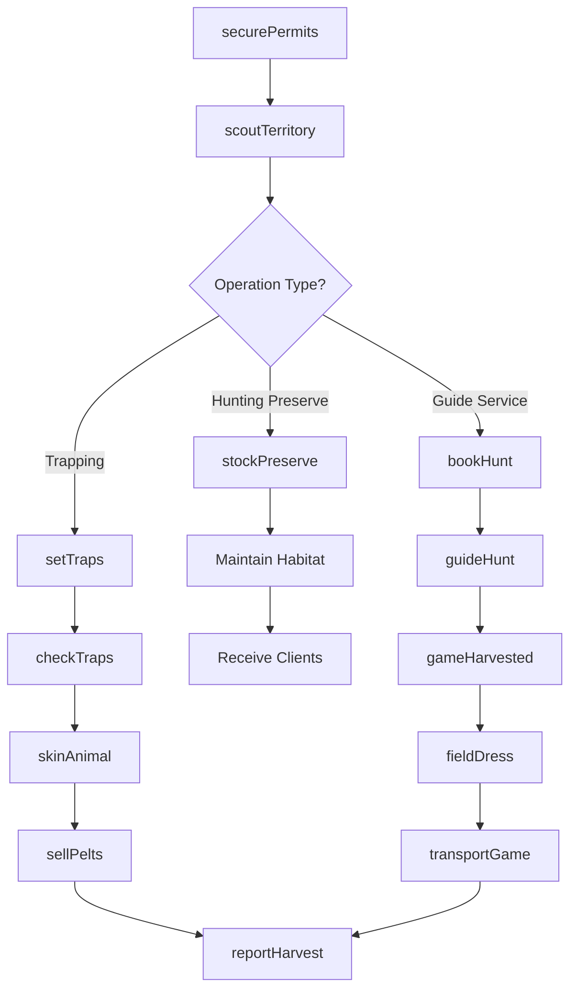
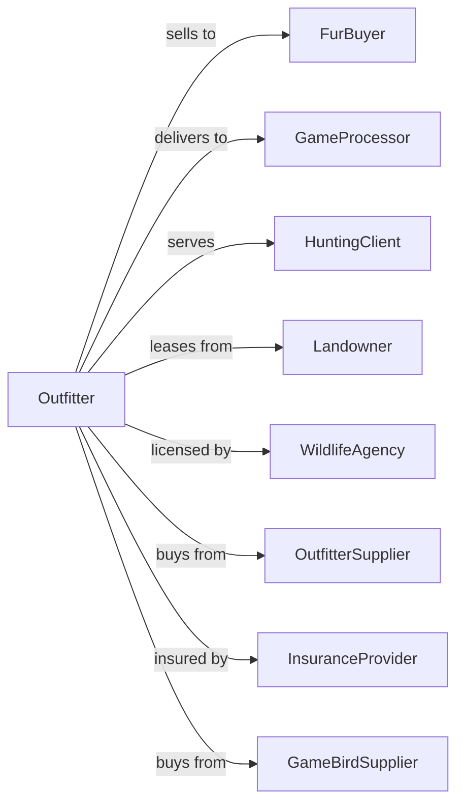

# Hunting and Trapping

> Business-as-Code definition for commercial hunting, trapping, and game preserve operations. Models the complete cycle from permit acquisition through harvest or guided hunts including game management and client services.

## Overview

Hunting and trapping operations include commercial wildlife harvest for fur and meat, game preserve management, and guided hunting services. Operations manage wildlife populations, maintain hunting grounds, secure permits, and provide outfitting services. This definition exposes actions for game management, harvest operations, and client coordination with events for automation and searches for production analytics.

## Actors

| Actor | Description |
|-------|-------------|
| FurBuyer | Purchases pelts and furs from trappers |
| GameProcessor | Processes harvested game animals |
| HuntingClient | Pays for guided hunting experiences |
| Landowner | Grants hunting and trapping access |
| WildlifeAgency | Manages permits, quotas, and seasons |
| OutfitterSupplier | Provides hunting and trapping equipment |
| InsuranceProvider | Covers liability for hunting operations |
| GameBirdSupplier | Provides birds for preserve stocking |

## Roles

| Role | Description |
|------|-------------|
| OutfitterOwner | Owns operation and holds permits |
| GuideManager | Oversees guide services and scheduling |
| HuntingGuide | Leads clients on hunts |
| Trapper | Sets and tends trap lines |
| GameKeeper | Manages wildlife habitat and populations |
| Bookkeeper | Manages permits, bookings, and finances |
| Skinner | Skins, stretches, and dries pelts on fur boards for market |

## Entities

| Entity | Description |
|--------|-------------|
| HuntingPreserve | Land managed for hunting activities |
| TrapLine | Route of traps for fur-bearing animals |
| GameAnimal | Wildlife species legally hunted |
| FurBearer | Animal trapped for pelt |
| Pelt | Animal skin with fur for sale |
| Permit | License for specific species and areas |
| Quota | Allocated harvest number |
| Trap | Device for capturing fur-bearers |
| Blind | Concealment structure for hunters |
| HuntBooking | Client reservation for guided hunt |

## Actions

| Action | Description |
|--------|-------------|
| securePermits | Obtain hunting and trapping licenses |
| scoutTerritory | Survey land for game populations |
| setTraps | Deploy traps on trap line |
| checkTraps | Inspect and harvest from trap lines |
| skinAnimal | Process harvested animals for pelts |
| stockPreserve | Release game birds for hunting |
| bookHunt | Schedule client hunting trip |
| guideHunt | Lead client on hunting experience |
| fieldDress | Process harvested game in field |
| transportGame | Move harvested animals for processing |
| sellPelts | Complete sale of furs |
| reportHarvest | Submit harvest data to wildlife agency |

## Events

| Event | Description |
|-------|-------------|
| permitsSecured | Licenses obtained for season |
| trapsSet | Trap line deployed |
| trapsChecked | Harvest collected from traps |
| animalSkinned | Pelt prepared for sale |
| preserveStocked | Game birds released |
| huntBooked | Client reservation confirmed |
| huntCompleted | Guided hunt finished |
| gameHarvested | Animal taken during hunt |
| peltsConsigned | Furs submitted for sale |
| harvestReported | Data submitted to agency |
| seasonClosed | Hunting or trapping season ended |

## Searches

| Search | Description |
|--------|-------------|
| getPermitStatus | Check license validity and quotas |
| getTrapLineStatus | View trap locations and catch |
| getBookingCalendar | List scheduled hunts |
| findClients | List potential hunting customers |
| getPeltInventory | Track unsold furs |
| getHarvestHistory | Retrieve past harvest records |
| getSeasonDates | Check open seasons by species |
| getWeatherForecast | Check conditions for operations |

## Workflow



## Actor Relationships



## Usage

### Calling Actions

```typescript
import { huntGameWildlife } from '@headlessly/hunt-game-wildlife'

const outfitter = huntGameWildlife()

// Secure permits for trapping season
await outfitter.securePermits({
  species: ['beaver', 'muskrat', 'mink'],
  territory: 'county-zone-4',
  season: '2024-2025'
})

// Set trap line for beaver
await outfitter.setTraps({
  trapLineId: 'beaver-creek-line',
  trapType: 'conibear-330',
  trapCount: 25,
  locations: generateTrapLocations('beaver-creek', 25)
})

// Book guided deer hunt
const booking = await outfitter.bookHunt({
  clientId: 'client-johnson',
  species: 'whitetail-deer',
  huntType: 'rifle',
  dates: { start: new Date('2024-11-15'), end: new Date('2024-11-18') },
  partySize: 2
})

// Guide the hunt
await outfitter.guideHunt({
  bookingId: booking.id,
  guideId: 'guide-smith',
  territory: 'north-ridge-stand'
})
```

### Event-Driven Automation

```typescript
// Auto-report harvest to agency
outfitter.gameHarvested(async ({ huntId, species, tagNumber, location }) => {
  await outfitter.reportHarvest({
    huntId,
    species,
    tagNumber,
    harvestDate: new Date(),
    location
  })
})

// Notify on pelt accumulation for sale
outfitter.animalSkinned(async ({ species, peltId }) => {
  const inventory = await outfitter.getPeltInventory({ species })

  if (inventory.count >= 50) {
    await notifyFurBuyer({
      species,
      quantity: inventory.count,
      quality: inventory.avgGrade,
      message: 'Pelts available for purchase'
    })
  }
})
```

## Related

- [Other Poultry Production](../../112-AnimalProductionAndAquaculture/1123-PoultryAndEggProduction/112390-OtherPoultryProduction.mdx)
- [Fur-Bearing Animal and Rabbit Production](../../112-AnimalProductionAndAquaculture/1129-OtherAnimalProduction/112930-FurBearingAnimalAndRabbitProduction.mdx)
